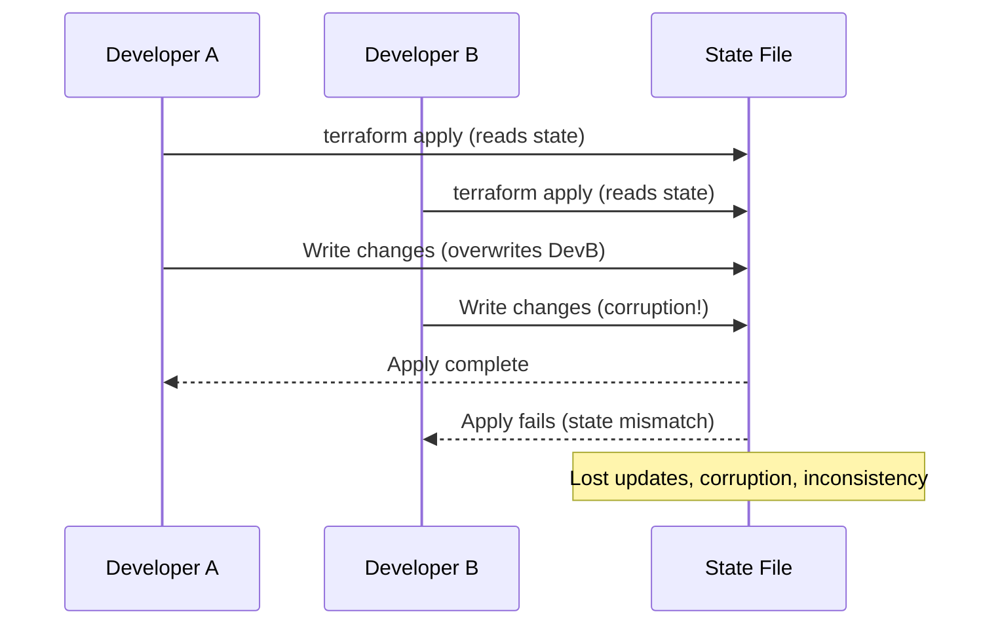
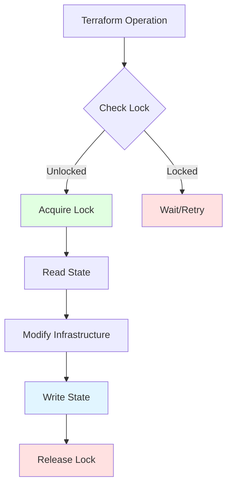

# State Locking

## Summary

**Terraform state locking** prevents concurrent modifications to state files, which could cause corruption or race conditions. Locking ensures only one operation can modify state at a time. Remote backends (S3, GCS, Azure Blob, Consul) require a separate locking mechanism (DynamoDB, etcd, etc.). Terraform automatically acquires locks before `apply`/`destroy` and releases them when complete or on error.

## Detailed Explanation

### The Problem Without Locking



### How State Locking Works



### Lock Information

When a lock is held, Terraform stores metadata:

| Field | Description | Example |
|--------|-------------|---------|
| **ID** | Unique lock identifier | `1234567890abcdef0` |
| **Operation** | Type of operation | `OperationTypeApply` |
| **Who** | User or system info | `user@example.com` |
| **Version** | Terraform version | `1.5.7` |
| **Created** | Lock timestamp | `2024-01-10 10:00:00.000 Z` |
| **Path** | State file path | `prod/terraform.tfstate` |

### S3 + DynamoDB Locking

```hcl
# backend.tf
terraform {
  required_version = ">= 1.5.0"

  required_providers {
    aws = {
      source  = "hashicorp/aws"
      version = "~> 5.0"
    }
  }

  backend "s3" {
    # State storage
    bucket         = "terraform-state-prod"
    key           = "production/terraform.tfstate"
    region        = "us-west-2"
    encrypt       = true

    # State locking via DynamoDB
    dynamodb_table = "terraform-locks"

    # Optional: KMS encryption
    kms_key_id = "arn:aws:kms:us-west-2:123456789012:key/terraform-state"
  }
}
```

```hcl
# Create DynamoDB table for locking
resource "aws_dynamodb_table" "terraform_locks" {
  name           = "terraform-locks"
  hash_key       = "LockID"
  range_key      = null
  billing_mode   = "PAY_PER_REQUEST"
  attribute {
    name = "LockID"
    type = "S"
  }

  # Point-in-time recovery
  point_in_time_recovery {
    enabled = false  # Faster operations
  }

  tags = {
    Purpose    = "Terraform State Locking"
    ManagedBy  = "Terraform"
  }
}
```

### GCS + No Locking (Use Terraform Cloud)

```hcl
terraform {
  backend "gcs" {
    bucket  = "terraform-state-prod"
    prefix  = "production"

    # GCS does not have built-in locking like S3+DynamoDB
    # Use Terraform Cloud for enterprise locking
  }
}
```

### Consul Backend with Locking

```hcl
terraform {
  backend "consul" {
    path    = "terraform/production"

    # Consul configuration
    address = "consul.example.com"
    scheme  = "https"
    ca_file  = "/path/to/ca.crt"

    # Locking is built into Consul
    # No separate locking service needed
  }
}
```

### Azure Blob + Locking

```hcl
terraform {
  backend "azurerm" {
    resource_group_name  = "terraform-state-rg"
    storage_account_name = "tfstatestorage"
    container_name       = "tfstate"
    key                  = "production.terraform.tfstate"

    # Locking via Azure Blob storage
    # No separate service needed
    # Uses blob lease mechanism
  }
}
```

### Terraform Cloud Locking

```hcl
terraform {
  cloud {
    organization = "my-org"
    workspaces {
      name = "production"
    }
  }

  # Locking managed by Terraform Cloud
  # No backend configuration needed
}
```

### Lock Error Handling

```bash
# terraform apply (another operation has lock)
terraform apply

# Error: Error acquiring the state lock
#
# Error message:
#   Error acquiring the state lock
#
# Lock Info:
#   ID:        1234567890abcdef0
#   Path:      prod/terraform.tfstate
#   Operation:  OperationTypeApply
#   Who:       user@example.com
#   Version:   1.5.7
#   Created:   2024-01-10 10:00:00.000 Z
#   Info:
#     Contact: user@example.com
#
# Terraform acquires a state lock to protect the state file from being
# written by multiple users at the same time.
#
# Please confirm that this user has permission to modify this state file.
# If this is an error, please clear the lock manually by running:
#
#   terraform force-unlock <LOCK_ID>
```

### Force Unlock (Dangerous)

```bash
# Only force unlock when you're sure lock is stale
# Example: Previous operation crashed without releasing lock

terraform force-unlock 1234567890abcdef0

# WARNING: Force unlock can cause state corruption if operation still running
# Verify operation is actually dead before unlocking
```

### Automatic Lock Release

Terraform automatically releases locks when:

| Situation | Lock Release |
|------------|---------------|
| **Successful apply** | Lock released immediately after apply |
| **Failed apply** | Lock released (state may be partially updated) |
| **Process killed** | Lock released (SIGTERM, SIGINT) |
| **Timeout** | Lock expires after backend-specific timeout |
| **Manual unlock** | Lock released via `terraform force-unlock` |

### Lock Timeout Configuration

```hcl
# Set lock timeout in backend
terraform {
  backend "consul" {
    path    = "terraform/production"
    address = "consul.example.com"

    # Lock timeout (default: 15 seconds)
    # Override if long operations expected
    lock_timeout = "10m"
  }
}

# For S3 backend, lock is held until operation completes or manually unlocked
# No explicit timeout, but operations may timeout
```

### Multi-Region Locking

```hcl
# Different state per region = separate locks
terraform {
  backend "s3" {
    bucket = "terraform-state-prod"

    # Each region has separate state file
    key    = "us-west-2/terraform.tfstate"    # Lock A
    # key    = "us-east-1/terraform.tfstate"   # Lock B
    # key    = "eu-west-1/terraform.tfstate"   # Lock C

    dynamodb_table = "terraform-locks"  # All share same table
    region          = "us-west-2"
  }
}
```

### Locking in CI/CD

```yaml
# .github/workflows/terraform.yml
name: Terraform with Locking

on:
  push:
    branches: [main]

jobs:
  deploy:
    runs-on: ubuntu-latest
    steps:
      - uses: actions/checkout@v3

      - name: Configure AWS credentials
        uses: aws-actions/configure-aws-credentials@v2
        with:
          aws-access-key-id: ${{ secrets.AWS_ACCESS_KEY_ID }}
          aws-secret-access-key: ${{ secrets.AWS_SECRET_ACCESS_KEY }}
          aws-region: us-west-2

      - name: Setup Terraform
        uses: hashicorp/setup-terraform@v2

      - name: Terraform Init
        run: terraform init

      - name: Terraform Apply
        run: terraform apply -auto-approve
        # Terraform automatically handles lock acquisition
        # If lock held (e.g., another job running), waits or fails

      - name: Handle Lock Failure
        if: failure()
        run: |
          echo "Terraform apply failed - check if another deployment is running"
          echo "Lock ID will be in error message"
```

### Preventing Lock Contention

```bash
# Use pull requests to prevent concurrent applies

# Workflow:
# 1. Developer creates PR with changes
# 2. CI/CD runs terraform plan (no apply)
# 3. PR reviewed and approved
# 4. Merge to main
# 5. CI/CD runs terraform apply (with lock)

# Alternative: Terraform workspaces
# Different developers work in different workspaces (no lock conflict)

terraform workspace new feature-xyz
terraform apply  # Separate workspace, separate lock
terraform workspace select production
```

### Monitoring Locks

```bash
# Monitor DynamoDB locks (AWS CLI)
aws dynamodb get-item \
  --table-name terraform-locks \
  --key '{"LockID": {"S": "prod/terraform.tfstate"}}'

# Output:
# {
#   "Item": {
#     "LockID": {"S": "prod/terraform.tfstate"},
#     "Info": {
#       "S": "{\"ID\":\"1234567890\",\"Operation\":\"OperationTypeApply\",\"Who\":\"ci@company.com\",\"Version\":\"1.5.7\",\"Created\":\"2024-01-10T10:00:00Z\"}"
#     }
#   }
# }
```

### Locking Best Practices

| Practice | Why | How |
|----------|------|------|
| **Use remote backends** | Local state has no locking | S3, GCS, Consul, Terraform Cloud |
| **Enable DynamoDB for S3** | Provides locking mechanism | `dynamodb_table` in backend config |
| **Set up proper IAM permissions** | Lock table access | CI/CD role needs DynamoDB permissions |
| **Monitor lock contention** | Identify bottlenecks | Query lock table, check Terraform Cloud |
| **Use PR workflows** | Prevent concurrent applies | Plan in PR, apply only on merge |
| **Implement timeouts** | Avoid permanent locks | CI/CD job timeout, Terraform lock_timeout |
| **Handle force-unlock carefully** | Prevent corruption | Verify lock is truly stale before unlocking |
| **Audit lock usage** | Track who locked when | Terraform Cloud UI, CloudTrail logs |

### Troubleshooting Locks

| Problem | Solution |
|---------|----------|
| **Lock held by crashed process** | Verify operation is dead, then `terraform force-unlock` |
| **Lock held by other developer** | Contact developer to release, wait for completion, or force unlock (risky) |
| **Cannot acquire lock (permission error)** | Check IAM permissions for DynamoDB, S3, or Consul |
| **Lock never releases** | Check for long-running operation, verify process health |
| **Multiple locks in same workspace** | Use workspaces for parallel development, avoid concurrent applies |

### Complete Locking Example

```hcl
# backend.tf - Remote state with locking
terraform {
  required_version = ">= 1.5.0"

  required_providers {
    aws = {
      source  = "hashicorp/aws"
      version = "~> 5.0"
    }
  }

  backend "s3" {
    # State storage
    bucket         = "my-company-terraform-state"
    key           = "production/terraform.tfstate"
    region        = "us-west-2"
    encrypt       = true

    # Locking
    dynamodb_table = "terraform-locks"
    kms_key_id    = "arn:aws:kms:us-west-2:123456789012:key/terraform-state"
  }
}

# dynamodb_table.tf - Create lock table
resource "aws_dynamodb_table" "terraform_locks" {
  name           = "terraform-locks"
  hash_key       = "LockID"
  range_key      = null
  billing_mode   = "PAY_PER_REQUEST"
  read_capacity  = 5
  write_capacity = 5

  attribute {
    name = "LockID"
    type = "S"
  }

  tags = {
    Environment = "production"
    Purpose     = "Terraform State Locking"
    ManagedBy   = "Terraform"
  }
}

# s3_bucket.tf - State bucket
resource "aws_s3_bucket" "terraform_state" {
  bucket = "my-company-terraform-state"

  versioning {
    enabled = true
  }

  server_side_encryption_configuration {
    rule {
      apply_server_side_encryption_by_default = true
    }
  }

  # Prevent accidental deletion
  lifecycle {
    prevent_destroy = true
  }

  tags = {
    Environment = "production"
    Purpose     = "Terraform State Storage"
    ManagedBy   = "Terraform"
  }
}
```

```bash
# deploy.sh - Deployment with lock handling
#!/bin/bash
set -e

echo "Initializing Terraform..."
terraform init

# Try to apply (will acquire lock automatically)
echo "Applying Terraform configuration..."
if terraform apply -auto-approve; then
  echo "✅ Deployment successful"
  exit 0
else
  EXIT_CODE=$?
  echo "❌ Terraform apply failed with exit code $EXIT_CODE"

  # Check if it was a lock error
  if echo "$ERROR_OUTPUT" | grep -q "Error acquiring the state lock"; then
    echo "⚠️  State is locked by another operation"
    echo "Options:"
    echo "1. Wait for other operation to complete"
    echo "2. Force unlock (only if lock is stale): terraform force-unlock <LOCK_ID>"
    exit $EXIT_CODE
  fi

  exit $EXIT_CODE
fi
```

## Interview Questions

**Q: What is Terraform state locking and why is it needed?**
**A:** State locking prevents concurrent modifications to Terraform state files, which could cause corruption or race conditions. Without locking, two developers running `terraform apply` simultaneously could overwrite each other's changes, resulting in lost updates, inconsistent state, or infrastructure corruption. Locking ensures only one operation modifies state at a time.

**Q: How does state locking work with S3 backend?**
**A:** S3 alone doesn't provide locking. Use DynamoDB table as the locking mechanism with `dynamodb_table = "terraform-locks"` in S3 backend config. Terraform writes a lock entry to DynamoDB before applying, reads state from S3, writes changes back to S3, then removes lock from DynamoDB on completion.

**Q: What happens if Terraform cannot acquire a state lock?**
**A:** Terraform waits and displays error: "Error acquiring the state lock" with lock info (ID, who, when, operation). The operation fails. Options: 1) Wait for lock to be released (another apply completes), 2) Contact whoever holds the lock, 3) Force unlock with `terraform force-unlock` (only if lock is stale).

**Q: What is `terraform force-unlock` and when should you use it?**
**A:** `terraform force-unlock <LOCK_ID>` manually releases a state lock. Use only when: 1) Previous Terraform process crashed without releasing lock, 2) Lock is truly stale (process definitely dead), 3) No risk of concurrent operation. Force unlocking while operation is running can cause state corruption.

**Q: How do you monitor who is holding Terraform state locks?**
**A:** Methods: 1) For S3+DynamoDB: Query DynamoDB table (`aws dynamodb get-item`), 2) For Terraform Cloud: View locks in UI, 3) For Consul: Query Consul KV store, 4) Check Terraform Cloud run history. Lock metadata includes who, when, operation type.

**Q: Does the GCS backend support state locking?**
**A:** GCS backend does not have built-in locking like S3+DynamoDB. GCS uses optimistic concurrency control (last write wins), which can cause race conditions. For production locking with GCS, use Terraform Cloud or implement a custom locking service (Consul, etcd) as a workaround.

**Q: How do you prevent state lock contention in teams?**
**A:** Prevention strategies: 1) Use pull request workflows (plan in PR, apply only on merge), 2) Use Terraform workspaces for parallel development (separate state per workspace), 3) Schedule deployments to avoid overlaps, 4) Implement CI/CD queue (only one deployment runs at a time), 5) Communicate deployment times via chat/email.

**Q: What happens to the lock when a Terraform operation is killed?**
**A:** When Terraform receives termination signals (SIGTERM, SIGINT), it attempts to release the lock before exiting. If process dies abruptly (kill -9), lock may remain held. In this case, manually force unlock after verifying no operation is running, or wait for automatic timeout (backend-dependent).

**Q: How does state locking work with Terraform Cloud?**
**A:** Terraform Cloud manages locking automatically in the cloud. No backend configuration needed. When you run `terraform apply`, Terraform Cloud acquires a lock for that workspace. Multiple concurrent operations block until lock releases. Lock status visible in Terraform Cloud UI and run history.

**Q: What IAM permissions are required for DynamoDB state locking?**
**A:** Required permissions for DynamoDB table: `dynamodb:GetItem`, `dynamodb:PutItem`, `dynamodb:DeleteItem` for lock operations. Terraform needs these to acquire, renew, and release locks. For the lock table itself: `dynamodb:CreateTable` (if creating). Apply principle of least privilege to the CI/CD IAM role.

**Q: How do you handle state locking in a CI/CD pipeline with multiple jobs?**
**A:** In CI/CD: 1) Ensure only one deployment job runs at a time (use job dependencies or exclusive resources), 2) Fail gracefully if lock held (display lock info, exit with error), 3) Use workflow dispatch for manual deployments (serialized), 4) Implement job timeout to prevent permanent lock holds, 5) Use Terraform Cloud which manages locking centrally.

**Q: What is the difference between locking via DynamoDB and Consul?**
**A:** DynamoDB (AWS): separate service from state storage, requires explicit configuration `dynamodb_table`, works with S3 backend, provides eventual consistency, AWS-native. Consul: built-in key-value store with native locking support, can store state and locks together, works across cloud providers, not AWS-specific. Choose based on your infrastructure: AWS = DynamoDB, multi-cloud/hybrid = Consul.
