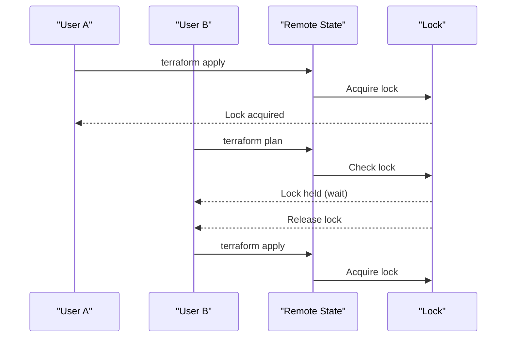

# Remote State

## Summary

**Remote state** stores Terraform state file remotely (S3, GCS, Azure Blob, Terraform Cloud) instead of locally. Remote state enables team collaboration, state locking, backup, and secure access. Essential for production environments where multiple team members work simultaneously. State file is encrypted and versioned.

## Detailed Explanation

### Why Remote State?

```mermaid
graph TB
    A[Local State] -->|Team A|
    B[Remote State] -->|Team B|
    C[Remote State] -->|Team C|

    A -.->|Conflicts - No locking|
    B -.->|Collaboration - Shared state|
    B -.->|Backups - Automatic versioning|
    B -.->|Security - Encrypted storage|

    style A fill:#ffe1e1
    style B fill:#e1f5ff
```

| Aspect | Local State | Remote State |
|---------|-----------|---------------|
| **Location** | Local filesystem | Cloud storage (S3, GCS, etc.) |
| **Collaboration** | Difficult (copy state files) | Easy (shared access) |
| **Locking** | None (manual coordination) | Built-in (automatic) |
| **Backups** | Manual (version control) | Automatic (versions retained) |
| **Security** | Local file exposure | Encrypted in transit/at rest |
| **CI/CD** | Complex (state management) | Simple (native support) |

### Remote State Backends

| Provider | Backend | Configuration | Features |
|----------|---------|-------------|-----------|
| **AWS** | S3 | `terraform { backend "s3" { ... } }` | Locking via DynamoDB, versioning |
| **AWS** | DynamoDB | State only | Automatic locking, no storage cost |
| **AWS** | Enhanced S3 (Terraform Cloud) | Locking, encryption, state versioning |
| **GCP** | GCS | `terraform { backend "gcs" { ... } }` | Versioning, encryption |
| **Azure** | Azure Blob | `terraform { backend "azurerm" { ... } }` | Locking, encryption |
| **Consul** | Consul | `terraform { backend "consul" { ... } }` | Locking, KV storage |
| **HTTP** | Generic | `terraform { backend "http" { ... } }` | Locking via API |

### AWS S3 Backend (Recommended)

```hcl
# backend.tf
terraform {
  backend "s3" {
    bucket         = "terraform-state-prod"
    key           = "prod/terraform.tfstate"
    region        = "us-west-2"
    encrypt       = true
    dynamodb_table = "terraform-locks"
    kms_key_id    = "arn:aws:kms:us-west-2:123456789012:alias/terraform-state-key"
  }

  required_providers {
    aws = {
      source  = "hashicorp/aws"
      version = "~> 5.0"
    }
  }
}

provider "aws" {
  region = "us-west-2"
}
```

### DynamoDB Backend (State Locking Only)

```hcl
# backend.tf
terraform {
  backend "s3" {
    bucket         = "terraform-state-prod"
    key           = "prod/terraform.tfstate"
    region        = "us-west-2"
    encrypt       = true
    dynamodb_table = "terraform-locks"
  }
}

# DynamoDB table must exist with LockID as hash key
# LockID string stored in DynamoDB attribute
# Provides automatic locking
```

### GCS Backend

```hcl
# backend.tf
terraform {
  backend "gcs" {
    bucket  = "terraform-state-prod"
    prefix  = "prod/"
    credentials = "/path/to/service-account.json"
  }

  required_providers {
    google = {
      source  = "hashicorp/google"
      version = "~> 4.0"
    }
  }
}
```

### Azure Blob Backend

```hcl
# backend.tf
terraform {
  backend "azurerm" {
    resource_group_name  = "terraform-state-rg"
    storage_account_name = "terraformstate"
    container_name       = "tfstate"
    key                  = "prod/terraform.tfstate"
    sas_token           = var.sas_token
  }

  required_providers {
    azurerm = {
      source  = "hashicorp/azurerm"
      version = "~> 3.0"
    }
  }
}
```

### Consul Backend

```hcl
# backend.tf
terraform {
  backend "consul" {
    path      = "terraform/prod"
    address   = "consul.example.com"
    datacenter = "dc1"
    scheme    = "http"
    gzip      = true
  }
}
```

### Terraform Cloud Backend

```hcl
# backend.tf (automatic for Terraform Cloud)
terraform {
  cloud {
    organization = "my-org"
    workspaces {
      name = "prod"
    tags = ["production", "networking"]
    project = "main-platform"
    }
  }

  required_providers {
    aws = {
      source  = "hashicorp/aws"
      version = "~> 5.0"
    }
  }
}
```

### State Encryption

```hcl
# AWS S3: Server-side encryption with SSE-S3 or SSE-KMS
terraform {
  backend "s3" {
    bucket         = "terraform-state"
    encrypt       = true              # Default SSE-S3
    # server_side_encryption_configuration = "aws:kms:..."  # Or KMS
    kms_key_id    = "arn:aws:kms:us-west-2:123456789012"
  }
}

# GCS: Customer-managed encryption key
terraform {
  backend "gcs" {
    bucket     = "terraform-state"
    encryption_key = "projects/my-project/locations/us/key1"
  }
}
```

### State Versioning

```hcl
# Terraform Cloud: Automatic state versioning
terraform {
  cloud {
    workspaces {
      name = "prod"
      # State automatically versioned
      # Rollback to previous versions available
    }
  }
}

# S3 with versioning (manual)
terraform {
  backend "s3" {
    bucket = "terraform-state"
    key    = "prod/terraform.tfstate"

    # No native versioning in standard S3 backend
    # Use DynamoDB or Terraform Cloud for automatic
  }
}
```

### State Locking



### Configuration per Environment

```bash
# Dev environment
export TF_WORKSPACE=dev
export AWS_ACCESS_KEY_ID=$DEV_ACCESS_KEY
export AWS_SECRET_ACCESS_KEY=$DEV_SECRET_KEY

# terraform init
# Uses: terraform-state-dev bucket
# Key: dev/terraform.tfstate

# Production environment
export TF_WORKSPACE=prod
export AWS_ACCESS_KEY_ID=$PROD_ACCESS_KEY
export AWS_SECRET_ACCESS_KEY=$PROD_SECRET_KEY

# terraform init
# Uses: terra-state-prod bucket
# Key: prod/terraform.tfstate
```

### Remote State Commands

```bash
# Initialize with remote backend
terraform init

# List workspaces (Terraform Cloud)
terraform workspace list

# Select workspace
terraform workspace select prod

# Migrate state (move local to remote)
terraform init -migrate-state

# Pull state (download remote)
terraform state pull > terraform.tfstate.local

# Push state (upload local to remote)
terraform state push

# List managed resources
terraform state list
```

### S3 Backend Setup

```bash
# Create S3 bucket for state
aws s3api create-bucket \
  --bucket terra-state-prod \
  --region us-west-2 \
  --versioning-enabled \
  --server-side-encryption

# Create DynamoDB table for locking
aws dynamodb create-table \
  --table-name terraform-locks \
  --attribute-definitions LockID=S,Owner=S,TTL=N \
  --key-schema AttributeDefinitions/AttributeDefinitions/AttributeName=S \
  --billing-mode PAY_PER_REQUEST \
  --region us-west-2

# Block public access
aws s3api put-bucket-acl \
  --bucket terra-state-prod \
  --grant-read acp@example.com \
  --grant-write acp@example.com \
  --acl private

# Enable versioning (optional)
aws s3api put-bucket-versioning \
  --bucket terra-state-prod \
  --status-enabled
```

### GCS Backend Setup

```bash
# Create GCS bucket
gsutil mb -p gs://terraform-state-prod

# Create service account for Terraform
gcloud iam service-accounts create terraform \
  --display-name "Terraform State" \
  --role roles/storage.objectViewer

# Download credentials
gcloud iam service-accounts keys create terraform \
  --key-file terraform-key.json

# Use credentials in backend
```

### Best Practices

| Practice | Description | Example |
|-----------|-------------|---------|
| **Separate environments** | Different state files/buckets for dev/staging/prod | `dev/terraform.tfstate`, `prod/terraform.tfstate` |
| **Use workspaces** | Terraform Cloud workspaces or prefix-based state | `prod/networking/tfstate` vs `dev/networking/tfstate` |
| **Enable encryption** | Always encrypt state at rest and in transit | `encrypt = true`, KMS keys |
| **Enable locking** | Use DynamoDB or Consul backend with automatic locking | `dynamodb_table = "terraform-locks"` |
| **Restrict access** | Block public access, IAM policies for state bucket | `s3api put-bucket-acl --acl private` |
| **Regular backups** | Enable S3 versioning or Terraform Cloud automatic | `versioning-enabled` on bucket |
| **Document backend** | Include backend.tf in version control | Commit with other infrastructure code |
| **Test disaster recovery** | Restore state from backup after issues | `terraform state pull` from S3 version |

### Troubleshooting

```bash
# Lock already held
# Error: Error acquiring the state lock
# Solution: Wait for lock to release or force-unlock
terraform force-unlock <LOCK_ID>

# State corruption
# Error: Failed to unmarshal state file
# Solution: Restore from backup or delete state and reapply

# Access denied
# Error: AccessDenied: User is not authorized
# Solution: Check IAM permissions, S3 bucket policies

# Network issues
# Error: Failed to load state from S3
# Solution: Check network connectivity, S3 region, credentials
```

## Interview Questions

**Q: What is remote state in Terraform and why use it?**
**A:** Remote state stores Terraform state file remotely (S3, GCS, Azure Blob) instead of locally. Benefits: team collaboration, automatic state locking, encryption, backups, CI/CD friendliness. Essential for production where multiple team members work simultaneously. Eliminates state file sharing and coordination issues.

**Q: How do you configure Terraform to use S3 as remote state backend?**
**A:** Add `backend "s3" { }` block to `terraform` configuration: specify bucket, key, region. Add `dynamodb_table = "locks"` for locking. Set `encrypt = true` for security. Run `terraform init` to initialize. State file stored at `s3://bucket/key/terraform.tfstate`.

**Q: What's the difference between S3 and DynamoDB backends for state locking?**
**A:** S3 backend stores actual state file (encrypted). DynamoDB backend stores only lock information (who holds lock, when acquired). Used together for automatic state locking: S3 stores state, DynamoDB provides locking mechanism. Enables safe concurrent operations across team.

**Q: How does Terraform Cloud handle remote state?**
**A:** Terraform Cloud hosts state for you automatically. Configure via `terraform { cloud { organization = "org" }` block. Features: automatic locking, encryption, state versioning, rollback to previous states, no need to manage infrastructure. Free tier available with generous limits.

**Q: What's the best way to organize remote state for multiple environments?**
**A:** Use separate state files or prefixes per environment: `dev/terraform.tfstate`, `staging/terraform.tfstate`, `prod/terraform.tfstate`. Or use Terraform Cloud workspaces: `terraform workspace select prod`. Ensure state isolation between environments. Use different S3 buckets or prefix within same bucket.

**Q: How do you enable encryption for Terraform remote state?**
**A:** AWS S3: `encrypt = true` for SSE-S3 or `kms_key_id` for SSE-KMS. GCP: `encryption_key = "projects/..."`. Azure: `use_managed_identity = true` or specify encryption key. Terraform Cloud: encryption enabled by default. Encrypts state at rest and in transit to protect sensitive data.

**Q: What is state locking in Terraform and why is it important?**
**A:** State locking prevents concurrent modifications by multiple team members. When one user runs `terraform apply`, lock is acquired. Other users wait or fail with lock error. Prevents state corruption, race conditions, and conflicting changes. Automatic with remote backends (S3+DynamoDB, Consul, Terraform Cloud).

**Q: How do you migrate from local state to remote state?**
**A:** Change backend in `terraform` configuration to remote backend. Run `terraform init -migrate-state`. Terraform migrates local state to remote location. Old local state preserved. No data loss if migration successful. Test in non-prod environment first.

**Q: How do you handle state locking issues in CI/CD pipelines?**
**A:** Configure remote backend with automatic locking. CI/CD jobs automatically acquire lock. If lock held (another job), job fails with clear error. Use timeout settings. For long-running operations, ensure lock timeout is sufficient. Avoid manual state management in CI/CD.

**Q: What happens if remote state is corrupted or lost?**
**A:** If S3 versioning enabled: Restore from previous version via AWS CLI or Terraform Cloud UI. If no versioning: State lost, must recreate infrastructure from scratch (or import). Terraform Cloud: Rollback to previous state. Always enable backups and versioning for disaster recovery.

**Q: How do you secure remote state access?**
**A:** IAM policies: restrict who can read/write state bucket. Use least privilege principle. Block public access (`acl private`). Enable MFA on AWS accounts. Use IAM roles for automation. Rotate access keys regularly. Audit state access logs. Never commit state file to git.

**Q: Can you use different remote backends for different Terraform modules?**
**A:** Yes, you can configure different backends per module using partial configuration or separate backend files. However, simpler to use single backend for entire configuration. Use `terragrunt` for complex backend configuration management. Terraform Cloud workspaces another option for multi-environment setups.
