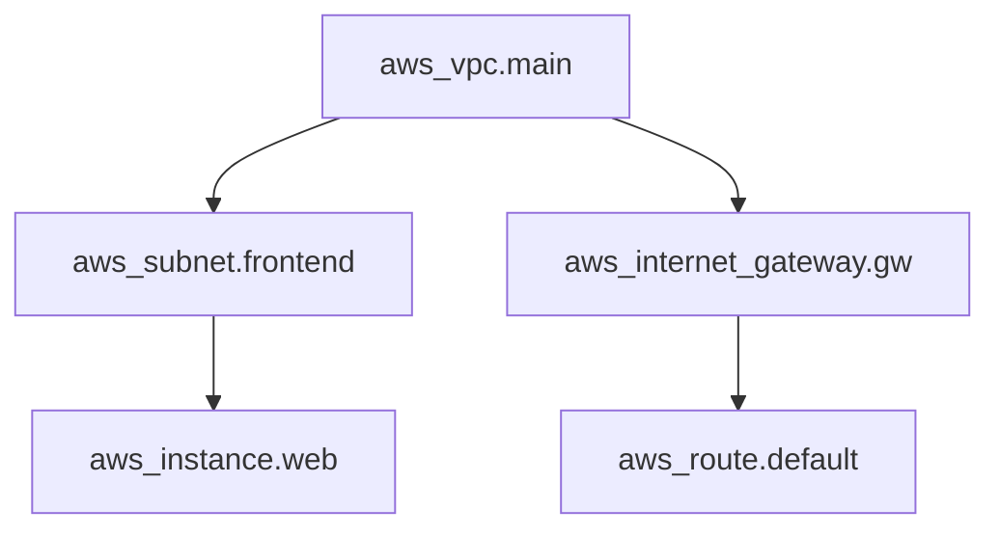

## Summary
The `terraform graph` command is used to generate a visual representation of a Terraform configuration or execution plan. It outputs data in the **DOT format**, which can be processed by visualization tools like **Graphviz** to create charts (PNG, SVG, etc.). It is essential for understanding resource dependencies, identifying potential bottlenecks, and debugging complex infrastructure relationships.

## Detailed Explanation

### What is Terraform Graph?
Terraform builds a **Directed Acyclic Graph (DAG)** to manage resource dependencies. The `terraform graph` command exposes this internal structure. By default, it generates a simplified graph showing the dependency ordering of resources and data blocks defined in the configuration.

### Why Use It?
*   **Visualization**: Provides a clear bird's-eye view of your infrastructure.
*   **Dependency Analysis**: Helps identify implicit and explicit dependencies (`depends_on`).
*   **Debugging**: Useful for identifying circular dependencies (though Terraform usually catches these during validation) or understanding why certain resources are being created in a specific order.
*   **Documentation**: Can be used to generate architecture diagrams automatically from code.

### Usage and Options
The basic command is:
```bash
terraform graph
```

To generate an image, you typically pipe the output to Graphviz's `dot` utility:
```bash
terraform graph | dot -Tpng > graph.png
```

#### Graph Types
You can specify the type of graph using the `-type` flag:
*   `plan`: Visualization of the execution plan.
*   `plan-destroy`: Visualization of a destruction plan.
*   `apply`: Visualization of the state after application.

### Visualizing with MermaidJS
In modern documentation (like GitHub or Obsidian), you can use Mermaid to represent these dependencies:



## Go Application

Terraform is written in **Go**, and its core logic revolves around a custom DAG implementation. Below is a simplified example of how you might implement a basic dependency graph in Go, mirroring how Terraform connects "vertices" (resources) with "edges" (dependencies).

```go
package main

import (
	"fmt"
	"github.com/hashicorp/terraform/dag"
)

func main() {
	// Initialize an acyclic graph (DAG)
	g := &dag.AcyclicGraph{}

	// Define resources (Vertices)
	vpc := "aws_vpc.main"
	subnet := "aws_subnet.frontend"
	instance := "aws_instance.web"

	// Add vertices to the graph
	g.Add(vpc)
	g.Add(subnet)
	g.Add(instance)

	// Connect dependencies (Edges)
	// Subnet depends on VPC
	g.Connect(dag.BasicEdge(subnet, vpc))
	// Instance depends on Subnet
	g.Connect(dag.BasicEdge(instance, subnet))

	// Walk the graph in order of dependencies
	fmt.Println("Resource Deployment Order:")
	g.Walk(func(v dag.Vertex) error {
		fmt.Printf("Deploying: %v\n", v)
		return nil
	})
}
```

*Note: In a real-world scenario, you would use `github.com/hashicorp/terraform/internal/dag` or a similar library. The `Walk` function ensures that dependencies are processed before the resources that depend on them.*

## Interview Questions

**Q: What is the primary purpose of the `terraform graph` command?**
**A:** It generates a visual representation of the dependency graph of Terraform resources in DOT format, helping users understand and debug resource relationships.

**Q: Which tool is commonly used to convert `terraform graph` output into an image file?**
**A:** **Graphviz** (specifically the `dot` command) is the standard tool for converting DOT output into formats like PNG, SVG, or PDF.

**Q: What format does `terraform graph` use for its output?**
**A:** It uses the **DOT language**, which is a plain text graph description language.

**Q: How does Terraform handle resource dependencies internally?**
**A:** Terraform builds a **Directed Acyclic Graph (DAG)**. It uses this graph to determine the correct order of operations, allowing for parallel execution of independent resources while ensuring dependent resources are handled sequentially.

**Q: Can you generate a graph for a specific plan file?**
**A:** Yes, by using the `-plan=tfplan` option with `terraform graph`, you can visualize the specific actions described in a saved plan file.
