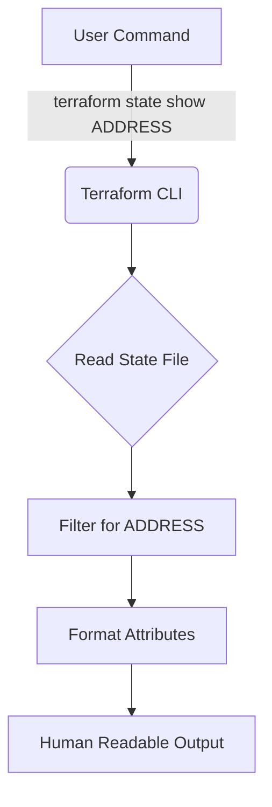

## Summary
The `terraform state show` command is used to display the detailed attributes of a single resource within the Terraform state file. It provides a human-readable output of the current state of a resource as recorded by Terraform, making it an essential tool for debugging and verifying the actual configuration of deployed infrastructure without manually inspecting the state file.

## Detailed Explanation

### Purpose and Usage
In Terraform, the state file (`terraform.tfstate`) acts as a source of truth for the resources managed by your configuration. While `terraform state list` gives you a high-level overview of all managed resources, `terraform state show` allows you to "zoom in" on a specific resource.

**Syntax:**
```bash
terraform state show [options] ADDRESS
```

The `ADDRESS` must be a valid resource address. If the resource is part of a module or has multiple instances (using `count` or `for_each`), you must specify the exact instance.

### Key Use Cases
1.  **Debugging Attributes**: Verify if a specific attribute (like an IP address or a generated ID) was correctly captured in the state.
2.  **Resource ID Retrieval**: Quickly find the unique identifier of a resource for use in external scripts or manual cloud console searches.
3.  **State Verification**: Confirm that the state matches your expectations after a manual change or a complex `terraform apply`.

### Examples

**1. Basic Resource:**
```bash
terraform state show aws_instance.web
```

**2. Resource in a Module:**
```bash
terraform state show module.vpc.aws_vpc.main
```

**3. Resource with Count/For_Each:**
```bash
# Using index
terraform state show 'aws_instance.web[0]'

# Using key
terraform state show 'aws_instance.web["api_server"]'
```

### terraform state show vs. terraform show
*   **`terraform state show`**: Focuses on a **single resource**. It requires an address and output is tailored for that specific resource.
*   **`terraform show`**: Provides a summary of the **entire state** or a plan file. While it can be used to see everything, it is often too verbose for inspecting a single item.

### Workflow Visualization


## Go Application

In Go development, especially when building custom providers or automation tools, you might need to programmatically inspect Terraform state. While you could execute the CLI command, the official [tfexec](https://github.com/hashicorp/terraform-exec) library is the preferred way.

### Using `tfexec` in Go
The `tfexec` package provides a `StateShow` method, but it is often more useful to use `Show` to get a JSON representation of the entire state and then filter it using Go's strong typing.

```go
package main

import (
	"context"
	"fmt"
	"log"

	"github.com/hashicorp/terraform-exec/tfexec"
	"github.com/hashicorp/terraform-json"
)

func main() {
	workingDir := "./my-terraform-project"
	execPath := "/usr/local/bin/terraform"

	tf, err := tfexec.NewTerraform(workingDir, execPath)
	if err != nil {
		log.Fatalf("error running NewTerraform: %s", err)
	}

	// Read the state
	state, err := tf.Show(context.Background())
	if err != nil {
		log.Fatalf("error running Show: %s", err)
	}

	// Find a specific resource in the state
	targetAddress := "aws_instance.web"
	for _, res := range state.Values.RootModule.Resources {
		if res.Address == targetAddress {
			fmt.Printf("Resource Found: %s\n", res.Address)
			fmt.Printf("ID: %v\n", res.AttributeValues["id"])
			// Accessing complex attributes
			if val, ok := res.AttributeValues["public_ip"]; ok {
				fmt.Printf("Public IP: %v\n", val)
			}
		}
	}
}
```

### Why Go for State Inspection?
*   **Automation**: Building self-healing systems that check state and trigger actions.
*   **Validation**: Running custom compliance checks against the current state.
*   **Migration**: Writing tools to transform state between different formats or backends.

## Interview Questions

**Q: What is the primary difference between `terraform show` and `terraform state show`?**
**A:** `terraform show` displays the entire state file or a plan file in a human-readable format. `terraform state show` is targeted; it requires a specific resource address and only displays the attributes of that one resource instance.

**Q: How do you handle sensitive data when running `terraform state show`?**
**A:** Terraform displays sensitive data in the terminal when you run `state show`. You should be cautious in shared environments or when recording screens. In the state file itself, sensitive data is stored in plain text (unless using a remote backend with encryption at rest).

**Q: Can `terraform state show` be used to see what *will* happen in the next apply?**
**A:** No. `terraform state show` only shows the current state as of the last successful operation. To see what will happen next, you must use `terraform plan`.

**Q: If a resource was created using `count`, how do you inspect the second instance?**
**A:** You use the index in the address: `terraform state show 'aws_instance.web[1]'`. Note the use of single quotes to prevent shell interpretation of the brackets.
