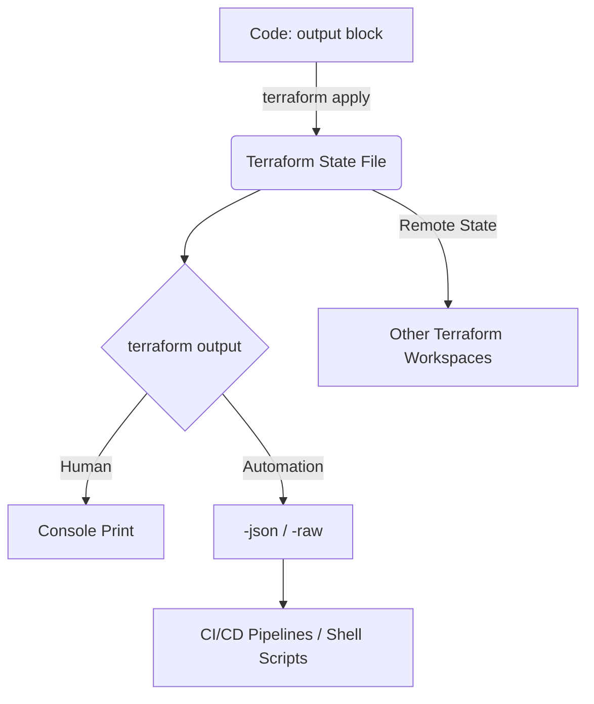

## Summary
The `terraform output` command is used to extract the values of output variables from the Terraform state file. It serves as the primary interface for exposing data from your infrastructure to the outside world, whether for manual inspection, automation scripts, or sharing data between different Terraform workspaces.

## Detailed Explanation

### Output Variables vs. Output Command
It is important to distinguish between the **declaration** and the **extraction**:
1.  **Output Variable (Code)**: Defined using the `output` block in `.tf` files. It specifies what data should be recorded in the state file after an `apply`.
2.  **`terraform output` (Command)**: A CLI tool that queries the state file to retrieve those recorded values.

### Interaction with State
Unlike `terraform plan` or `terraform apply`, the `terraform output` command **reads directly from the state file**. 
*   It does **not** trigger a refresh of the infrastructure by default.
*   It only displays values that have already been computed and stored during a previous `apply` or `refresh`.
*   If you change an `output` block in your code but haven't run `apply`, the command will still show the old value from the state.

### Key Usage and Flags

**1. Basic Usage:**
```bash
terraform output          # Shows all outputs for the root module
terraform output vpc_id   # Shows only the vpc_id value
```

**2. Automation with JSON:**
For scripts, the `-json` flag is essential as it provides machine-readable data.
```bash
terraform output -json | jq -r '.vpc_id.value'
```

**3. Raw Output:**
The `-raw` flag is useful for passing single string values directly to other commands or environment variables without quotes.
```bash
VPC_ID=$(terraform output -raw vpc_id)
```

### Sensitive Outputs
If an output is marked as `sensitive = true`, Terraform will:
*   Mask it in the CLI output of `terraform apply` and `terraform output`.
*   **However**, it is still stored in **plain text** within the state file.
*   To see the actual value, you must use `terraform output -json` or `terraform output -raw`.

### Inter-Workspace Communication
Outputs are the foundation for the `terraform_remote_state` data source. This allows one Terraform configuration to "reach into" the state of another configuration and read its outputs.

```hcl
# In the consumer workspace
data "terraform_remote_state" "vpc" {
  backend = "s3"
  config = {
    bucket = "my-terraform-state"
    key    = "network/terraform.tfstate"
    region = "us-east-1"
  }
}

resource "aws_instance" "web" {
  subnet_id = data.terraform_remote_state.vpc.outputs.public_subnet_id
}
```

## Workflow Visualization



## Go Application

In Go-based automation (like custom controllers or platform tools), you often need to parse Terraform outputs to trigger subsequent logic.

### Using `tfexec` to Get Outputs
The official `terraform-exec` library provides a high-level API to interact with the Terraform CLI.

```go
package main

import (
	"context"
	"fmt"
	"log"

	"github.com/hashicorp/terraform-exec/tfexec"
)

func main() {
	workingDir := "./infra"
	execPath := "/usr/local/bin/terraform"

	tf, err := tfexec.NewTerraform(workingDir, execPath)
	if err != nil {
		log.Fatal(err)
	}

	// Get all outputs
	outputs, err := tf.Output(context.Background())
	if err != nil {
		log.Fatal(err)
	}

	// Access a specific output
	if vpcID, ok := outputs["vpc_id"]; ok {
		// Output values in tfexec are returned as a map of OutputMeta
		// which includes the value, type, and sensitive flag.
		fmt.Printf("VPC ID: %s (Sensitive: %v)\n", string(vpcID.Value), vpcID.Sensitive)
	}
}
```

### Parsing JSON Output Manually
If you are calling the CLI directly and want to parse the JSON:

```go
type TfOutput struct {
	Value     interface{} `json:"value"`
	Type      string      `json:"type"`
	Sensitive bool        `json:"sensitive"`
}

// Example parsing logic
var outputs map[string]TfOutput
err := json.Unmarshal(stdoutBytes, &outputs)
```

## Interview Questions

**Q: What is the difference between an Output variable and a Local value?**
**A:** Local values (`locals`) are internal to a module and cannot be accessed from outside. Output variables (`outputs`) are intended to export data; they are recorded in the state file and can be accessed by parent modules, other workspaces via remote state, or the CLI.

**Q: Can you retrieve outputs if the state file is locked by another process?**
**A:** No. `terraform output` needs to read the state file. If the state is locked (e.g., during an ongoing `apply`), the command will wait or fail depending on the backend's locking implementation.

**Q: How does `terraform output` handle outputs from child modules?**
**A:** By default, it only shows outputs from the **root module**. To see a child module output, you must explicitly pass it through to a root module output.

**Q: Is it possible to see output values without having the Terraform source code?**
**A:** Yes, as long as you have access to the **state file** and the Terraform binary. You can run `terraform output` (or just read the JSON state) because the values are stored in the state itself.

**Q: Why would you use `-raw` instead of `-json` in a shell script?**
**A:** `-raw` is ideal for simple strings where you want to avoid shell quoting issues or additional `jq` parsing. It outputs the literal value without JSON structure or surrounding quotes.
