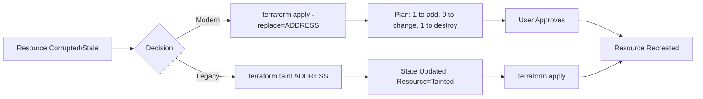

# Replace Option in Apply

## Summary

The **`-replace`** option in `terraform apply` (and `terraform plan`) is a planning-time flag used to force the destruction and recreation of a specific resource. Introduced in Terraform v0.15.2, it serves as the modern, safer alternative to the deprecated `terraform taint` command. By including the replacement intent in the plan itself, it ensures that the "side effect" of recreation is visible and explicit before any changes are committed to the state.

## Detailed Explanation

### The Problem: Hidden Corruption
Terraform typically tracks resource health via its state file and provider-specific logic. However, a resource might become dysfunctional in ways Terraform cannot detect (e.g., a crashed service inside a VM, a corrupted disk, or manual out-of-band changes that don't affect the tracked attributes). In such cases, the user needs to force Terraform to "start over" with that resource.

### How `-replace` Works
Unlike the old `taint` workflow, which modified the state file immediately to mark a resource as "unhealthy," the `-replace` flag is **transient**. It only affects the specific plan or apply command where it is used. It instructs the planning engine to treat the specified resource as if a change requires its replacement, regardless of its current state.

### Syntax and Usage
The flag requires the full resource address as defined in the Terraform configuration.

```bash
# Force replacement of a single resource
terraform apply -replace="aws_instance.web_server"

# Force replacement of a specific instance in a collection (count/for_each)
terraform apply -replace="aws_instance.workers[2]"

# Multiple replacements in one command
terraform apply -replace="aws_instance.a" -replace="aws_instance.b"
```

### Comparison: `-replace` vs. `terraform taint`

| Feature | `terraform taint` (Legacy) | `-replace` (Modern) |
| :--- | :--- | :--- |
| **State Modification** | Immediate and Persistent | Transient (only for the current plan) |
| **Safety** | Risky (taints are often forgotten) | High (explicitly requested per run) |
| **Visibility** | Hidden in state metadata | Clearly visible in the Plan output |
| **Workflow** | Two steps: `taint` then `apply` | One step: `apply -replace` |

### Workflow Diagram



---

## Go (Golang) Application: Automation with `tfexec`

In advanced CI/CD pipelines or platform engineering, you often wrap Terraform in Go using the [**terraform-exec**](https://github.com/hashicorp/terraform-exec) library. This allows you to programmatically trigger resource replacements based on external health checks or events.

To use the `-replace` option in Go, you pass the `Replace` option to the `Apply` or `Plan` functions.

```go
package main

import (
	"context"
	"fmt"
	"log"
	"os"

	"github.com/hashicorp/terraform-exec/tfexec"
)

func main() {
	workingDir := "./infrastructure"
	// Ensure the terraform binary is in your PATH or specify the full path
	execPath := "terraform"

	tf, err := tfexec.NewTerraform(workingDir, execPath)
	if err != nil {
		log.Fatalf("error creating tfexec instance: %s", err)
	}

	// Initialize the working directory
	err = tf.Init(context.Background(), tfexec.Upgrade(true))
	if err != nil {
		log.Fatalf("error during init: %s", err)
	}

	// Target resource address to be replaced
	resourceToReplace := "aws_instance.api_gateway"

	fmt.Printf("Initiating replacement for: %s...\n", resourceToReplace)

	// Execute Apply with the Replace option
	// This mirrors 'terraform apply -replace="aws_instance.api_gateway"'
	err = tf.Apply(context.Background(), tfexec.Replace(resourceToReplace))
	if err != nil {
		fmt.Fprintf(os.Stderr, "Error applying changes: %s\n", err)
		os.Exit(1)
	}

	fmt.Println("Replacement complete successfully.")
}
```

---

## Interview Questions

**Q: What is the primary advantage of using `-replace` over the deprecated `terraform taint`?**
**A:** The primary advantage is **safety and visibility**. `terraform taint` modifies the state file immediately, meaning if you forget to run `apply`, the resource remains "tainted" for future runs, potentially causing unintentional destruction. `-replace` is transient; it only exists for the duration of the command, and its impact is clearly shown in the plan output before any action is taken.

**Q: Can you use the `-replace` flag with `terraform plan`?**
**A:** Yes. Using `terraform plan -replace="ADDRESS"` is a best practice to verify exactly what will be destroyed and recreated before running the actual `apply`.

**Q: How do you replace multiple resources in a single Terraform command?**
**A:** You can specify the `-replace` flag multiple times: `terraform apply -replace="aws_instance.a" -replace="aws_instance.b"`.

**Q: What happens if the resource address passed to `-replace` is not found in the state?**
**A:** Terraform will return an error stating that the resource address does not match any resource in the current state, and the command will fail.

**Q: Does `-replace` work with resources inside modules?**
**A:** Yes, but you must provide the full path to the resource, for example: `module.database.aws_db_instance.main`.
