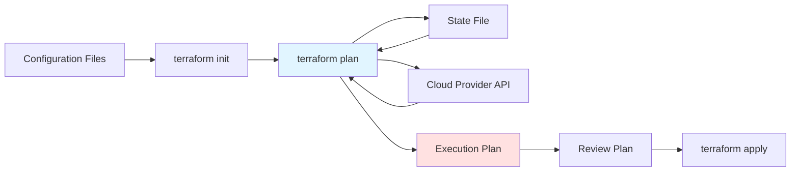

# terraform plan

## Summary

**`terraform plan`** creates an execution plan showing what Terraform will do without actually making changes. It compares configuration to current state and determines resources to create, update, or destroy. Plan includes dependency graph, change preview, and estimated costs. Always run plan before apply to verify changes and prevent unintended modifications.

## Detailed Explanation

### How terraform plan Works



### Basic Usage

```bash
# Basic plan
terraform plan

# Plan with output file
terraform plan -out=tfplan

# Plan with variables
terraform plan -var="region=us-east-1"

# Plan from file
terraform apply tfplan

# Detailed plan (machine-readable)
terraform plan -out=tfplan
terraform show -json tfplan > plan.json
```

### Plan Output Symbols

| Symbol | Meaning | Example |
|---------|-----------|---------|
| **`+`** | Resource will be created | `+ aws_instance.web` |
| **`-`** | Resource will be destroyed | `- aws_instance.web` |
| **`~`** | Resource will be updated (in-place) | `~ aws_instance.web` |
| **`-/+`** | Resource will be replaced (destroyed & created) | `-/+ aws_instance.web` |
| **`<=`** | Resource will be read and created (no changes) | `<= data.aws_vpc.main` |

### Plan Examples

```bash
# Creating new resources
terraform plan

Terraform used the selected providers to generate the following execution plan.
Resource actions are indicated with the following symbols:
  + create

Terraform will perform the following actions:

  # aws_vpc.main will be created
  + resource "aws_vpc" "main" {
      + cidr_block = "10.0.0.0/16"
      + tags         = {...}
    }

  # aws_subnet.public will be created
  + resource "aws_subnet" "public" {
      + vpc_id     = "vpc-123"
      + cidr_block = "10.0.1.0/24"
    }

Plan: 2 to add, 0 to change, 0 to destroy.
```

```bash
# Updating existing resources
terraform plan

  # aws_instance.web will be updated
  ~ resource "aws_instance" "web" {
      ~ instance_type = "t3.micro" -> "t3.large"
        + monitoring   = true
      }

Plan: 0 to add, 1 to change, 0 to destroy.
```

```bash
# Destroying resources
terraform plan

  # aws_instance.web will be destroyed
  - resource "aws_instance" "web" {
      - ami           = "ami-..."
      - instance_type = "t3.micro"
    }

Plan: 0 to add, 0 to change, 1 to destroy.
```

### Plan with Output File

```bash
# Create plan file
terraform plan -out=tfplan

# Review plan
terraform show tfplan

# Apply saved plan
terraform apply tfplan

# Benefits:
# - Team review before apply
# - CI/CD pipeline separation
# - Reproducible execution
# - Lock in exact changes
```

### Plan Options

```bash
# -out: Save plan to file
terraform plan -out=tfplan

# -refresh-only: Check for drift without plan
terraform plan -refresh-only

# -detailed-exitcode: Return non-zero on changes (for CI/CD)
terraform plan -detailed-exitcode

# -destroy: Show destroy plan
terraform plan -destroy

# -input=false: Disable interactive prompts
terraform plan -input=false

# -no-color: Disable colored output
terraform plan -no-color

# -json: Machine-readable JSON output
terraform plan -out=tfplan
terraform show -json tfplan
```

### Drift Detection

```bash
# Check for changes outside Terraform
terraform plan -refresh-only

# Output:
# Note: Objects have changed outside of Terraform
#
# Terraform detected the following changes made outside of Terraform:
#
#   # aws_instance.web has changed
#   ~ resource "aws_instance" "web" {
#       ~ tags                 = {
#           ~ "Owner" = "old-team" -> "new-team"
#         }
#     }
#
# No changes. Your infrastructure matches the configuration.
```

### Plan with Variables

```bash
# Single variable
terraform plan -var="region=us-east-1"

# Multiple variables
terraform plan \
  -var="region=us-east-1" \
  -var="environment=production" \
  -var="instance_count=3"

# Variable from file
terraform plan -var-file=prod.tfvars

# Multiple variable files
terraform plan \
  -var-file=common.tfvars \
  -var-file=prod.tfvars

# Environment variables (auto-loaded)
export TF_VAR_region=us-east-1
terraform plan
```

### Plan in CI/CD

```yaml
# .github/workflows/terraform.yml
name: Terraform Plan

on:
  pull_request:
    paths:
      - 'terraform/**'

jobs:
  plan:
    runs-on: ubuntu-latest
    steps:
      - uses: actions/checkout@v3

      - name: Setup Terraform
        uses: hashicorp/setup-terraform@v2

      - name: Terraform Init
        run: terraform init

      - name: Terraform Plan
        run: terraform plan -out=tfplan

      - name: Comment PR with plan
        uses: actions/github-script@v6
        with:
          script: |
            echo "## Terraform Plan" >> $GITHUB_STEP_SUMMARY
            echo '```' >> $GITHUB_STEP_SUMMARY
            terraform show -no-color tfplan >> $GITHUB_STEP_SUMMARY
            echo '```' >> $GITHUB_STEP_SUMMARY
```

### Plan Analysis

```bash
# Detailed plan analysis
terraform plan -out=tfplan

# Convert to JSON
terraform show -json tfplan > plan.json

# Extract changes
jq '.resource_changes[] | {resource: .address, action: .change.actions}' plan.json

# Output example:
# {"resource":"aws_instance.web","action":["create"]}

# Count changes
terraform plan | grep -E "^\s*[\+\-]" | wc -l
```

### Plan Review Checklist

```bash
#!/bin/bash
# plan-review.sh - Review checklist for terraform plan

terraform plan -out=tfplan

echo "=== Plan Review Checklist ==="
echo ""

# Check for destroys
if terraform show -json tfplan | jq -e '.resource_changes[] | select(.change.actions[0] == "delete")'; then
  echo "❌ WARNING: Resources will be destroyed"
fi

# Check for replacements
if terraform show -json tfplan | jq -e '.resource_changes[] | select(.change.actions | contains(["delete", "create"]))'; then
  echo "⚠️  WARNING: Resources will be replaced"
fi

# Check for new resources
new_count=$(terraform show -json tfplan | jq '[.resource_changes[] | select(.change.actions[0] == "create")] | length')
echo "✅ Resources to create: $new_count"

# Check for cost estimates
terraform show tfplan | grep -i cost
```

### Plan with Modules

```hcl
# main.tf
module "vpc" {
  source = "./modules/vpc"

  vpc_cidr = "10.0.0.0/16"
}

module "ec2" {
  source = "./modules/ec2"

  vpc_id     = module.vpc.vpc_id
  subnet_ids = module.vpc.subnet_ids
}
```

```bash
# Plan with modules
terraform plan

# Output:
# module.vpc.aws_vpc.main: Creating...
# module.ec2.aws_instance.web: Creating...
```

### Best Practices

```bash
# ✅ Always review plan before apply
terraform plan
# Read output carefully
terraform apply

# ✅ Save plan for review and reproducibility
terraform plan -out=tfplan
# Review tfplan file
terraform apply tfplan

# ✅ Use -detailed-exitcode in CI/CD
terraform plan -detailed-exitcode
# Returns non-zero if changes detected
# Useful for validation pipelines

# ✅ Run plan in PRs
# Don't allow direct applies to main
# Require plan approval

# ❌ Don't skip plan review
terraform apply -auto-approve  # Always review plan first!

# ✅ Use variables for environment-specific values
terraform plan -var-file=prod.tfvars

# ✅ Check for drift regularly
terraform plan -refresh-only
```

### Common Scenarios

#### Scenario 1: New Deployment

```bash
# First deployment
terraform plan

# Output:
# + resource "aws_vpc" "main"
# + resource "aws_subnet" "public"
# + resource "aws_instance" "web"

# Plan: 3 to add, 0 to change, 0 to destroy.
# Apply to create all resources.
```

#### Scenario 2: Resource Update

```bash
# Change instance type
# main.tf: instance_type = "t3.large"
terraform plan

# Output:
# ~ resource "aws_instance" "web"
#   ~ instance_type: "t3.micro" => "t3.large"

# Plan: 0 to add, 1 to change, 0 to destroy.
```

#### Scenario 3: Resource Replacement

```bash
# Change AMI (requires replacement)
# main.tf: ami = "ami-new"
terraform plan

# Output:
# -/+ resource "aws_instance" "web"
#   - ami: "ami-old"
#   + ami: "ami-new"

# Plan: 1 to add, 0 to change, 1 to destroy.
# Replacement: destroy old, create new.
```

#### Scenario 4: Resource Destruction

```bash
# Remove resource from config
# Delete resource definition
terraform plan

# Output:
# - resource "aws_instance" "web"

# Plan: 0 to add, 0 to change, 1 to destroy.
```

### Troubleshooting

```bash
# Plan fails with validation error
terraform plan

# Error: Invalid value for variable
# Solution: Fix variable value or constraint

# Plan fails with dependency error
terraform plan

# Error: Cycle: aws_instance.web depends on aws_eip.web
# Solution: Break circular dependency

# Plan shows unexpected changes
terraform plan -refresh-only

# Detect manual changes outside Terraform
# Update state or configuration accordingly

# Plan takes too long
terraform plan -refresh=false

# Skip provider refresh (faster, but may miss drift)
```

## Interview Questions

**Q: What does `terraform plan` do and when should you run it?**
**A:** `terraform plan` creates an execution plan showing what Terraform will do without actually making changes. It compares configuration to current state and shows resources to create, update, or destroy. Always run plan before apply to review changes, catch errors early, and prevent unintended infrastructure modifications.

**Q: What are the symbols used in terraform plan output?**
**A:** Symbols: `+` (create new resource), `-` (destroy existing resource), `~` (update in-place), `-/+` (replace: destroy and recreate), `<=` (read and create, no changes). These symbols appear before each resource in plan output to indicate what action Terraform will take.

**Q: What's the purpose of `terraform plan -out=tfplan`?**
**A:** The `-out` flag saves the execution plan to a file (`tfplan`). This allows: 1) Reviewing plan before applying, 2) Team collaboration (share plan file), 3) Reproducible execution (apply same plan multiple times), 4) CI/CD pipeline separation (plan in one step, apply in another).

**Q: How do you use terraform plan in CI/CD pipelines?**
**A:** In CI/CD: run `terraform plan` in PRs, output plan to file, post plan as PR comment for review. On main branch merge, run `terraform apply`. Use `-detailed-exitcode` flag to return non-zero if changes detected, useful for validation pipelines. Separate plan and apply stages for control.

**Q: What is infrastructure drift and how does `terraform plan` detect it?**
**A:** Infrastructure drift occurs when resources are modified outside Terraform (manual console changes). `terraform plan -refresh-only` compares actual infrastructure to state without planning changes. Detects drift by showing resources that changed outside Terraform control. Regular drift detection prevents unexpected behavior.

**Q: How do you pass variables to `terraform plan`?**
**A:** Variables can be passed: 1) CLI `-var` flag: `terraform plan -var="region=us-east-1"`, 2) Variable file `-var-file`: `terraform plan -var-file=prod.tfvars`, 3) Environment variables: `export TF_VAR_region=us-east-1`. Multiple values can be passed with multiple `-var` flags or `.tfvars` file.

**Q: What's the difference between in-place update and resource replacement in Terraform?**
**A:** In-place update: provider modifies existing resource (e.g., change tags, monitoring). Replacement: provider destroys old and creates new (e.g., change AMI, instance type if provider doesn't support in-place). Plan shows `~` for in-place, `-/+` for replacement. Replacement may cause downtime.

**Q: How do you analyze terraform plan output programmatically?**
**A:** Use `terraform show -json tfplan` to get machine-readable JSON. Parse with jq or scripting tools: `jq '.resource_changes[] | {address, actions}' plan.json`. Useful for CI/CD validation, change counting, automated review, generating custom reports.

**Q: What happens when you run `terraform plan -destroy`?**
**A:** `terraform plan -destroy` shows a plan to destroy all resources managed by Terraform without creating anything new. Useful to preview destruction before running `terraform destroy`. Shows all resources with `-` symbol. Plan: "X to destroy".

**Q: Why is it important to review terraform plan output before applying?**
**A:** Reviewing plan helps catch: 1) Configuration errors before infrastructure is created, 2) Unintended changes (destroys, replacements), 3) Security issues (exposed secrets, public resources), 4) Cost implications (expensive resources), 5) Dependency problems (circular references). Prevents costly mistakes.
