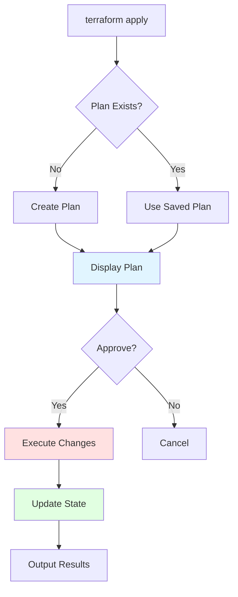

# terraform apply

## Summary

**`terraform apply`** creates, updates, or destroys infrastructure resources to match your configuration. It's the primary command for deploying infrastructure after reviewing the plan. Apply locks state, creates execution plan, makes API calls to cloud providers, and updates state file. Always review plan output before applying to avoid unintended changes.

## Detailed Explanation

### How terraform apply Works



### Basic Usage

```bash
# Basic apply (with auto-approval)
terraform apply

# Apply with explicit approval
terraform apply

# Apply with saved plan
terraform apply tfplan

# Apply without prompts (auto-approve)
terraform apply -auto-approve

# Apply with variables
terraform apply -var="region=us-east-1"

# Apply with variable file
terraform apply -var-file=prod.tfvars
```

### Apply Workflow

```bash
# Step 1: Initialize
terraform init

# Step 2: Create plan
terraform plan -out=tfplan

# Step 3: Review plan output
# + aws_instance.web (new)
# ~ aws_vpc.main (update)

# Step 4: Apply plan
terraform apply tfplan

# Output:
# aws_vpc.main: Modifying... [id=vpc-123]
# aws_instance.web: Creating... [id=i-456]
# Apply complete! Resources: 2 added, 1 changed, 0 destroyed.
```

### Apply with Auto-Approval

```bash
# Approve without typing 'yes'
terraform apply -auto-approve

# Or use -auto flag (same as -auto-approve)
terraform apply -auto

# Use carefully - no review!
# Better: review plan first
terraform plan -out=tfplan
terraform apply tfplan  # Auto-approves saved plan
```

### Apply with Saved Plan

```bash
# Create plan
terraform plan -out=tfplan

# Review plan file
terraform show tfplan

# Apply exact plan (no recalculation)
terraform apply tfplan

# Benefits:
# - Plan won't change during apply
# - Team review before apply
# - Reproducible execution
# - CI/CD friendly
```

### Apply Options

| Flag | Description | Use Case |
|-------|-------------|-----------|
| **`-auto-approve`** | Skip approval prompt | CI/CD automation |
| **`-var`** | Set variable value | Override variable |
| **`-var-file`** | Load variables from file | Environment-specific config |
| **`-refresh-only`** | Refresh state without plan | Check for drift |
| **`-lock`** | Lock state file | Manual state locking |
| **`-lock-timeout`** | State lock duration | Long-running applies |
| **`-parallelism`** | Resource creation parallelism | Performance tuning |
| **`-input=false`** | Disable interactive input | Automation |

### Apply Output

```bash
terraform apply

# Output:
# Terraform used the selected providers to generate the following execution plan.

# Terraform will perform the following actions:

#   # aws_vpc.main will be created
#   + resource "aws_vpc" "main" {
#       + cidr_block = "10.0.0.0/16"
#     }

# Plan: 1 to add, 0 to change, 0 to destroy.

# Do you want to perform these actions?
#   Terraform will perform the actions described above.
#   Only 'yes' will be accepted to proceed.

# Enter a value: yes

# aws_vpc.main: Creating...
# aws_vpc.main: Creation complete after 2s [id=vpc-123]

# Apply complete! Resources: 1 added, 0 changed, 0 destroyed.

# Outputs:
#
# vpc_id = "vpc-123"
```

### Apply in CI/CD

```yaml
# .github/workflows/deploy.yml
name: Terraform Apply

on:
  push:
    branches: [main]

jobs:
  deploy:
    runs-on: ubuntu-latest
    steps:
      - uses: actions/checkout@v3

      - name: Setup Terraform
        uses: hashicorp/setup-terraform@v2

      - name: Terraform Init
        run: terraform init

      - name: Terraform Plan
        run: terraform plan -out=tfplan

      - name: Terraform Apply
        run: terraform apply -auto-approve tfplan
```

### Apply with State Locking

```bash
# Apply with state lock
terraform apply

# If state is locked by another process:
# Error: Error acquiring the state lock
#
# Lock Info:
#   ID:        1234567890
#   Path:      prod/terraform.tfstate
#   Operation:  OperationTypeApply
#   Who:       user@example.com
#   Version:   1.6.0
#   Created:   2024-01-10 10:00:00.000 Z
#   Info:
#     Contact: user@example.com

# Wait for lock or force unlock
terraform force-unlock <LOCK_ID>

# Then retry apply
terraform apply
```

### Apply with Targeted Resources

```bash
# Apply only specific resources
terraform apply -target=aws_instance.web

# Apply multiple targets
terraform apply \
  -target=aws_instance.web \
  -target=aws_instance.db

# Use cases:
# - Partial apply after error
# - Update specific resources
# - Test specific changes

# ⚠️ Warning: Can break dependencies
```

### Apply Error Handling

```bash
# Common errors and solutions

# Error: Invalid configuration
# terraform apply
# Error: Error: Invalid value for variable
# Solution: Fix variable definition or value

# Error: Authentication failed
# terraform apply
# Error: Error: error configuring Terraform AWS Provider
# Solution: Check credentials, provider version

# Error: Resource already exists
# terraform apply
# Error: Error creating EC2 instance: InvalidAMIID.NotFound
# Solution: Import existing resource or use different AMI

# Error: Dependency cycle
# terraform apply
# Error: Cycle: aws_instance.web -> aws_eip.web -> aws_instance.web
# Solution: Remove circular dependency
```

### Apply Rollback

```bash
# After failed apply, state may be partially updated

# Option 1: Revert last change
terraform apply tfplan.backup  # Use backup state

# Option 2: Restore from backup
cp terraform.tfstate.backup terraform.tfstate

# Option 3: Reapply working configuration
git checkout HEAD~1  # Previous commit
terraform apply

# Option 4: Manual rollback
terraform destroy  # Destroy all
terraform apply    # Apply desired state
```

### Apply with Modules

```hcl
# main.tf
module "vpc" {
  source = "./modules/vpc"
}

module "ec2" {
  source = "./modules/ec2"
  vpc_id = module.vpc.vpc_id
}
```

```bash
# Apply with modules
terraform apply

# Output:
# module.vpc.aws_vpc.main: Creating...
# module.ec2.aws_instance.web: Creating...

# Apply complete! Resources: 5 added.
```

### Apply Outputs

```bash
terraform apply

# At the end of apply, Terraform outputs values:

# Outputs:
#
# instance_id = "i-1234567890abcdef0"
# public_ip = "54.123.45.67"
#
# These outputs can be used by other tools or scripts
```

### Best Practices

```bash
# ✅ Always review plan first
terraform plan -out=tfplan
terraform apply tfplan

# ✅ Use saved plans in CI/CD
# Don't rely on -auto-approve for unsaved plans

# ✅ Enable state locking
# Terraform default with remote backends

# ✅ Use environment-specific variables
terraform apply -var-file=prod.tfvars

# ✅ Review apply output carefully
# Check for unexpected destroys or replacements

# ❌ Don't use -auto-approve without plan review
terraform apply -auto-approve  # Dangerous without review!

# ✅ Test in non-prod environments first
terraform workspace select dev
terraform apply
# Then apply to prod
```

### Complete Workflow Example

```bash
#!/bin/bash
# deploy.sh - Complete deployment workflow

set -e  # Exit on error

# 1. Initialize
echo "Initializing Terraform..."
terraform init

# 2. Create plan
echo "Creating execution plan..."
terraform plan -out=tfplan

# 3. Review plan (optional)
echo "Plan created. Review tfplan file."
terraform show tfplan

# 4. Confirm apply
read -p "Apply this plan? (yes/no): " confirm
if [ "$confirm" != "yes" ]; then
  echo "Deployment cancelled."
  exit 0
fi

# 5. Apply
echo "Applying changes..."
terraform apply tfplan

# 6. Show outputs
echo "Deployment outputs:"
terraform output -json | jq '.'

echo "Deployment complete!"
```

## Interview Questions

**Q: What does `terraform apply` do and when should you run it?**
**A:** `terraform apply` creates, updates, or destroys infrastructure to match your configuration. Run after reviewing `terraform plan` output. Apply makes API calls to cloud providers, updates state file, and shows results. Always review plan before applying to avoid unintended changes.

**Q: What's the difference between `terraform apply` and `terraform apply tfplan`?**
**A:** `terraform apply` generates a new plan and applies it. `terraform apply tfplan` applies a saved plan file created by `terraform plan -out=tfplan`. Using saved plan ensures exact same plan is applied, useful for team review and CI/CD reproducibility.

**Q: How do you approve Terraform apply without interactive prompt?**
**A:** Use `-auto-approve` or `-auto` flag: `terraform apply -auto-approve`. This skips the "Do you want to perform these actions?" prompt. Use carefully, typically only in CI/CD after plan review. Best practice: review saved plan first, then auto-approve.

**Q: What happens when terraform apply fails?**
**A:** When apply fails, some resources may be created and others not, leaving infrastructure in partial state. State file reflects partially applied changes. Options: 1) Fix error and reapply (Terraform continues), 2) Restore from state backup, 3) Revert configuration and apply. State locking prevents concurrent applies.

**Q: How do you use `terraform apply` in CI/CD pipelines?**
**A:** In CI/CD: 1) Run `terraform init`, 2) Run `terraform plan -out=tfplan`, 3) Review plan (post as comment), 4) On approval/main branch, run `terraform apply -auto-approve tfplan`. Use `-auto-approve` in pipelines but always review plan first.

**Q: What is the `-target` flag in `terraform apply`?**
**A:** `-target` applies only specific resources: `terraform apply -target=aws_instance.web`. Useful for: partial applies after errors, testing specific changes, updating subsets of resources. Warning: can break dependencies, use carefully and only when necessary.

**Q: How does state locking work during `terraform apply`?**
**A:** Terraform acquires a lock on state file before apply. If another operation holds the lock, apply waits or fails with lock info (who, when, operation). Locking prevents concurrent state corruption. Remote backends (S3, GCS) automatically implement locking. Locks expire after timeout.

**Q: What outputs does `terraform apply` produce?**
**A:** After successful apply, Terraform displays outputs defined in `output` blocks. Outputs show values from configuration: `Outputs: vpc_id = "vpc-123", instance_ip = "54.123.45.67"`. Can be retrieved later with `terraform output` and used by other tools or scripts.

**Q: How do you handle variable values during `terraform apply`?**
**A:** Variables provided via: 1) CLI `-var` flag: `terraform apply -var="region=us-east-1"`, 2) Variable file `-var-file`: `terraform apply -var-file=prod.tfvars`, 3) Environment variables: `export TF_VAR_region=us-east-1`, 4) Defaults in variable blocks. Priority: CLI > env > .tfvars > defaults.

**Q: What should you do if `terraform apply` shows unexpected resource destruction?**
**A:** Stop immediately! Review plan output to understand why destruction is planned. Common causes: 1) Resource removed from configuration (intentional or accidental), 2) State corruption, 3) Drift detection forcing replacement. If unintentional, revert configuration or restore state from backup before proceeding.

**Q: How do you rollback after failed `terraform apply`?**
**A:** Rollback options: 1) Restore state from backup (`terraform.tfstate.backup`), 2) Revert configuration change and reapply, 3) Use `terraform refresh-only` to restore actual infrastructure to state, 4) For complete rollback: `terraform destroy` then reapply working configuration. Choose based on situation.
