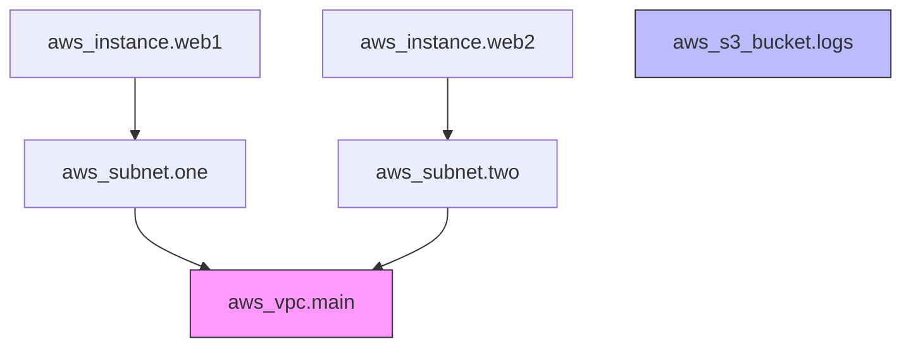

# Terraform Parallelism

## Summary

**Terraform Parallelism** refers to the ability of Terraform to perform multiple resource operations (create, update, destroy, read) simultaneously. By default, Terraform uses a dependency graph to determine which resources can be managed in parallel and limits the concurrency to **10** simultaneous operations. This can be tuned using the `-parallelism=n` flag to optimize performance or avoid API rate limiting.

## Detailed Explanation

### 1. Dependency Graph and Execution

Terraform builds a **Directed Acyclic Graph (DAG)** to model the relationships between resources. 

- **Implicit Dependencies**: Inferred from resource references (e.g., `subnet_id = aws_vpc.main.id`).
- **Explicit Dependencies**: Defined via the `depends_on` meta-argument.

During the `apply` or `plan` phase, Terraform:
1. Performs a **topological sort** on the graph.
2. Identifies "independent" nodes (resources with no pending dependencies).
3. Executes operations for these independent nodes in parallel, up to the limit defined by the parallelism setting.


*In this graph, `aws_vpc.main` and `aws_s3_bucket.logs` can start in parallel. Once VPC is done, `Subnet1` and `Subnet2` can run in parallel.*

### 2. The -parallelism=n Flag

The `-parallelism` flag controls the maximum number of concurrent operations in the graph walkthrough.

- **Default Value**: `10`
- **Usage**: Can be passed to `plan`, `apply`, and `destroy`.
- **Scope**: It applies to the entire execution of the command.

```bash
# Set parallelism to 20
terraform apply -parallelism=20
```

### 3. When to Adjust Parallelism

#### When to INCREASE (e.g., `-parallelism=30`)
- **Large Infrastructure**: When you have hundreds of independent resources (e.g., many S3 buckets or IAM users).
- **Fast APIs**: When the target API is very fast and has high rate limits.
- **Initial Provisioning**: Speeding up the first-time setup of a large environment.

#### When to DECREASE (e.g., `-parallelism=2`)
- **API Rate Limiting (Throttling)**: When the cloud provider returns `429 Too Many Requests` or `LimitExceeded`.
- **Complex Dependencies**: When resources have race conditions not captured by the graph (rare).
- **Network Constraints**: When running from a restricted environment with low bandwidth/concurrency limits.
- **Provider Stability**: Some providers might struggle with high concurrency.

### 4. Common Issues: API Rate Limiting

Cloud providers (AWS, Azure, GCP) enforce API rate limits (quotas) to protect their services.

- **Symptoms**:
    - `RequestLimitExceeded` (AWS)
    - `429 Too Many Requests` (Azure/GCP)
    - Terraform hangs or retries excessively.
- **Root Cause**: Terraform's default parallelism (10) + many resources + provider-side "burst" limits being exceeded.
- **Solutions**:
    1. **Reduce Parallelism**: Lower to 5 or even 1.
    2. **Retries**: Most providers have built-in exponential backoff, but it can still fail if the limit is consistently hit.
    3. **Request Quota Increase**: Contact the cloud provider to increase your API limits.

## Bash Examples

### Standard Apply with Custom Parallelism
```bash
# Run apply with 15 concurrent operations
terraform apply -parallelism=15 -auto-approve
```

### Debugging Rate Limits (Lowering Concurrency)
```bash
# If you hit AWS throttling, try reducing to 5 or 2
terraform apply -parallelism=2
```

### Using in a CI/CD Pipeline
```bash
#!/bin/bash
# Example script for a large deployment
TF_PARALLELISM=${TF_PARALLELISM:-10}

terraform plan -out=tfplan -parallelism=$TF_PARALLELISM
terraform apply -parallelism=$TF_PARALLELISM tfplan
```

## Interview Questions

**Q: What is the default parallelism in Terraform?**
**A:** The default value is 10.

**Q: How does Terraform decide what to run in parallel?**
**A:** It uses a Directed Acyclic Graph (DAG). Resources that do not depend on each other (directly or indirectly) are candidates for parallel execution.

**Q: Can you set parallelism in the HCL configuration?**
**A:** No, parallelism is a CLI-level setting and cannot be defined within the `.tf` files.

**Q: Does parallelism affect the `terraform plan` command?**
**A:** Yes, `terraform plan` also walks the graph to refresh the state of existing resources. Increasing parallelism can speed up the planning phase for large states.
