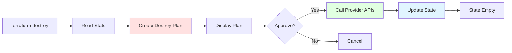

# terraform destroy

## Summary

**`terraform destroy`** removes all resources managed by Terraform in your configuration. It uses the same state file as apply to identify resources, calls provider APIs to delete them, and updates state accordingly. Destruction is irreversible - review plan carefully. Use `-target` for selective destruction or workspaces for environment-specific cleanup.

## Detailed Explanation

### How terraform destroy Works



### Basic Usage

```bash
# Basic destroy (with confirmation)
terraform destroy

# Destroy with auto-approval
terraform destroy -auto-approve

# Destroy specific resources
terraform destroy -target=aws_instance.web

# Destroy from plan
terraform plan -destroy -out=tfplan
terraform apply tfplan

# Destroy with variables
terraform destroy -var="environment=dev"
```

### Destroy Workflow

```bash
# Step 1: Check current state
terraform state list

# Step 2: Create destroy plan
terraform plan -destroy

# Output:
# Terraform will perform the following actions:
#
#   # aws_instance.web will be destroyed
#   - resource "aws_instance" "web" {
#       - ami           = "ami-..."
#       - instance_type = "t3.micro"
#     }

# Plan: 0 to add, 0 to change, 1 to destroy.

# Step 3: Confirm and destroy
terraform destroy -auto-approve

# Output:
# aws_instance.web: Destroying... [id=i-123]
# aws_instance.web: Destruction complete after 45s

# Destroy complete! Resources: 0 added, 0 changed, 1 destroyed.
```

### Destroy with Plan

```bash
# Create destroy plan
terraform plan -destroy -out=tfplan

# Review plan
terraform show tfplan

# Apply destroy plan
terraform apply tfplan
```

### Destroy Options

| Flag | Description | Use Case |
|-------|-------------|-----------|
| **`-auto-approve`** | Skip confirmation prompt | Automation, CI/CD |
| **`-target`** | Destroy specific resources | Selective cleanup |
| **`-refresh-only`** | Refresh state without plan | Check for drift |
| **`-lock`** | Manual state lock | Prevent concurrent operations |
| **`-lock-timeout`** | Lock duration timeout | Long-running destroys |
| **`-input=false`** | Disable interactive prompts | Full automation |

### Destroy Specific Resources

```bash
# Destroy single resource
terraform destroy -target=aws_instance.web

# Destroy multiple resources
terraform destroy \
  -target=aws_instance.web \
  -target=aws_instance.db

# Destroy module
terraform destroy -target=module.ec2

# ⚠️ Warning: Dependencies not destroyed
# Only targeted resources are removed
```

### Destroy with Workspaces

```bash
# List workspaces
terraform workspace list

# Select workspace
terraform workspace select dev

# Destroy dev workspace resources
terraform destroy -auto-approve

# Switch to prod
terraform workspace select prod

# Prod resources untouched
```

### Destroy Output

```bash
terraform destroy

# Output:
# Terraform used the selected providers to generate the following execution plan.

# Terraform will perform the following actions:

#   # aws_vpc.main will be destroyed
#   - resource "aws_vpc" "main" {
#       - cidr_block = "10.0.0.0/16"
#     }

#   # aws_subnet.public will be destroyed
#   - resource "aws_subnet" "public" {
#       - cidr_block = "10.0.1.0/24"
#     }

#   # aws_instance.web will be destroyed
#   - resource "aws_instance" "web" {
#       - ami           = "ami-..."
#       - instance_type = "t3.micro"
#     }

# Plan: 0 to add, 0 to change, 3 to destroy.

# Do you want to perform these actions?
#   Terraform will perform the actions described above.
#   Only 'yes' will be accepted to proceed.

# Enter a value: yes

# aws_vpc.main: Destroying... [id=vpc-123]
# aws_subnet.public: Destroying... [id=subnet-456]
# aws_instance.web: Destroying... [id=i-789]

# Destroy complete! Resources: 0 added, 0 changed, 3 destroyed.
```

### Destroy in CI/CD

```yaml
# .github/workflows/destroy.yml
name: Terraform Destroy

on:
  workflow_dispatch:  # Manual trigger

jobs:
  destroy:
    runs-on: ubuntu-latest
    steps:
      - uses: actions/checkout@v3

      - name: Setup Terraform
        uses: hashicorp/setup-terraform@v2

      - name: Terraform Init
        run: terraform init

      - name: Terraform Plan - Destroy
        run: terraform plan -destroy -out=tfplan

      - name: Terraform Apply - Destroy
        run: terraform apply -auto-approve tfplan
```

### Destroy with State Preservation

```bash
# Save state before destroy (for backup)
cp terraform.tfstate terraform.tfstate.backup

# Destroy resources
terraform destroy -auto-approve

# State file now empty or minimal
# Backup preserved
```

### Destroy Error Handling

```bash
# Common errors and solutions

# Error: Resource not found
terraform destroy
# Error: Error destroying EC2 instance: InvalidInstanceID.NotFound
# Solution: Refresh state or remove from state

# Error: Resource dependencies
terraform destroy
# Error: Error: Cannot destroy: dependency still exists
# Solution: Destroy dependencies first or use -target carefully

# Error: State lock
terraform destroy
# Error: Error acquiring the state lock
# Solution: Wait for lock or force-unlock

# Error: Timeout
terraform destroy
# Error: Error waiting for resource to delete
# Solution: Increase timeout in resource configuration
```

### Destroy Non-Terraform Resources

```bash
# Destroy resources created outside Terraform
# Option 1: Import then destroy
terraform import aws_instance.example i-1234567890
terraform destroy -target=aws_instance.example

# Option 2: Remove from state then destroy manually
terraform state rm aws_instance.example
# Manually delete via console

# Option 3: Use destroy plan to remove from state
terraform plan -destroy -target=aws_instance.example -out=tfplan
terraform apply tfplan
```

### Best Practices

```bash
# ✅ Always review destroy plan
terraform plan -destroy
# Check what will be destroyed
terraform destroy -auto-approve

# ✅ Use workspaces for environment isolation
terraform workspace select dev
terraform destroy
# Prod safe

# ✅ Backup state before destroy
cp terraform.tfstate terraform.tfstate.backup
terraform destroy

# ✅ Destroy test environments regularly
# Cost savings
terraform workspace select test
terraform destroy -auto-approve

# ✅ Confirm workspace before destroy
terraform workspace show
# Make sure you're destroying correct environment

# ❌ Don't use -auto-approve without checking
terraform destroy -auto-approve  # Dangerous in production!

# ✅ Use -target for selective cleanup
# When only some resources need removal
terraform destroy -target=aws_instance.web
```

### Environment-Specific Destroy

```bash
#!/bin/bash
# destroy-env.sh - Destroy specific environment

ENV=${1:-dev}

echo "Destroying environment: $ENV"

# Select workspace
terraform workspace select $ENV

# Create destroy plan
terraform plan -destroy -out=tfplan

# Review plan
terraform show tfplan

# Confirm
read -p "Destroy all resources in $ENV? (yes/no): " confirm
if [ "$confirm" != "yes" ]; then
  echo "Cancelled."
  exit 0
fi

# Destroy
terraform apply -auto-approve tfplan

echo "Environment $ENV destroyed."
```

### Complete Example

```bash
#!/bin/bash
# destroy-all.sh - Complete destruction workflow

set -e

# 1. Check current state
echo "Current resources:"
terraform state list

# 2. Create destroy plan
echo "Creating destroy plan..."
terraform plan -destroy -out=tfplan

# 3. Review plan
echo "Destroy plan:"
terraform show tfplan | grep -A 5 "Plan:"

# 4. Confirm
read -p "Destroy all resources? (yes/no): " confirm
if [ "$confirm" != "yes" ]; then
  echo "Cancelled."
  exit 0
fi

# 5. Backup state
echo "Backing up state..."
cp terraform.tfstate terraform.tfstate.backup.$(date +%s)

# 6. Destroy
echo "Destroying resources..."
terraform apply -auto-approve tfplan

# 7. Verify
echo "Remaining resources:"
terraform state list

echo "Destruction complete!"
```

## Interview Questions

**Q: What does `terraform destroy` do and when should you use it?**
**A:** `terraform destroy` removes all resources managed by Terraform in your configuration. Use to clean up infrastructure when it's no longer needed (test environments, temporary resources, complete teardown). Destruction is irreversible - review plan carefully before confirming.

**Q: What's the difference between `terraform destroy` and `terraform plan -destroy`?**
**A:** `terraform destroy` creates and executes a destroy plan in one command. `terraform plan -destroy` only creates the plan without executing. Use `-destroy` plan to review what will be deleted, then optionally apply with `terraform apply tfplan` for more control.

**Q: How do you destroy only specific resources with Terraform?**
**A:** Use `-target` flag: `terraform destroy -target=aws_instance.web`. This destroys only the targeted resource(s), not dependencies. Use carefully as it can leave orphaned resources. Better: remove resource from configuration, then regular `terraform destroy`.

**Q: What happens to Terraform state file after `terraform destroy`?**
**A:** After successful destroy, state file is updated to remove destroyed resources. If all resources are destroyed, state may be minimal or empty. Original state file remains but reflects destroyed resources. Use backups to preserve state history before destruction.

**Q: How do you prevent accidental destruction of production resources?**
**A:** Use workspaces: `terraform workspace select dev` before destroy. Always review destroy plan first: `terraform plan -destroy`. Require explicit confirmation (don't use `-auto-approve` without check). Use CI/CD safeguards: require approval, separate destroy workflow.

**Q: Can you undo a `terraform destroy` operation?**
**A:** No, destroy is irreversible. However: 1) If state file exists, you can restore it from backup, 2) If resources still exist (destroy failed), `terraform refresh` may restore state, 3) Re-create resources with `terraform apply`. Prevention (workspaces, confirmation) is better than undo.

**Q: How do you destroy resources created outside Terraform?**
**A:** Options: 1) Import into Terraform then destroy: `terraform import aws_instance.example id`, `terraform destroy -target=aws_instance.example`. 2) Remove from state manually: `terraform state rm aws_instance.example`. 3) Manually delete via cloud console (not recommended). Option 1 maintains Terraform control.

**Q: What's the difference between destroying resources and removing them from state?**
**A:** `terraform destroy` calls provider APIs to actually delete resources AND removes them from state. `terraform state rm` only removes from state file (resources still exist in cloud). Use `state rm` for resources managed outside Terraform that you want to ignore.

**Q: How do you use `terraform destroy` in CI/CD pipelines?**
**A:** In CI/CD: 1) Run `terraform init`, 2) Create destroy plan: `terraform plan -destroy -out=tfplan`, 3) Review plan (optional), 4) Apply destroy: `terraform apply -auto-approve tfplan`. Use workflow dispatch for manual triggers, or scheduled cleanup of test environments.

**Q: What should you check before running `terraform destroy`?**
**A:** Before destroy: 1) Verify workspace (`terraform workspace show`) to ensure correct environment, 2) Review state (`terraform state list`) to confirm resources, 3) Create destroy plan (`terraform plan -destroy`) to preview, 4) Check for critical resources (databases, storage with data), 5) Confirm with team if in production environment.

**Q: How do you handle errors during `terraform destroy`?**
**A:** Common errors: resource dependencies (destroy depends-on resources first), state lock (wait or force-unlock), timeouts (increase resource timeout), resources not found (refresh state). If destroy fails, some resources may be deleted and others not. Fix error and retry, or manually clean up remaining resources via console.
