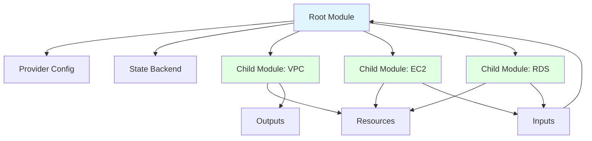

# Root vs Child Modules

## Summary

**Root module** is the top-level Terraform configuration that's directly executed. **Child modules** are reusable configurations called by root modules or other child modules. Modules promote reusability, organization, and DRY principles. Root modules manage state and provider configuration; child modules encapsulate infrastructure patterns and expose inputs/outputs.

## Detailed Explanation

### Module Structure



```
project/
├── main.tf                    # Root module
├── variables.tf
├── outputs.tf
├── modules/
│   ├── vpc/
│   │   ├── main.tf           # Child module
│   │   ├── variables.tf
│   │   └── outputs.tf
│   ├── ec2/
│   │   ├── main.tf
│   │   ├── variables.tf
│   │   └── outputs.tf
│   └── rds/
│       ├── main.tf
│       ├── variables.tf
│       └── outputs.tf
```

### Root Module

```hcl
# main.tf (root module)
terraform {
  required_version = ">= 1.5.0"

  # Root defines providers
  required_providers {
    aws = {
      source  = "hashicorp/aws"
      version = "~> 5.0"
    }
  }

  # Root defines state backend
  backend "s3" {
    bucket         = "terraform-state"
    key           = "prod/terraform.tfstate"
    region        = "us-west-2"
    encrypt       = true
    dynamodb_table = "terraform-locks"
  }
}

# Root configures providers
provider "aws" {
  region = var.region
}

# Root calls child modules
module "vpc" {
  source = "./modules/vpc"

  vpc_cidr = var.vpc_cidr
}

module "ec2" {
  source = "./modules/ec2"

  vpc_id     = module.vpc.vpc_id
  subnet_ids = module.vpc.subnet_ids
}
```

### Child Module

```hcl
# modules/vpc/main.tf (child module)
resource "aws_vpc" "main" {
  cidr_block = var.vpc_cidr

  tags = var.tags
}

resource "aws_subnet" "public" {
  count      = length(var.availability_zones)
  vpc_id     = aws_vpc.main.id
  cidr_block = cidrsubnet(var.vpc_cidr, 8, count.index)

  availability_zone = var.availability_zones[count.index]
  tags              = var.tags
}

resource "aws_subnet" "private" {
  count      = length(var.availability_zones)
  vpc_id     = aws_vpc.main.id
  cidr_block = cidrsubnet(var.vpc_cidr, 8, count.index + length(var.availability_zones))

  availability_zone = var.availability_zones[count.index]
  tags              = var.tags
}
```

```hcl
# modules/vpc/variables.tf (child module inputs)
variable "vpc_cidr" {
  type        = string
  description = "CIDR block for VPC"
}

variable "availability_zones" {
  type        = list(string)
  description = "List of availability zones"
}

variable "tags" {
  type        = map(string)
  description = "Tags to apply to all resources"
  default     = {}
}
```

```hcl
# modules/vpc/outputs.tf (child module outputs)
output "vpc_id" {
  description = "VPC ID"
  value       = aws_vpc.main.id
}

output "subnet_ids" {
  description = "All subnet IDs"
  value       = concat(aws_subnet.public[*].id, aws_subnet.private[*].id)
}
```

### Root Module Variables

```hcl
# main.tf (root)
variable "region" {
  type        = string
  default     = "us-east-1"
  description = "AWS region"
}

variable "vpc_cidr" {
  type        = string
  default     = "10.0.0.0/16"
  description = "VPC CIDR block"
}

variable "instance_count" {
  type        = number
  default     = 2
  description = "Number of EC2 instances"
}

# Pass to child modules
module "vpc" {
  source    = "./modules/vpc"
  vpc_cidr = var.vpc_cidr
}
```

### Root Module Outputs

```hcl
# outputs.tf (root)
output "vpc_id" {
  description = "VPC ID"
  value       = module.vpc.vpc_id
}

output "instance_ids" {
  description = "EC2 instance IDs"
  value       = module.ec2.instance_ids
}

output "database_endpoint" {
  description = "RDS endpoint"
  value       = module.rds.endpoint
}
```

### Module Calling

```hcl
# Calling child module from root
module "vpc" {
  source = "./modules/vpc"

  # Input variables
  vpc_cidr        = var.vpc_cidr
  availability_zones = var.availability_zones
  tags             = merge(var.default_tags, {
    Environment = var.environment
  })
}

# Access module outputs
output "vpc_id" {
  value = module.vpc.vpc_id
}

output "public_subnet_ids" {
  value = module.vpc.public_subnet_ids
}
```

### Local vs Remote Modules

| Aspect | Local Module | Remote Module |
|--------|---------------|----------------|
| **Source** | `./modules/vpc` | `terraform-aws-modules/vpc/aws` |
| **Location** | Same repository | Terraform Registry, GitHub |
| **Versioning** | Git commits | Version tags/branches |
| **Updates** | Pull locally | Terraform downloads |
| **Sharing** | Same team only | Public/private |

```hcl
# Local module
module "vpc" {
  source = "./modules/vpc"
}

# Remote module (Terraform Registry)
module "vpc" {
  source  = "terraform-aws-modules/vpc/aws"
  version = "5.1.2"
}

# Remote module (GitHub)
module "vpc" {
  source  = "github.com/terraform-aws-modules/terraform-aws-vpc"
  version = "v5.1.2"
}
```

### Nested Modules

```hcl
# Root module
module "infrastructure" {
  source = "./modules/infrastructure"
}

# modules/infrastructure/main.tf (child module calls grandchildren)
module "vpc" {
  source = "../vpc"
}

module "ec2" {
  source = "../ec2"
  vpc_id = module.vpc.vpc_id
}
```

### Multi-Module Composition

```hcl
# Root module composes multiple child modules

module "vpc" {
  source = "./modules/vpc"
}

module "security_groups" {
  source = "./modules/security_groups"
  vpc_id = module.vpc.vpc_id
}

module "load_balancer" {
  source = "./modules/load_balancer"
  subnet_ids = module.vpc.public_subnet_ids
  vpc_id     = module.vpc.vpc_id
}

module "ec2" {
  source = "./modules/ec2"
  subnet_ids        = module.vpc.public_subnet_ids
  security_groups = [module.security_groups.web_sg_id]
}
```

### Module Patterns

```hcl
# Pattern 1: Base infrastructure module
module "base_infra" {
  source = "./modules/base_infra"
}

# Pattern 2: Compute module
module "compute" {
  source = "./modules/compute"

  vpc_id = module.base_infra.vpc_id
}

# Pattern 3: Database module
module "database" {
  source = "./modules/database"

  subnet_ids = module.base_infra.private_subnet_ids
  vpc_id     = module.base_infra.vpc_id
}
```

### Provider Passing

```hcl
# Root module configures provider
provider "aws" {
  region = var.region
}

# Child modules don't reconfigure providers
# They inherit from root automatically

module "vpc" {
  source = "./modules/vpc"
  # No provider block needed
}

# Explicit provider configuration (advanced)
module "vpc" {
  source    = "./modules/vpc"
  providers = {
    aws = aws.west  # Pass specific provider instance
  }
}
```

### Complete Example

```hcl
# root/main.tf
terraform {
  required_version = ">= 1.5.0"

  required_providers {
    aws = {
      source  = "hashicorp/aws"
      version = "~> 5.0"
    }
  }
}

provider "aws" {
  region = var.region
}

variable "region" {
  type    = string
  default = "us-east-1"
}

variable "environment" {
  type    = string
  default = "production"
}

variable "vpc_cidr" {
  type    = string
  default = "10.0.0.0/16"
}

module "vpc" {
  source = "./modules/vpc"

  vpc_cidr        = var.vpc_cidr
  availability_zones = ["us-east-1a", "us-east-1b", "us-east-1c"]
  tags             = {
    Environment = var.environment
    ManagedBy   = "Terraform"
  }
}

module "ec2" {
  source = "./modules/ec2"

  vpc_id     = module.vpc.vpc_id
  subnet_ids = module.vpc.public_subnet_ids

  instance_type = "t3.micro"
  instance_count = 3

  tags = {
    Environment = var.environment
  }
}

output "vpc_id" {
  value = module.vpc.vpc_id
}

output "instance_ids" {
  value = module.ec2.instance_ids
}
```

```hcl
# modules/vpc/main.tf (child)
variable "vpc_cidr" {
  type = string
}

variable "availability_zones" {
  type = list(string)
}

variable "tags" {
  type = map(string)
  default = {}
}

resource "aws_vpc" "main" {
  cidr_block = var.vpc_cidr
  tags        = var.tags
}

resource "aws_subnet" "public" {
  for_each          = toset(var.availability_zones)
  vpc_id            = aws_vpc.main.id
  cidr_block        = cidrsubnet(var.vpc_cidr, 8, index(toset(var.availability_zones), each.value))
  availability_zone  = each.value
  tags               = var.tags
}

output "vpc_id" {
  value = aws_vpc.main.id
}

output "public_subnet_ids" {
  value = values(aws_subnet.public)[*].id
}
```

## Interview Questions

**Q: What's the difference between root and child modules in Terraform?**
**A:** Root module is the top-level configuration that's directly executed. It defines providers, state backend, and calls child modules. Child modules are reusable configurations encapsulating infrastructure patterns. Child modules receive inputs, define resources, and expose outputs. Root manages overall state; children handle specific components.

**Q: What is the typical directory structure for Terraform modules?**
**A:** Root level has `main.tf`, `variables.tf`, `outputs.tf`. Subdirectory `modules/` contains child modules (e.g., `modules/vpc/`, `modules/ec2/`). Each child module is a complete package with its own config, variables, and outputs. Modules can nest deeper.

**Q: How do you call a child module from a root module?**
**A:** Use `module` block: `module "name" { source = "./modules/path" }`. Pass inputs as module block arguments (matching child's input variables). Access outputs using `module.<name>.<output>` syntax. Example: `module.vpc.vpc_id`.

**Q: Can child modules define their own providers?**
**A:** Child modules typically inherit providers from root module and don't redefine them. Root configures providers once, all children share. Exception: Explicit provider passing using `providers = { aws = aws.west }` for advanced multi-region/multi-account scenarios.

**Q: What's the difference between local and remote modules?**
**A:** Local modules reference same repository: `source = "./modules/vpc"`. Remote modules reference external sources: Terraform Registry (`terraform-aws-modules/vpc/aws`) or GitHub/Bitbucket (`github.com/org/module`). Local modules update with git pull; remote modules downloaded by Terraform with version control.

**Q: How do modules promote reusability in Terraform?**
**A:** Modules encapsulate infrastructure patterns as reusable components. Define once in module, use multiple times with different inputs. Reduces code duplication (DRY principle), promotes consistency, easier updates (change module, affects all uses). Examples: VPC module, EC2 module, security group module.

**Q: How do you handle provider configuration in modules?**
**A:** Best practice: configure providers in root module only. Child modules inherit automatically. Provider defined in root applies to all modules. For multi-provider scenarios (different regions/accounts), use provider aliases and pass explicitly: `providers = { aws = aws.west }` to child.

**Q: What's the role of inputs and outputs in child modules?**
**A:** Inputs define parameters module accepts (like function arguments). Outputs define values module returns (like function return value). Root passes inputs to child; child processes and returns outputs. Root can access: `module.child_name.output_name`. Enables parameterized, reusable infrastructure.

**Q: Can modules be nested? If so, how does it work?**
**A:** Yes, modules can nest indefinitely. Root calls child module A, which calls child module B (grandchild). Useful for layered architecture: infrastructure → compute → specific services. Each module has own inputs/outputs. Access outputs through module chain: `module.child.grandchild.output`.

**Q: What happens to state management when using modules?**
**A:** State is managed at root level. Root module's state includes all resources from child modules. Child modules don't have their own state (unless explicitly configured with separate backends). Single state file tracks entire infrastructure, regardless of module depth.

**Q: How do you handle versioning of modules?**
**A:** Local modules: version controlled by git (commits, branches, tags). Remote modules (Terraform Registry, GitHub): specify `version = "5.1.2"` or `version = "~> 5.0"`. Locks module to specific version, ensuring reproducibility. Use `terraform init -upgrade` to update to latest allowed version.
