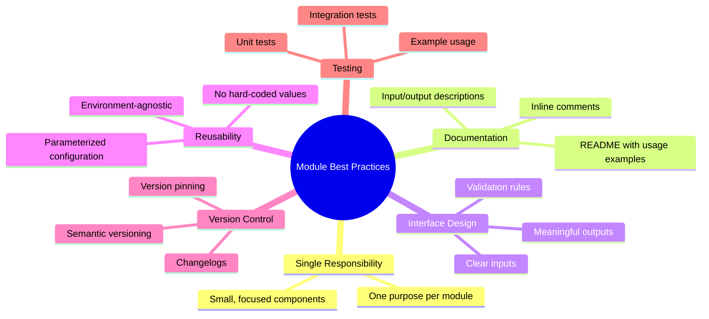

# Terraform Modules Best Practices

## Summary

Terraform modules promote reusability, maintainability, and collaboration through organized, documented, and versioned infrastructure code. Best practices include: single responsibility principle, comprehensive documentation, input validation, output clarity, consistent naming, version pinning, and testing. Follow these patterns to build reliable, shareable modules.

## Detailed Explanation

### Module Design Principles



### 1. Single Responsibility

```hcl
# ✅ DO: One clear purpose
module "vpc" {
  source = "./modules/vpc"
  # Only networking logic
}

module "ec2" {
  source = "./modules/ec2"
  # Only compute logic
}

# ❌ DON'T: Multiple responsibilities
module "everything" {
  source = "./modules/everything"
  # VPC, EC2, RDS, S3, Security Groups - too much!
}
```

### 2. Comprehensive Documentation

```markdown
# modules/vpc/README.md

# VPC Module

Creates AWS VPC with public and private subnets.

## Quick Start

```hcl
module "vpc" {
  source = "./modules/vpc"
  vpc_cidr = "10.0.0.0/16"
}
```

## Requirements

- Terraform >= 1.0.0
- AWS Provider >= 5.0.0

## Inputs

| Name | Type | Required | Default | Description |
|-------|-------|-----------|----------|-------------|
| vpc_cidr | string | Yes | - | CIDR block for VPC |
| availability_zones | list(string) | No | `["us-east-1a"]` | AZs for subnets |
| enable_dns_hostnames | bool | No | `false` | Enable DNS hostnames |
| enable_dns_support | bool | No | `true` | Enable DNS support |
| tags | map(string) | No | `{}` | Resource tags |

## Outputs

| Name | Type | Description |
|-------|-------|-------------|
| vpc_id | string | VPC ID |
| public_subnet_ids | list(string) | Public subnet IDs |
| private_subnet_ids | list(string) | Private subnet IDs |

## Examples

### Basic Usage

```hcl
module "vpc" {
  source = "./modules/vpc"
  vpc_cidr        = "10.0.0.0/16"
  availability_zones = ["us-east-1a", "us-east-1b"]
}
```

### With Tags

```hcl
module "vpc" {
  source = "./modules/vpc"
  vpc_cidr = "10.0.0.0/16"
  tags = {
    Environment = "production"
    Owner       = "platform-team"
  }
}
```

## Notes

- This module creates 3 public and 3 private subnets
- Each subnet spans a different AZ
- DNS resolution is enabled by default

## Version History

### v2.0.0 (2024-01-15)
- Added IPv6 support
- Improved subnet spacing

### v1.0.0 (2023-11-01)
- Initial release
```

### 3. Input Validation

```hcl
variable "vpc_cidr" {
  type = string
  description = "CIDR block for VPC (e.g., 10.0.0.0/16)"

  validation {
    condition     = can(cidrhost(var.vpc_cidr))
    error_message = "Must be a valid CIDR block."
  }
}

variable "instance_type" {
  type = string
  description = "EC2 instance type"

  validation {
    condition     = can(regex("^t[23]\\.(nano|micro|small|medium|large|xlarge|2xlarge)", var.instance_type))
    error_message = "Instance type must be t2 or t3 family."
  }
}
```

### 4. Clear Outputs

```hcl
# ✅ DO: Descriptive output names
output "vpc_id" {
  description = "The ID of the VPC"
  value       = aws_vpc.main.id
}

output "public_subnet_ids" {
  description = "List of public subnet IDs"
  value       = aws_subnet.public[*].id
}

# ❌ DON'T: Cryptic names
output "id" {
  value = aws_vpc.main.id
}

output "subs" {
  value = aws_subnet.public[*].id
}
```

### 5. Version Management

```hcl
# modules/vpc/versions.tf
terraform {
  required_version = ">= 1.5.0"

  required_providers {
    aws = {
      source  = "hashicorp/aws"
      version = "~> 5.0"
    }
  }
}
```

```bash
# Root module pinning
module "vpc" {
  source  = "./modules/vpc"
  version = "2.0.0"  # Pin to specific version
}

# Pin to git branch
module "vpc" {
  source  = "github.com/org/terraform-aws-modules//modules/vpc?ref=main"
}
```

### 6. Consistent Naming

```hcl
# ✅ DO: Consistent naming convention
module "networking_vpc" {
  source = "./modules/vpc"
}

module "compute_ec2" {
  source = "./modules/ec2"
}

module "database_rds" {
  source = "./modules/rds"
}

# ❌ DON'T: Inconsistent names
module "vpc"
module "create_ec2"
module "postgres_db"
```

### 7. No Hard-Coded Values

```hcl
# ✅ DO: Parameterize everything
variable "instance_type" {
  type    = string
  default = "t3.micro"
}

resource "aws_instance" "web" {
  instance_type = var.instance_type
}

# ❌ DON'T: Hard-code values
resource "aws_instance" "web" {
  instance_type = "t3.micro"  # Hard-coded!
}

# ❌ DON'T: Embed secrets
resource "aws_instance" "web" {
  password = "my-secret-password"  # Never in modules!
}
```

### 8. Default Values

```hcl
# ✅ DO: Provide sensible defaults
variable "instance_type" {
  type        = string
  default     = "t3.micro"
  description = "EC2 instance type"
}

variable "enable_monitoring" {
  type        = bool
  default     = true
  description = "Enable detailed CloudWatch monitoring"
}

# ✅ DO: Optional vs required
variable "required_input" {
  type = string  # No default = required
}

variable "optional_input" {
  type    = string
  default = "default-value"  # Has default = optional
}
```

### 9. Directory Structure

```bash
# ✅ DO: Clear organization
modules/
├── networking/
│   ├── vpc/
│   │   ├── main.tf
│   │   ├── variables.tf
│   │   ├── outputs.tf
│   │   └── README.md
│   ├── security-groups/
│   └── load-balancer/
├── compute/
│   ├── ec2/
│   └── lambda/
├── storage/
│   ├── rds/
│   └── s3/
└── shared/
    └── utils/

# ❌ DON'T: Flat structure
modules/
├── vpc.tf
├── ec2.tf
├── rds.tf
├── subnet.tf
```

### 10. Testing Strategy

```bash
# Module test directory
modules/vpc/tests/
├── main.tf
├── variables.tf
└── tests.sh

# tests.sh
#!/bin/bash
set -e

cd "$(dirname $0)"

# Test with default values
echo "Testing with defaults..."
terraform init
terraform plan -out=tfplan

# Test with minimal configuration
echo "Testing minimal config..."
cd minimal
terraform init
terraform plan -out=tfplan

# Test with production values
echo "Testing production config..."
cd production
terraform init
terraform plan -out=tfplan

echo "All tests passed!"
```

### Complete Example Module

```hcl
# modules/ec2/main.tf
variable "instance_count" {
  description = "Number of EC2 instances to create"
  type        = number
  default     = 1

  validation {
    condition     = var.instance_count >= 1 && var.instance_count <= 100
    error_message = "Instance count must be between 1 and 100."
  }
}

variable "instance_type" {
  description = "EC2 instance type (e.g., t3.micro, t3.small)"
  type        = string
  default     = "t3.micro"

  validation {
    condition     = can(regex("^t[23]\\.(nano|micro|small|medium|large)", var.instance_type))
    error_message = "Instance type must be t2 or t3 family."
  }
}

variable "ami" {
  description = "AMI ID for EC2 instances"
  type        = string
}

variable "subnet_ids" {
  description = "List of subnet IDs to launch instances in"
  type        = list(string)
}

variable "tags" {
  description = "Tags to apply to all instances"
  type        = map(string)
  default     = {}
}

locals {
  default_tags = merge(var.tags, {
    ManagedBy = "Terraform"
    Source     = "https://github.com/org/terraform-modules"
  })
}

resource "aws_instance" "web" {
  count         = var.instance_count
  ami           = var.ami
  instance_type = var.instance_type
  subnet_id     = element(var.subnet_ids, count.index % length(var.subnet_ids))

  tags = merge(local.default_tags, {
    Name = "web-${count.index}"
  })
}

output "instance_ids" {
  description = "IDs of created EC2 instances"
  value       = aws_instance.web[*].id
}

output "instance_public_ips" {
  description = "Public IP addresses of created instances"
  value       = aws_instance.web[*].public_ip
}

output "instance_private_ips" {
  description = "Private IP addresses of created instances"
  value       = aws_instance.web[*].private_ip
}
```

```markdown
# modules/ec2/README.md

# EC2 Module

Creates configurable EC2 instances with tagging.

## Features

- Supports 1-100 instances
- Validates instance type and count
- Applies default tags (ManagedBy, Source)
- Returns instance IDs and IPs

## Usage

### Basic

```hcl
module "ec2" {
  source = "./modules/ec2"
  ami       = "ami-0c55b159cbfafe1f0"
  subnet_ids = ["subnet-001", "subnet-002"]
}
```

### With Custom Tags

```hcl
module "ec2" {
  source = "./modules/ec2"
  ami       = "ami-0c55b159cbfafe1f0"
  subnet_ids = ["subnet-001"]
  tags = {
    Environment = "production"
    Owner       = "team-platform"
  }
}
```

### Multiple Instances

```hcl
module "ec2" {
  source        = "./modules/ec2"
  ami           = "ami-0c55b159cbfafe1f0"
  subnet_ids    = ["subnet-001", "subnet-002"]
  instance_count = 3
  instance_type  = "t3.micro"
}
```
```

## Interview Questions

**Q: What are key best practices for Terraform modules?**
**A:** Key practices: 1) Single responsibility (one function per module), 2) Comprehensive documentation (README with usage, inputs, outputs), 3) Input validation (type constraints, validation rules), 4) Clear outputs (descriptive names), 5) Version pinning (specify exact or semantic versions), 6) Testing (unit/integration tests).

**Q: Why is single responsibility principle important for Terraform modules?**
**A:** Single responsibility makes modules focused, easier to understand, maintain, and test. Modules with one clear purpose can be reused across different projects. Large, multi-purpose modules are hard to debug and understand. Break complex modules into smaller, focused components.

**Q: How do you document Terraform modules effectively?**
**A:** Use `README.md` with sections: Description (what module does), Quick Start (basic example), Requirements (Terraform/provider versions), Inputs (table with name/type/required/default/description), Outputs (table with name/type/description), Examples (advanced usage), and Notes (important considerations).

**Q: What's the purpose of input validation in Terraform modules?**
**A:** Input validation catches configuration errors early (at plan time) instead of during apply. Use `validation` blocks to check conditions: type constraints, regex patterns, allowed values, ranges (`count >= 1`). Provides clear error messages guiding users to fix issues.

**Q: How do you handle versioning for Terraform modules?**
**A:** Version control via Git commits/tags, semantic versioning (v1.0.0, v2.0.0), and version pinning in calling code (`version = "2.0.0"`). Local modules: Git tags/commits. Remote modules: Version constraints (`~> 5.0`, `= 1.0.0`). Document changes in changelog.

**Q: Why should you avoid hard-coding values in Terraform modules?**
**A:** Hard-coding reduces reusability - module can't be parameterized for different environments or use cases. Always pass values as variables/inputs. Exception: reasonable defaults for common cases. Never hard-code secrets, IPs, or environment-specific IDs.

**Q: How do you design clear module interfaces (inputs and outputs)?**
**A:** Clear interfaces: inputs should be minimal but sufficient for configuration (don't require users to know internal details), outputs should provide useful values other modules need (IDs, endpoints, attributes). Use descriptive names (`instance_id`, not `id`), document each with descriptions.

**Q: What's the difference between module defaults and required inputs?**
**A:** Required inputs have no `default` value - calling module must provide value. Optional inputs have `default` value - module works without input being passed. Use required for essential parameters, optional for enhancements with sensible defaults. Helps users understand what's mandatory.

**Q: How do you test Terraform modules?**
**A:** Test modules in isolated environments: 1) Create test directory with test variables, 2) Run `terraform init` and `terraform plan` to verify, 3) Test different scenarios (minimal, maximal, edge cases), 4) Automate with scripts. Validate no validation errors, plan looks correct. Clean up test state (`rm .terraform/`) after.

**Q: How do you organize Terraform module directory structure?**
**A:** Organize by function or layer: `modules/networking/vpc`, `modules/compute/ec2`, `modules/storage/rds`. Each module has its own directory with `main.tf`, `variables.tf`, `outputs.tf`, `README.md`. Group related modules together. Avoid flat structure - use nested directories for organization.

**Q: What should you consider when naming Terraform modules?**
**A:** Naming conventions: 1) Descriptive and clear (`vpc` or `networking-vpc`, not `infra`), 2) Consistent pattern (`<domain>_<component>`, like `compute_ec2`), 3) Short but meaningful, 4) Avoid conflicts with built-in types, 5) Use lowercase with underscores or kebab-case. Good naming improves discoverability.
