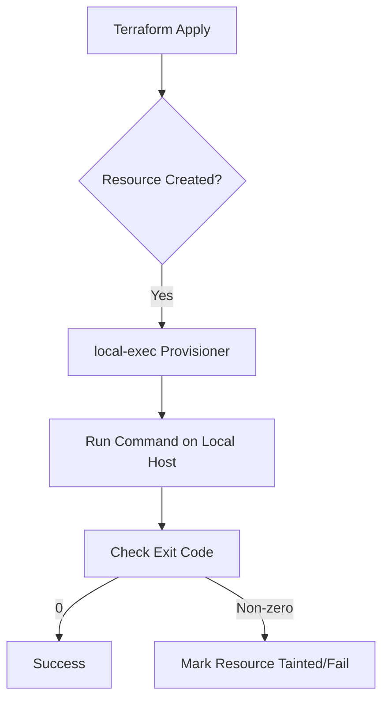

# 04 - local-exec Provisioner

## Summary
The `local-exec` provisioner invokes a local executable after a resource is created or destroyed. It executes on the machine running Terraform, making it ideal for bridging Terraform's declarative infrastructure with imperative local tasks like running Ansible, updating local files, or triggering CI/CD webhooks.

## Detailed Explanation

### What is local-exec?
The `local-exec` provisioner is a built-in Terraform tool that allows you to run shell commands or scripts on the host system where you execute `terraform apply`. Unlike most Terraform features, it is **imperative**, meaning it executes a specific sequence of actions rather than just describing a desired state.

### Why use it?
HashiCorp recommends using provisioners as a **last resort**. However, they are necessary when:
- **Configuration Management**: You need to trigger an Ansible playbook immediately after an instance is ready.
- **Local State Updates**: You need to save the IP address of a new resource to a local `/etc/hosts` file or a configuration file.
- **External Integration**: You need to notify an external system (via `curl` or a script) that a resource has been provisioned.

### How it works
The provisioner is defined within a resource block.



#### Key Arguments
- **`command`**: The actual shell command to run.
- **`working_dir`**: The directory to execute the command in.
- **`interpreter`**: A list of arguments for the shell (e.g., `["/bin/bash", "-c"]`).
- **`environment`**: A map of environment variables to pass to the script.
- **`when`**: Set to `destroy` to run the command during resource deletion.
- **`on_failure`**: Set to `continue` to ignore errors.

## Code Examples (HCL)

### Basic Usage: Saving IP to a file
```hcl
resource "aws_instance" "web" {
  ami           = "ami-0c55b159cbfafe1f0"
  instance_type = "t2.micro"

  provisioner "local-exec" {
    command = "echo ${self.private_ip} >> private_ips.txt"
  }
}
```

### Advanced Usage: Passing Environment Variables
```hcl
resource "null_resource" "trigger_ansible" {
  provisioner "local-exec" {
    command = "ansible-playbook -i ${var.ip}, playbook.yml"
    environment = {
      ANSIBLE_HOST_KEY_CHECKING = "False"
    }
    interpreter = ["/bin/bash", "-c"]
  }
}
```

## Interview Questions

**Q: Where exactly does the `local-exec` provisioner run its commands?**
**A:** It runs on the local machine where the `terraform` command is being executed (the runner), not on the remote resource.

**Q: What is the consequence of a `local-exec` provisioner returning a non-zero exit code?**
**A:** By default, Terraform will fail the apply operation and mark the resource as **tainted**, meaning it will be destroyed and recreated on the next run.

**Q: How do you ensure a `local-exec` provisioner runs only when a resource is destroyed?**
**A:** You must include the `when = destroy` argument inside the provisioner block.

**Q: Why are provisioners considered a "last resort" in Terraform?**
**A:** Because they are imperative, do not support drift detection, and are not tracked in the state file for idempotency. Native resources or `user_data` are preferred for stability.
