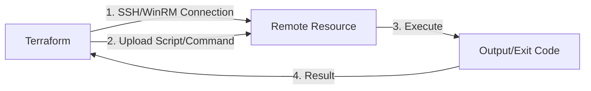

# 05 - remote-exec Provisioner

## Summary
The `remote-exec` provisioner invokes scripts on a remote resource after it is created. This is primarily used for server bootstrapping, package installation, and initial configuration. Unlike `local-exec`, it requires a `connection` block to establish an SSH or WinRM tunnel to the remote machine.

## Detailed Explanation

### What is remote-exec?
`remote-exec` is a Terraform provisioner designed to execute commands directly on the resource you have just provisioned (e.g., an EC2 instance, Azure VM, or on-premise server). It bridges the gap between infrastructure provisioning and software configuration.

### Connection Requirement
For `remote-exec` to function, Terraform must be able to reach the remote resource. You must define a `connection` block which specifies:
- **`type`**: Usually `ssh` (Linux) or `winrm` (Windows).
- **`user`**: The username for login.
- **`password`** or **`private_key`**: Authentication credentials.
- **`host`**: The IP address or DNS name of the remote resource.

### Execution Modes
You can specify commands in three ways:
1. **`inline`**: A list of shell command strings.
2. **`script`**: A path to a local script to be uploaded and executed.
3. **`scripts`**: A list of paths to multiple local scripts.



### Best Practices
- **Network Access**: Ensure security groups/firewalls allow SSH (port 22) or WinRM (port 5985/5986) from the Terraform runner.
- **Preferred Alternatives**: Use **Cloud-init** (`user_data`) or **Golden Images** (built with Packer) whenever possible, as they are more robust than SSH-based provisioning.

## Code Examples (HCL)

### Basic Usage: Installing Nginx via SSH
```hcl
resource "aws_instance" "web" {
  ami           = "ami-0c55b159cbfafe1f0"
  instance_type = "t2.micro"

  connection {
    type        = "ssh"
    user        = "ubuntu"
    private_key = file("~/.ssh/id_rsa")
    host        = self.public_ip
  }

  provisioner "remote-exec" {
    inline = [
      "sudo apt-get update",
      "sudo apt-get install -y nginx",
      "sudo systemctl start nginx"
    ]
  }
}
```

## Interview Questions

**Q: What is the main difference between `local-exec` and `remote-exec`?**
**A:** `local-exec` runs on the machine where Terraform is executed, while `remote-exec` runs on the remote resource created by Terraform.

**Q: What block is mandatory when using a `remote-exec` provisioner?**
**A:** A `connection` block is mandatory to specify how Terraform should connect to the remote resource via SSH or WinRM.

**Q: How do you handle a `remote-exec` provisioner that fails due to a temporary network glitch?**
**A:** You can use `on_failure = continue` if the failure isn't critical, but generally, it's better to ensure reliable connectivity or use `user_data` which is handled by the cloud provider.

**Q: What are the three ways to provide commands to `remote-exec`?**
**A:** Using the `inline` list of strings, a single `script` file path, or a list of `scripts` file paths.
