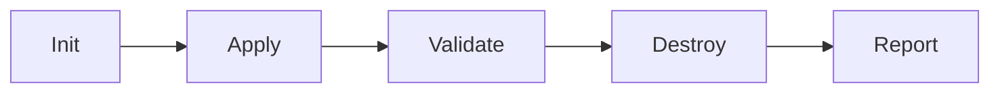

# Terraform Integration Testing

## Summary
Integration testing in Terraform ensures that infrastructure components work together as expected in a real-world environment. Unlike unit testing, which validates logic through plans, integration testing provisions real resources, performs functional assertions (e.g., HTTP health checks, API validations), and then destroys the environment. The industry standard workflow follows the **Init -> Apply -> Validate -> Destroy** cycle, implemented either via the native `terraform test` framework or the Go-based **Terratest** library.

## Detailed Explanation

Integration testing is the highest level of validation for Infrastructure as Code (IaC). It moves beyond static analysis and plan inspection to verify that the provisioned infrastructure is actually functional and reachable.

### Core Objectives
1.  **Functional Verification**: Does the web server respond on port 80? Can the database be reached from the app subnet?
2.  **Provider Compliance**: Validates that the cloud provider (AWS, Azure, etc.) accepts the configuration and that the resources behave as documented.
3.  **Module Interoperability**: Ensures that outputs from one module correctly feed into the inputs of another.
4.  **End-to-End Flow**: Validates the entire lifecycle of the infrastructure.

### The Standard Workflow
Integration tests follow a strict "clean room" approach to avoid state pollution and costs:



1.  **Init**: Initialize the Terraform working directory and download providers.
2.  **Apply**: Provision the real infrastructure in a temporary, isolated environment.
3.  **Validate**: Run assertions against the state, outputs, or externally reachable endpoints (SSH, HTTP).
4.  **Destroy**: Tear down all resources to ensure no costs or "leftover" resources remain.

---

## Native Terraform Testing (`terraform test`)

Introduced in Terraform v1.6.0, this native HCL framework allows writing integration tests without learning Go.

-   **File Extension**: `.tftest.hcl`
-   **Default Command**: `command = apply` (Executes the full integration workflow).
-   **Structure**: Uses `run` blocks to execute operations and `assert` blocks for validation.

### Example: Native Integration Test
```hcl
# tests/integration.tftest.hcl

variables {
  bucket_name = "integration-test-bucket-12345"
}

run "setup_and_apply" {
  command = apply

  assert {
    condition     = aws_s3_bucket.main.region == "us-east-1"
    error_message = "S3 bucket was not created in the expected region."
  }
}

run "verify_outputs" {
  # This run block uses the state from the previous one
  assert {
    condition     = output.bucket_arn != ""
    error_message = "Bucket ARN was not exported."
  }
}
```

---

## Programmatic Testing with Terratest (Go)

**Terratest** is a Go library developed by Gruntwork. It is more powerful than native HCL testing when you need to perform complex external validations (e.g., SSH-ing into a box, querying a database, or checking a web page's content).

### Go (Terratest) Code Example

```go
package test

import (
	"fmt"
	"testing"
	"time"

	"github.com/gruntwork-io/terratest/modules/http-helper"
	"github.com/gruntwork-io/terratest/modules/terraform"
)

func TestTerraformWebserverExample(t *testing.T) {
	t.Parallel()

	// 1. Configure Terraform options
	terraformOptions := terraform.WithDefaultRetryableErrors(t, &terraform.Options{
		// The path to where our Terraform code is located
		TerraformDir: "../examples/terraform-webserver",

		// Variables to pass to our Terraform code using -var options
		Vars: map[string]interface{}{
			"server_name": "terratest-demo",
		},
	})

	// 2. Schedule "terraform destroy" to run at the end of the test
	defer terraform.Destroy(t, terraformOptions)

	// 3. Run "terraform init" and "terraform apply"
	terraform.InitAndApply(t, terraformOptions)

	// 4. Validate the infrastructure works as expected
	// Read the "public_ip" output variable
	publicIp := terraform.Output(t, terraformOptions, "public_ip")
	url := fmt.Sprintf("http://%s:8080", publicIp)

	// Verify the server returns 200 OK with specific body
	expectedStatus := 200
	expectedBody := "Hello, World!"
	maxRetries := 30
	timeBetweenRetries := 5 * time.Second

	http_helper.HttpGetWithRetry(t, url, nil, expectedStatus, expectedBody, maxRetries, timeBetweenRetries)
}
```

---

## Comparison: Native HCL vs. Terratest

| Feature | Native HCL (`terraform test`) | Terratest (Go) |
| :--- | :--- | :--- |
| **Language** | HCL (HashiCorp Configuration Language) | Go (Golang) |
| **Learning Curve** | Low (same as Terraform) | High (requires Go knowledge) |
| **External Validation** | Limited to State/Outputs/Checks | High (HTTP, SSH, SQL, AWS/GCP SDKs) |
| **Integration** | Built-in to Terraform CLI | Requires Go environment & toolchain |
| **Performance** | Faster for internal checks | Slower (Go compilation + heavier binary) |
| **Complexity** | Best for modules and simple resources | Best for E2E system testing and infra-apps |

---

## Interview Questions

### Q: Why is it important to use 'defer terraform.Destroy' in Terratest?
**A:** In Go, `defer` ensures that the cleanup command (`terraform destroy`) runs even if the test fails or panics. Without it, failed tests would leave real resources (and costs) active in the cloud provider, leading to "infrastructure leakage."

### Q: What is the main difference between unit and integration tests in Terraform?
**A:** Unit tests (often `terraform test` with `command = plan`) validate the logic and expected resource counts without reaching out to a provider. Integration tests (`command = apply`) provision real resources to verify behavior, networking, and provider-specific side effects.

### Q: How do you handle secrets in integration tests?
**A:** Secrets should never be hardcoded. They should be injected via environment variables (prefixed with `TF_VAR_`), retrieved from a Secret Manager (AWS Secrets Manager, Vault) during the test setup, or managed via OIDC-based short-lived credentials in CI/CD pipelines.

### Q: When would you choose Terratest over the native 'terraform test' framework?
**A:** Use Terratest when you need to validate anything *outside* of the Terraform state. If you need to verify that a web app is running inside a VM, that an API returns a specific JSON payload, or that a database contains specific records after deployment, Terratest’s extensive library of helpers makes this possible, whereas native HCL is mostly restricted to HCL expressions and output values.

### Q: How does 'terraform test' manage state during integration testing?
**A:** It creates a temporary, in-memory state for each run. It does not interfere with your production state file. At the end of the test suite, it automatically executes a destroy operation for all resources tracked in that temporary state.
