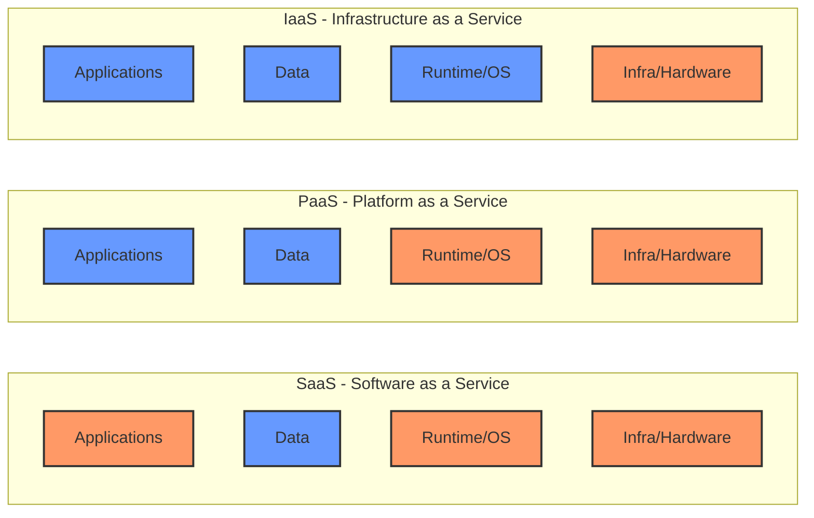

## Summary
Cloud computing service models—Infrastructure as a Service (**IaaS**), Platform as a Service (**PaaS**), and Software as a Service (**SaaS**)—represent different tiers of abstraction in the cloud. They define the "Shared Responsibility Model" between the cloud provider and the customer, determining who manages which parts of the stack. By choosing the appropriate model, organizations can balance the need for granular control over their infrastructure with the speed and efficiency of managed services.

## Detailed Explanation
The "as-a-Service" continuum shifts the management of "undifferentiated heavy lifting" (hardware, networking, patching) from the user to the provider (AWS).

### 1. IaaS (Infrastructure as a Service)
IaaS provides the raw building blocks. You get virtualized hardware (CPU, RAM, Storage, Networking) and are responsible for everything on top.
- **AWS Example**: **Amazon EC2**. You choose the OS, install the runtime (e.g., Go), manage security patches, and handle scaling.
- **Best For**: Maximum control, legacy migrations, or custom OS requirements.

### 2. PaaS (Platform as a Service)
PaaS abstracts the underlying hardware and OS. You only provide the application code and configuration.
- **AWS Example**: **AWS Elastic Beanstalk** or **AWS Lambda**. AWS handles the server provisioning, load balancing, scaling, and OS/runtime patching.
- **Best For**: Developers who want to focus on business logic without worrying about server maintenance.

### 3. SaaS (Software as a Service)
SaaS is a finished product managed entirely by the vendor. You consume it through a web browser or API.
- **AWS Example**: **Amazon WorkSpaces** or **AWS Marketplace** applications.
- **Non-AWS Example**: Gmail, Salesforce, Slack.
- **Best For**: Standard business functions where customization isn't needed.

### Responsibility Model Comparison



| Layer | On-Premises | IaaS (EC2) | PaaS (Beanstalk) | SaaS (Gmail) |
| :--- | :---: | :---: | :---: | :---: |
| **Applications** | Customer | Customer | Customer | Provider |
| **Data** | Customer | Customer | Customer | Provider |
| **Runtime** | Customer | Customer | Provider | Provider |
| **Middleware** | Customer | Customer | Provider | Provider |
| **OS** | Customer | Customer | Provider | Provider |
| **Virtualization**| Customer | Provider | Provider | Provider |
| **Servers** | Customer | Provider | Provider | Provider |
| **Storage** | Customer | Provider | Provider | Provider |
| **Networking** | Customer | Provider | Provider | Provider |

### Go Implementation Context
When developing in Go, the choice of service model changes how you interact with the environment. In a **PaaS** environment, you focus purely on the binary and environment variables, whereas in **IaaS**, you might manage the entire deployment pipeline and system dependencies.

```go
package main

import (
	"fmt"
	"log"
	"net/http"
	"os"
)

// In a PaaS (like AWS Elastic Beanstalk), the environment provides the configuration.
// In IaaS, you might have to read this from a specific config file you deployed.
func main() {
	// 1. Getting Port from Environment (Standard PaaS practice)
	// AWS Elastic Beanstalk and Lambda inject configuration here.
	port := os.Getenv("PORT")
	if port == "" {
		port = "8080" // Default for local dev or IaaS manual setup
	}

	// 2. Application Logic
	http.HandleFunc("/", func(w http.ResponseWriter, r *http.Request) {
		fmt.Fprintf(w, "Service Model Demo: Running on port %s\n", port)
		// Metadata often provided by PaaS providers
		fmt.Fprintf(w, "Deployment Type: %s\n", os.Getenv("AWS_EXECUTION_ENV")) 
	})

	log.Printf("Server starting on port %s...", port)
	if err := http.ListenAndServe(":"+port, nil); err != nil {
		log.Fatalf("Failed to start server: %v", err)
	}
}
```

## Interview Questions
1. **Q: If a company requires a specific kernel version to run their proprietary software, which service model should they choose?**
   **A:** They should choose **IaaS** (e.g., Amazon EC2), as it is the only model that gives the customer control over the operating system and kernel.

2. **Q: How does PaaS reduce the "Time to Market"?**
   **A:** PaaS eliminates "undifferentiated heavy lifting"—tasks like server provisioning, OS patching, and network configuration. Developers can focus purely on writing and deploying code, significantly speeding up the release cycle.

3. **Q: Who is responsible for patching the Operating System in the IaaS model?**
   **A:** The **Customer** is responsible for patching and securing the OS in an IaaS model.

4. **Q: Is AWS Lambda considered IaaS or PaaS?**
   **A:** AWS Lambda is a **PaaS** (more specifically **FaaS** - Function as a Service). The user manages only the code, while AWS handles all infrastructure, scaling, and runtime execution.

5. **Q: Why is SaaS often more cost-effective for generic business needs like Email?**
   **A:** SaaS provides a shared infrastructure and platform managed by the vendor, offering "economy of scale." The customer pays only for a subscription, avoiding the overhead of maintaining servers and software licenses.
