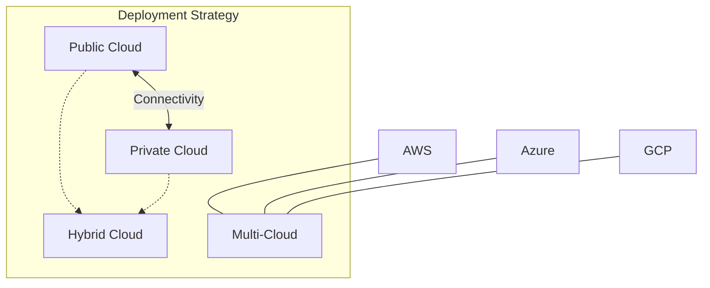

## Summary
Cloud deployment models define the environment in which cloud services are hosted and who has access to them. The four primary models are **Public**, **Private**, **Hybrid**, and **Multi-cloud**. As of 2026, the industry has shifted towards a "distributed cloud" approach, where organizations leverage multiple models to balance scalability, security, and data sovereignty. AWS supports these models through its global infrastructure, **AWS Outposts**, and advanced connectivity services like **AWS Direct Connect**.

## Detailed Explanation

The choice of a deployment model is driven by business needs, regulatory requirements, and technical constraints.

### 1. Public Cloud
Services are delivered over the public internet and shared across multiple organizations (multi-tenant).
- **Pros**: 
    - **No CapEx**: Pay-as-you-go pricing.
    - **Elasticity**: Near-infinite scalability.
    - **Low Overhead**: Provider manages all hardware and virtualization.
- **Cons**: 
    - **Shared Resources**: Potential "noisy neighbor" issues (though mitigated by modern hypervisors).
    - **Compliance**: Some industries require physically isolated hardware.
- **AWS Examples**: Amazon EC2, Amazon S3, AWS Lambda.

### 2. Private Cloud (On-Premises)
Infrastructure is used exclusively by a single organization. It can be hosted on-site or by a third-party provider.
- **Pros**: 
    - **Security & Control**: Complete isolation of data and hardware.
    - **Compliance**: Meets strict regulatory requirements (e.g., for government or finance).
- **Cons**: 
    - **High Cost**: Significant upfront investment (CapEx) and maintenance (OpEx).
    - **Limited Scalability**: Restricted by the physical capacity of the data center.
- **AWS Example**: **AWS Outposts** allows you to run AWS infrastructure and services on-premises for a truly consistent hybrid experience.

### 3. Hybrid Cloud
A combination of public and private clouds, connected by technology that allows data and applications to be shared between them.
- **Pros**: 
    - **Flexibility**: Keep sensitive data on-premises while using the public cloud for high-volume, non-sensitive workloads.
    - **Cloud Bursting**: Automatically scale into the public cloud during demand spikes.
    - **Cost Optimization**: Balance between fixed-cost private resources and variable-cost public resources.
- **Cons**: 
    - **Complexity**: Requires sophisticated networking (Direct Connect/VPN) and management.
- **AWS Connectivity**: **AWS Direct Connect**, **AWS Site-to-Site VPN**, and **AWS Transit Gateway**.

### 4. Multi-cloud
The use of multiple cloud providers (e.g., AWS + Azure + GCP) to meet specific business or technical goals.
- **Pros**: 
    - **Vendor Lock-in Avoidance**: Flexibility to move workloads between providers.
    - **Best-of-Breed**: Use the specific strengths of each provider (e.g., AWS for compute, GCP for AI/ML).
    - **Disaster Recovery**: High availability across different cloud infrastructures.
- **Cons**: 
    - **Management Overhead**: Complexity in handling different APIs, billing, and security models.
    - **Data Egress**: High costs for moving data between cloud providers.

### 5. Emerging Trends (2026 Context)
- **Sovereign Cloud**: Specialized clouds designed to meet the data residency and digital sovereignty requirements of specific regions (e.g., the AWS European Sovereign Cloud).
- **Distributed Cloud (Edge)**: Extending cloud services to specific physical locations like **AWS Local Zones** and **AWS Wavelength** (5G edge) to reduce latency.

### Deployment Model Comparison

| Feature | Public Cloud | Private Cloud | Hybrid Cloud | Multi-cloud |
| :--- | :---: | :---: | :---: | :---: |
| **Control** | Low | Very High | Medium | Medium |
| **Scalability** | Very High | Low | High | Very High |
| **Cost** | Low (OpEx) | High (CapEx) | Balanced | Variable |
| **Security** | Shared | Dedicated | Mixed | Mixed |

## Interview Questions

1. **Q: What is "Cloud Bursting" and which model facilitates it?**
   **A:** Cloud bursting is a configuration where an application runs in a private cloud or data center and "bursts" into a public cloud when the demand for computing capacity spikes. This is a key benefit of the **Hybrid Cloud** model.

2. **Q: Why would an organization choose AWS Outposts for a private cloud setup?**
   **A:** AWS Outposts is chosen when an organization needs low-latency access to on-premises systems, local data processing, or data residency, while still wanting to use the same AWS APIs, tools, and infrastructure they use in the public cloud.

3. **Q: What is the primary difference between Hybrid Cloud and Multi-cloud?**
   **A:** **Hybrid Cloud** refers to the combination of a private (on-premises) environment and a public cloud. **Multi-cloud** refers to the use of two or more public cloud providers (e.g., AWS and Azure) to distribute workloads.

4. **Q: What are the main challenges of a Multi-cloud strategy?**
   **A:** The main challenges include high operational complexity (managing multiple interfaces and security models), data silos, increased security surface area, and potentially high data egress costs when moving data between providers.

5. **Q: How does the "Shared Responsibility Model" change in a Private Cloud (like Outposts)?**
   **A:** In a public cloud, AWS manages the hardware and physical security. With **AWS Outposts**, the customer is responsible for the physical security and environmental conditions (power, cooling, rack space) of the Outposts equipment, while AWS still manages the software, APIs, and patching of the services running on it.
