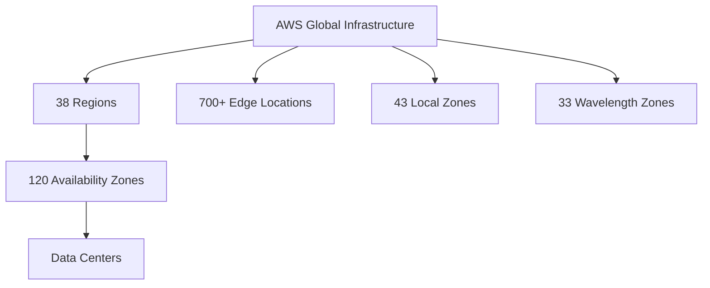

## Summary
Amazon Web Services (AWS) is the world's leading cloud computing platform, offering over 200 fully featured services from data centers globally. Since its public launch in 2006, AWS has pioneered the Infrastructure-as-a-Service (IaaS) model, providing businesses with scalable, reliable, and low-cost infrastructure. As of 2026, it remains the dominant market leader with the most extensive global footprint in the industry.

## Detailed Explanation

### **History and Evolution**
AWS originated from Amazon's internal need to manage its massive retail infrastructure more efficiently. 
- **2002:** Initial internal formalization of infrastructure services.
- **2004:** Launch of Simple Queue Service (SQS), the first building block.
- **2006:** Official public launch with **Simple Storage Service (S3)** and **Elastic Compute Cloud (EC2)**.
- **2026 Context:** AWS has evolved from basic storage and compute to advanced specialized services in Generative AI (Bedrock), Quantum Computing (Braket), and Edge Computing (Wavelength).

### **Market Share (2026 Context)**
AWS continues to lead the "Big Three" cloud providers. According to Gartner's 2025 Magic Quadrant for Strategic Cloud Platform Services, AWS has been a leader for 15 consecutive years.
- **AWS:** ~32% market share.
- **Microsoft Azure:** ~25% market share.
- **Google Cloud (GCP):** ~12% market share.

### **Global Infrastructure**
AWS's global reach is categorized into several hierarchical components:

1.  **Regions:** Geographic areas containing multiple AZs (e.g., `us-east-1` in Northern Virginia). As of 2026, there are **38 launched Regions**.
2.  **Availability Zones (AZs):** One or more discrete data centers with redundant power, networking, and connectivity within a Region. There are **120 AZs** globally.
3.  **Local Zones:** Extensions of Regions that place compute, storage, and database services closer to large population centers for sub-10ms latency.
4.  **Wavelength Zones:** Optimized for 5G applications, embedding AWS services within telecommunications providers' data centers.
5.  **Edge Locations:** Points of Presence (PoP) for **Amazon CloudFront** (CDN). There are **700+ PoPs** globally.



### **Core Service Overview**
AWS services are broadly categorized into foundational domains:
-   **Compute:** Amazon EC2 (Virtual Servers), AWS Lambda (Serverless), Amazon ECS/EKS (Containers).
-   **Storage:** Amazon S3 (Object), Amazon EBS (Block), Amazon EFS (Network File).
-   **Databases:** Amazon RDS (Relational), Amazon DynamoDB (NoSQL), Amazon Aurora.
-   **Networking:** Amazon VPC (Private Cloud), Amazon Route 53 (DNS), Amazon CloudFront (CDN).
-   **Security:** AWS IAM (Identity/Access), AWS KMS (Encryption), AWS Shield (DDoS protection).

### **Go Application: Connecting to AWS**
In Go, interacting with AWS is done via the `aws-sdk-go-v2`. Developers must initialize a configuration that loads credentials and region settings.

```go
package main

import (
	"context"
	"fmt"
	"log"

	"github.com/aws/aws-sdk-go-v2/config"
	"github.com/aws/aws-sdk-go-v2/service/s3"
)

func main() {
	// Load the SDK's default configuration, which includes:
	// - Credentials from environment variables or ~/.aws/credentials
	// - Region from ~/.aws/config or environment
	cfg, err := config.LoadDefaultConfig(context.TODO(), config.WithRegion("us-east-1"))
	if err != nil {
		log.Fatalf("unable to load SDK config, %v", err)
	}

	// Create an S3 client using the loaded configuration
	client := s3.NewFromConfig(cfg)

	// Example: List buckets
	result, err := client.ListBuckets(context.TODO(), &s3.ListBucketsInput{})
	if err != nil {
		log.Fatalf("failed to list buckets, %v", err)
	}

	fmt.Println("Buckets:")
	for _, b := range result.Buckets {
		fmt.Printf("* %s\n", *b.Name)
	}
}
```

## Interview Questions

### 1. What is the "Shared Responsibility Model" in AWS?
**Answer:** AWS manages the security **of** the cloud (infrastructure, hardware, global network). The customer is responsible for security **in** the cloud (data, IAM configurations, operating systems on EC2, firewall rules).

### 2. Explain the difference between a Region and an Availability Zone.
**Answer:** A **Region** is a physical geographical area (e.g., Ireland). An **Availability Zone (AZ)** is one or more discrete data centers within a Region. High availability is achieved by deploying applications across multiple AZs within a single Region.

### 3. What are "Edge Locations" and how do they differ from Regions?
**Answer:** Edge Locations are specialized sites used by Amazon CloudFront (CDN) to cache content closer to end-users for lower latency. They are not used to host full application stacks like Regions are.

### 4. Why is AWS considered "Elastic"?
**Answer:** Elasticity refers to the ability to automatically scale resources up or down based on real-time demand. This ensures that you have enough capacity during spikes but aren't paying for idle resources during low-traffic periods.

### 5. What was the first AWS service launched publicly?
**Answer:** **Amazon S3** (Simple Storage Service) was the first service to be publicly launched in March 2006, followed by Amazon SQS and EC2.
