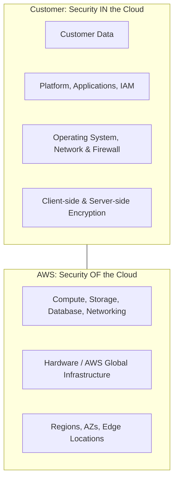

## Summary
The **AWS Shared Responsibility Model** is a fundamental security framework that defines the division of security obligations between AWS and the customer. The core principle is that AWS is responsible for the **security OF the cloud** (infrastructure, hardware, and physical facilities), while the customer is responsible for **security IN the cloud** (data protection, identity management, and configuration). This model helps reduce the customer's operational burden as AWS manages the foundational layers of the stack.

## Detailed Explanation

The Shared Responsibility Model ensures that security is a collaborative effort. The extent of responsibility varies depending on the service model used: **Infrastructure as a Service (IaaS)**, **Platform as a Service (PaaS)**, or **Software as a Service (SaaS)**.

### 1. Security OF the Cloud (AWS Responsibility)
AWS is responsible for protecting the infrastructure that runs all of the services offered in the AWS Cloud. This infrastructure is composed of the hardware, software, networking, and facilities that run AWS Cloud services.

*   **Physical Security**: Controlled access to data centers, environmental monitoring, and physical hardware disposal.
*   **Global Infrastructure**: Management of Regions, Availability Zones (AZs), and Edge Locations.
*   **Foundational Services**: Security and maintenance of compute, storage, database, and networking software (the virtualization layer).

### 2. Security IN the Cloud (Customer Responsibility)
The customer assumes responsibility and management of the guest operating system (including updates and security patches), other associated application software, as well as the configuration of the AWS-provided security group firewall.

*   **Customer Data**: Encryption (at rest and in transit), data integrity, and backup.
*   **Identity and Access Management (IAM)**: Managing users, groups, roles, and permissions. Ensuring the principle of least privilege.
*   **Platform & Application Security**: Patching applications and the guest OS (on EC2).
*   **Network & Firewall Configuration**: Configuring VPCs, Security Groups, and Network ACLs.

### 3. Classification of Controls
AWS further categorizes controls into three types to clarify how they are managed:

| Control Type | Description | Examples |
| :--- | :--- | :--- |
| **Inherited Controls** | Controls that a customer fully inherits from AWS. | Physical and Environmental controls. |
| **Shared Controls** | Controls applied to both infrastructure and customer layers in separate contexts. | Patch Management, Configuration Management, Awareness & Training. |
| **Customer Specific** | Controls solely the responsibility of the customer based on their application. | Service and Communications Protection, Zone Security. |

### 4. Shared Responsibility by Service Type

The division of labor shifts depending on how much of the stack AWS manages:

| Service Category | Examples | Customer Responsibility | AWS Responsibility |
| :--- | :--- | :--- | :--- |
| **Infrastructure (IaaS)** | EC2, EBS, VPC | OS Patching, Apps, Data, IAM | Physical, Hardware, Virtualization |
| **Containerized/Managed** | RDS, EMR | Data, IAM, Security Groups | OS Patching, DB Engine, Hardware |
| **Abstracted (SaaS/FaaS)** | S3, Lambda, DynamoDB | Data, IAM, Usage | Everything else (OS, Scaling, Infrastructure) |

### 5. Visualization (Mermaid)

## Interview Questions

**Q: What is the fundamental difference between "Security of the cloud" and "Security in the cloud"?**
**A:** "Security OF the cloud" refers to the protection of the underlying infrastructure (hardware, data centers, virtualization layer) managed by AWS. "Security IN the cloud" refers to the security measures that the customer must implement and manage, such as data encryption, IAM policies, and OS patching for EC2 instances.

**Q: Who is responsible for patching the guest operating system on an AWS EC2 instance?**
**A:** The **Customer**. Since EC2 is an IaaS service, AWS provides the virtual machine, but the customer has full control over the operating system and is therefore responsible for updates, patches, and configuration.

**Q: In a serverless model (e.g., AWS Lambda), how does the shared responsibility shift?**
**A:** AWS takes on significantly more responsibility. AWS manages the underlying infrastructure, the operating system, the runtime environment, and scaling. The customer is primarily responsible for the **code** they write, the **IAM roles** assigned to the function, and the **data** processed.

**Q: What are "Shared Controls" in the context of the Shared Responsibility Model?**
**A:** Shared controls are those that apply to both AWS and the customer but in different contexts. For example, in **Patch Management**, AWS is responsible for patching the infrastructure (hosts, network devices), while the customer is responsible for patching their guest OS and applications.

**Q: If a customer stores sensitive data in an S3 bucket, who is responsible for ensuring that the bucket is not publicly accessible?**
**A:** The **Customer**. While AWS provides the tools (Block Public Access, Bucket Policies, IAM), it is the customer's responsibility to configure them correctly to protect their data.
