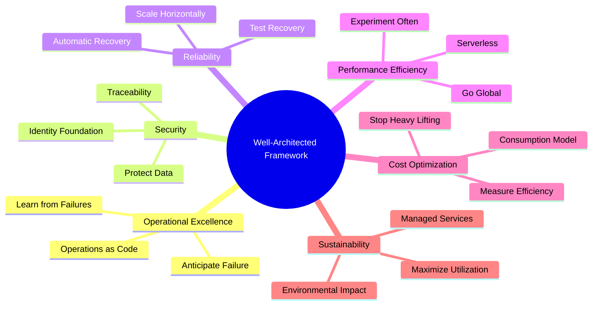

## Summary
The **AWS Well-Architected Framework** provides a consistent set of best practices for customers and partners to evaluate architectures and implement designs that can scale over time. It is organized into six "pillars" that help cloud architects build secure, high-performing, resilient, and efficient infrastructure for their applications. By following this framework, organizations can reduce technical debt, improve system performance, and ensure their cloud operations align with business objectives and environmental sustainability.

## Detailed Explanation
The framework was developed after years of reviewing thousands of customer architectures on AWS. It helps you understand the pros and cons of decisions you make while building systems on AWS. It provides a way for you to consistently measure your architectures against best practices and identify areas for improvement.

### 1. Operational Excellence
Focuses on running and monitoring systems, and continually improving processes and procedures. Key topics include automating changes, responding to events, and defining standards to manage daily operations.
*   **Design Principles**:
    *   **Perform operations as code**: Define your entire workload (applications, infrastructure) as code and update it with code.
    *   **Make frequent, small, reversible changes**: Design workloads to allow components to be updated regularly.
    *   **Refine operations procedures frequently**: Evolution of procedures as you evolve your workloads.
    *   **Anticipate failure**: Perform "pre-mortem" exercises to identify potential sources of failure.
    *   **Learn from all operational failures**: Drive improvement through lessons learned from all operational events.
*   **Key Services**: AWS CloudFormation, AWS Config, AWS Systems Manager, Amazon CloudWatch.

### 2. Security
Focuses on protecting information and systems. Key topics include confidentiality and integrity of data, identifying and managing who can do what with privilege management, protecting systems, and establishing controls to detect security events.
*   **Design Principles**:
    *   **Implement a strong identity foundation**: Implement the principle of least privilege and enforce separation of duties with appropriate authorization for every interaction.
    *   **Enable traceability**: Monitor, alert, and audit actions and changes to your environment in real time.
    *   **Apply security at all layers**: Apply a defense-in-depth approach with multiple security controls.
    *   **Automate security best practices**: Improve your ability to securely scale more rapidly and cost-effectively.
    *   **Protect data in transit and at rest**: Classify your data into sensitivity levels and use mechanisms like encryption and tokenization.
    *   **Keep people away from data**: Use mechanisms and tools to reduce or eliminate the need for direct access or manual processing of data.
    *   **Prepare for security events**: Prepare for an incident by having incident management and investigation policy and processes that align with your organizational requirements.
*   **Key Services**: AWS IAM, AWS KMS, Amazon S3 (encryption), AWS CloudTrail, Amazon GuardDuty, AWS WAF.

### 3. Reliability
Focuses on workloads performing their intended functions and how to recover quickly from failure to meet demands. Key topics include distributed system design, recovery planning, and how to handle change.
*   **Design Principles**:
    *   **Automatically recover from failure**: Monitor your workload for key performance indicators (KPIs) and trigger automation when a threshold is breached.
    *   **Test recovery procedures**: Use automation to simulate different failures or to recreate scenarios that led to failures before.
    *   **Scale horizontally to increase aggregate workload availability**: Replace one large resource with multiple small resources to reduce the impact of a single failure.
    *   **Stop guessing capacity**: Monitor demand and workload utilization, and automate the addition or removal of resources.
    *   **Manage change in automation**: Changes to your infrastructure should be done using automation.
*   **Key Services**: Amazon Route 53, AWS Auto Scaling, AWS Backup, Amazon CloudWatch (monitoring/alerts), Multi-AZ deployments.

### 4. Performance Efficiency
Focuses on using IT and computing resources efficiently. Key topics include selecting the right resource types and sizes based on workload requirements, monitoring performance, and making informed decisions to maintain efficiency as business needs evolve.
*   **Design Principles**:
    *   **Democratize advanced technologies**: Use managed services (like machine learning or databases) to let your team focus on product development rather than infrastructure.
    *   **Go global in minutes**: Easily deploy your workload in multiple AWS Regions around the world.
    *   **Use serverless architectures**: Remove the operational burden of managing physical servers for compute and storage.
    *   **Experiment more often**: With virtual and automatable resources, you can quickly carry out comparative testing.
    *   **Consider mechanical sympathy**: Use the technology approach that aligns best to what you are trying to achieve.
*   **Key Services**: AWS Lambda, Amazon EC2 (right-sizing), Amazon EBS, Amazon RDS, Amazon CloudFront, AWS Elastic Beanstalk.

### 5. Cost Optimization
Focuses on avoiding unnecessary costs. Key topics include understanding where money is being spent, selecting the most appropriate and right-size resource types, analyzing spend over time, and scaling to meet business needs without overspending.
*   **Design Principles**:
    *   **Implement Cloud Financial Management**: Establish a capability to achieve business value and financial success in AWS.
    *   **Adopt a consumption model**: Pay only for the computing resources that you require and increase or decrease usage depending on business requirements.
    *   **Measure overall efficiency**: Measure the business output of the workload and the costs associated with delivering it.
    *   **Stop spending money on undifferentiated heavy lifting**: AWS does the heavy lifting of racking, stacking, and powering servers, so you can focus on your customers.
    *   **Analyze and attribute expenditure**: Accurately identify the usage and cost of systems, which allows transparent attribution of IT costs.
*   **Key Services**: AWS Cost Explorer, AWS Budgets, AWS Trusted Advisor, Amazon EC2 Spot Instances, AWS Organizations (Consolidated Billing).

### 6. Sustainability
Focuses on minimizing the environmental impact of running cloud workloads. Key topics include a shared responsibility model for sustainability, understanding impact, and maximizing utilization to minimize required resources and reduce downstream impact.
*   **Design Principles**:
    *   **Understand your impact**: Measure the impact of your entire workload and model the future impact of your workload.
    *   **Establish sustainability goals**: For every workload, establish long-term sustainability goals.
    *   **Maximize utilization**: Right-size workloads and implement efficient design to maximize the energy efficiency of the underlying hardware.
    *   **Anticipate and adopt new, more efficient hardware and software offerings**: Support the upstream adoption of more efficient technologies.
    *   **Use managed services**: Sharing services across a broad customer base maximizes resource utilization.
    *   **Reduce the downstream impact of your cloud workloads**: Reduce the amount of energy or resources required to use your services.
*   **Key Services**: AWS Customer Carbon Footprint Tool, AWS Graviton processors (higher efficiency), Amazon S3 Lifecycle policies, AWS Lambda.

### Visual Overview


### Go Application Example
Implementing security and reliability best practices programmatically using the AWS SDK for Go v2. This example shows how to enforce bucket encryption (Security) and versioning (Reliability).

```go
package main

import (
	"context"
	"fmt"
	"log"

	"github.com/aws/aws-sdk-go-v2/aws"
	"github.com/aws/aws-sdk-go-v2/config"
	"github.com/aws/aws-sdk-go-v2/service/s3"
	"github.com/aws/aws-sdk-go-v2/service/s3/types"
)

// EnsureBucketCompliance demonstrates "Security" and "Reliability" pillars
// by enabling AES256 encryption and versioning on an S3 bucket.
func EnsureBucketCompliance(ctx context.Context, client *s3.Client, bucket string) error {
	// 1. Enable Default Encryption (Security Pillar)
	_, err := client.PutBucketEncryption(ctx, &s3.PutBucketEncryptionInput{
		Bucket: aws.String(bucket),
		ServerSideEncryptionConfiguration: &types.ServerSideEncryptionConfiguration{
			Rules: []types.ServerSideEncryptionRule{
				{
					ApplyServerSideEncryptionByDefault: &types.ServerSideEncryptionByDefault{
						SSEAlgorithm: types.ServerSideEncryptionMethodAes256,
					},
				},
			},
		},
	})
	if err != nil {
		return fmt.Errorf("failed to enable encryption: %w", err)
	}

	// 2. Enable Versioning (Reliability Pillar - protection against accidental deletes)
	_, err = client.PutBucketVersioning(ctx, &s3.PutBucketVersioningInput{
		Bucket: aws.String(bucket),
		VersioningConfiguration: &types.VersioningConfiguration{
			Status: types.BucketVersioningStatusEnabled,
		},
	})
	if err != nil {
		return fmt.Errorf("failed to enable versioning: %w", err)
	}

	return nil
}

func main() {
	// Load the SDK configuration
	cfg, err := config.LoadDefaultConfig(context.TODO())
	if err != nil {
		log.Fatalf("unable to load SDK config, %v", err)
	}

	s3Client := s3.NewFromConfig(cfg)
	bucketName := "my-well-architected-bucket"

	err = EnsureBucketCompliance(context.TODO(), s3Client, bucketName)
	if err != nil {
		log.Printf("Compliance error: %v\n", err)
	} else {
		log.Printf("Bucket '%s' is now Well-Architected compliant!\n", bucketName)
	}
}
```

## Interview Questions

**Q: What are the six pillars of the AWS Well-Architected Framework?**
**A:** Operational Excellence, Security, Reliability, Performance Efficiency, Cost Optimization, and Sustainability.

**Q: Explain the "Shared Responsibility Model" in the context of the Sustainability pillar.**
**A:** AWS is responsible for optimizing the sustainability *of* the cloud (hardware, power, cooling, data center efficiency), while the customer is responsible for sustainability *in* the cloud (optimizing workloads, resource utilization, selecting efficient regions, and minimizing data movement).

**Q: How does "Stop Guessing Capacity" relate to the Reliability pillar?**
**A:** In a traditional environment, you often over-provision to handle peak load, which is wasteful, or under-provision, which leads to failure. On AWS, you can use Auto Scaling to automatically adjust capacity based on demand. This ensures the system remains reliable under varying loads without manual intervention.

**Q: What is "Mechanical Sympathy" in the Performance Efficiency pillar?**
**A:** It refers to understanding how a tool or platform works and using it in a way that aligns with its design. In AWS, this means choosing the right instance types (e.g., compute-optimized vs. memory-optimized), storage classes (e.g., S3 Intelligent-Tiering), and services (e.g., Lambda for event-driven tasks) to achieve the best performance for your specific workload.

**Q: How does "Performing Operations as Code" help in Operational Excellence?**
**A:** By defining infrastructure and processes as code (using tools like CloudFormation or Terraform), you ensure consistency, enable version control, and allow for easy replication and rollback. This reduces human error and makes operations more predictable and scalable.
