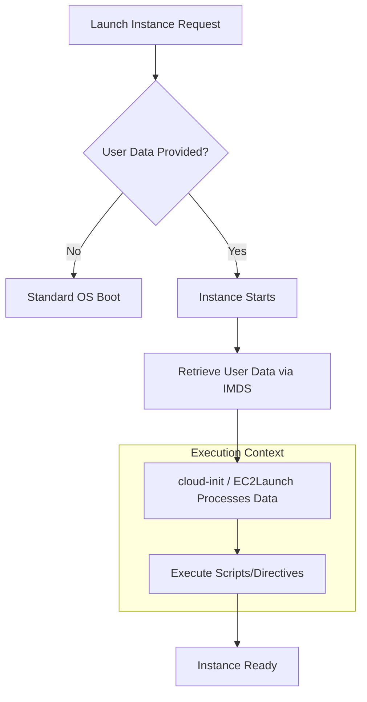

#AWS
#Cloud

---
tags: ['cloud', 'roadmap', 'aws', 'ec2']
---

## Summary
EC2 User Data is a powerful feature used for **bootstrapping** instances—automating the setup process (installing software, updating packages, configuring services) during the initial launch. It leverages the industry-standard **cloud-init** tool for Linux and **EC2Launch** for Windows. By passing scripts or configuration files at launch, you ensure that instances are "born" ready to serve traffic, eliminating manual configuration and enabling truly elastic scaling.

## Detailed Explanation

### Bootstrapping Workflow
The following diagram illustrates how AWS handles User Data during the instance lifecycle:



### What is User Data?
User Data is "opaque" metadata (up to **16 KB**) passed to the instance. The instance's OS is responsible for interpreting it. 
- **Default Behavior**: Scripts run only once, during the **first boot**.
- **Privileges**: Runs as `root` (Linux) or `System` (Windows).
- **Format**: Must be **Base64-encoded** when using APIs/SDKs (Console handles this automatically).

### Linux Deep Dive: cloud-init
On Linux (Amazon Linux, Ubuntu, RHEL), the `cloud-init` package manages the execution of User Data across four distinct phases:

1.  **cloud-init-local**: Early boot, searches for local data sources (like the Metadata Service).
2.  **cloud-init (init phase)**: Mounts filesystems and handles networking.
3.  **cloud-config**: Executes modules like `apt-configure`, `yum-add-repo`, and `ssh`.
4.  **cloud-final**: The final stage where user-provided shell scripts and `bootcmd` are executed.

#### Common Formats
-   **User-Data Scripts**: Starts with `#!/bin/bash`. Most common for simple automation.
-   **Cloud-Config Data**: YAML format starting with `#cloud-config`. High-level declarative configuration.
-   **MIME Multi-part**: Allows combining multiple types (e.g., a script and a config file) into one payload.

### Windows Execution: EC2Launch
Windows instances use specialized agents:
-   **EC2Launch v2**: The current standard. Supports YAML configurations.
-   **Execution**: Scripts must be enclosed in specific tags:
    -   `<script>` for Batch commands.
    -   `<powershell>` for PowerShell scripts.

### Accessing User Data via IMDSv2
Instances can query their own User Data via the **Instance Metadata Service (IMDS)** at `169.254.169.254`. Modern best practices require **IMDSv2**, which uses session-oriented tokens to prevent SSRF vulnerabilities.

```bash
# 1. Generate a session token
TOKEN=$(curl -X PUT "http://169.254.169.254/latest/api/token" -H "X-aws-ec2-metadata-token-ttl-seconds: 21600")

# 2. Retrieve the User Data
curl -H "X-aws-ec2-metadata-token: $TOKEN" http://169.254.169.254/latest/user-data
```

### Security & Best Practices
-   **Never store secrets**: User Data is visible in plain text via the AWS Console/API and IMDS. Use **AWS Secrets Manager** or **Parameter Store** and fetch them *inside* the script.
-   **Idempotency**: While scripts run once by default, write them to be safe if executed multiple times (e.g., check if a directory exists before creating it).
-   **Size Constraints**: If your script exceeds 16 KB, host the script in **S3** and use User Data to download and run it.
-   **Logging**: Always check logs for failures:
    -   Linux: `/var/log/cloud-init-output.log` (stdout/stderr) and `/var/log/cloud-init.log`.
    -   Windows: `C:\ProgramData\Amazon\EC2Launch\log\agent.log`.

### Go SDK Example: Launching with User Data
When using the AWS SDK for Go v2, you must Base64 encode the string before passing it to `RunInstances`.

```go
package main

import (
	"context"
	"encoding/base64"
	"fmt"
	"github.com/aws/aws-sdk-go-v2/aws"
	"github.com/aws/aws-sdk-go-v2/config"
	"github.com/aws/aws-sdk-go-v2/service/ec2"
	"github.com/aws/aws-sdk-go-v2/service/ec2/types"
)

func main() {
	cfg, _ := config.LoadDefaultConfig(context.TODO())
	client := ec2.NewFromConfig(cfg)

	// User Data script to install Nginx
	userData := "#!/bin/bash\nyum update -y\nyum install -y nginx\nsystemctl start nginx"
	encodedUserData := base64.StdEncoding.EncodeToString([]byte(userData))

	input := &ec2.RunInstancesInput{
		ImageId:      aws.String("ami-0abcdef1234567890"),
		InstanceType: types.InstanceTypeT3Micro,
		MinCount:     aws.Int32(1),
		MaxCount:     aws.Int32(1),
		UserData:     aws.String(encodedUserData),
	}

	result, err := client.RunInstances(context.TODO(), input)
	if err != nil {
		fmt.Printf("Error launching instance: %v\n", err)
		return
	}
	fmt.Printf("Launched instance: %s\n", *result.Instances[0].InstanceId)
}
```

## Interview Questions

**Q: Does EC2 User Data run every time an instance is rebooted?**
**A:** No, by default it only runs during the very first boot cycle. To run it on every boot, you must modify the `cloud-init` configuration (on Linux) or use the `<persist>true</persist>` tag in the launch agent (on Windows).

**Q: Where can you find the output of your User Data script if it fails on a Linux instance?**
**A:** The primary log file for script output (stdout and stderr) is `/var/log/cloud-init-output.log`. Detailed execution steps and internal `cloud-init` logic are logged in `/var/log/cloud-init.log`.

**Q: What is the maximum size allowed for User Data, and how do you bypass this limit?**
**A:** The limit is **16 KB** of raw data. To bypass this, you can store the actual configuration script in an **S3 bucket** and use a small User Data script to download and execute it, or use **Image Recipes** (Image Builder) to pre-bake the configuration into an AMI.

**Q: Why is IMDSv2 preferred over IMDSv1 when accessing User Data?**
**A:** IMDSv2 is session-oriented and requires a `PUT` request to generate a token before fetching data. This provides a critical defense-in-depth against **Server-Side Request Forgery (SSRF)** vulnerabilities, as many SSRF attacks can only perform simple `GET` requests.

**Q: Can you update the User Data of an already running instance?**
**A:** No, User Data cannot be modified while an instance is running. You must **stop** the instance, modify the User Data attribute, and then **start** the instance again. Note that the new script will still only run if `cloud-init` is configured to re-run or if the instance hasn't recorded a successful first-boot execution yet.
