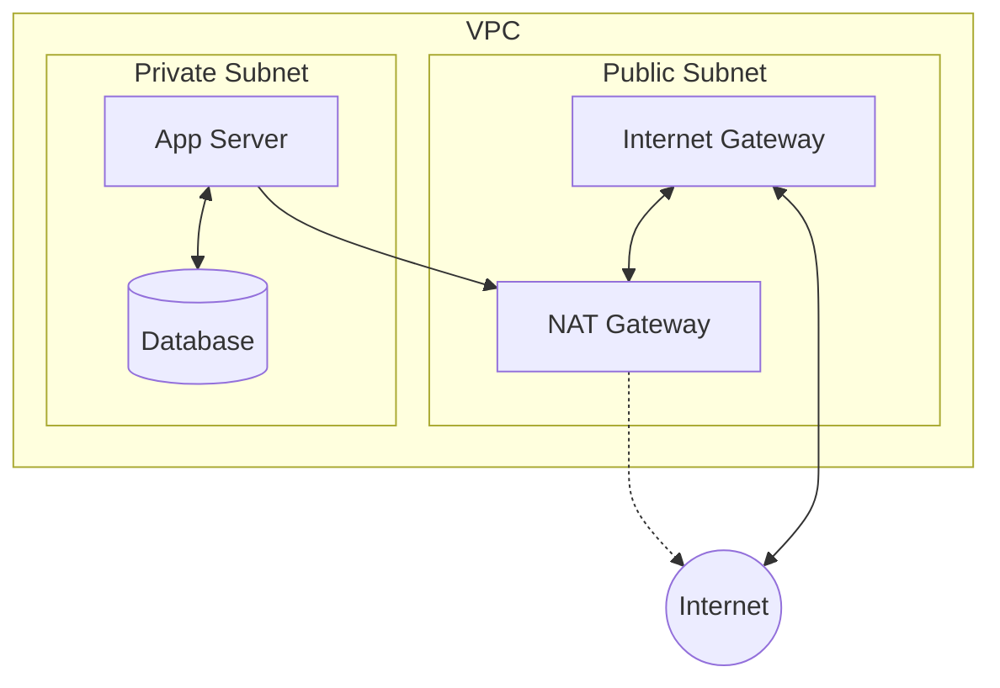

#AWS
#Cloud

---
tags: ['aws', 'roadmap', 'vpc', 'cloud']
---

## Summary
A **Private Subnet** is a segment of an AWS Virtual Private Cloud (VPC) that does not have a direct route to an Internet Gateway (IGW). Instances within a private subnet are isolated from the public internet, meaning they cannot be accessed directly from outside the VPC and cannot initiate outbound connections to the internet without a relay mechanism like a NAT Gateway or NAT Instance. This provides a critical security layer for sensitive components such as databases and backend application servers.

## Detailed Explanation

### Architecture Overview
In a standard multi-tier VPC architecture, resources are separated based on their need for internet exposure. While web servers might live in a public subnet, the application and database layers are placed in private subnets to minimize the attack surface.



### Route Table Configuration
The defining characteristic of a private subnet is its **Route Table**. 
- **Default Route**: Unlike a public subnet, which directs `0.0.0.0/0` to an IGW (`igw-id`), a private subnet's route table only contains a local route (e.g., `10.0.0.0/16`) for VPC internal communication by default.
- **Outbound Connectivity**: To enable internet access (e.g., for security patches), a route must be manually added to point `0.0.0.0/0` to a **NAT Gateway** or **NAT Instance** located in a public subnet.

### NAT Gateway Dependency
A **NAT Gateway** is the most common way to provide internet access to private subnets.
- **Placement**: Must reside in a **Public Subnet**.
- **Requirement**: Needs an **Elastic IP (EIP)** associated with it.
- **Directionality**: It allows *outbound* traffic from the private subnet but blocks *unsolicited inbound* traffic from the internet.
- **High Availability**: Best practice is to deploy one NAT Gateway per Availability Zone (AZ) to ensure that an AZ failure doesn't disrupt internet access for other zones.

### Go Application (AWS SDK v2)
In Go, you can identify private subnets by inspecting their associated route tables for the absence of an Internet Gateway route.

```go
package main

import (
	"context"
	"fmt"
	"log"

	"github.com/aws/aws-sdk-go-v2/config"
	"github.com/aws/aws-sdk-go-v2/service/ec2"
)

func main() {
	ctx := context.TODO()
	cfg, err := config.LoadDefaultConfig(ctx)
	if err != nil {
		log.Fatalf("unable to load SDK config, %v", err)
	}

	client := ec2.NewFromConfig(cfg)

	// Fetch subnets
	resp, err := client.DescribeSubnets(ctx, &ec2.DescribeSubnetsInput{})
	if err != nil {
		log.Fatalf("failed to describe subnets, %v", err)
	}

	for _, subnet := range resp.Subnets {
		// In a production tool, you would then call DescribeRouteTables
		// with a filter for the SubnetId to check for 'igw-*' targets.
		fmt.Printf("Analyzing Subnet: %s (CIDR: %s)\n", *subnet.SubnetId, *subnet.CidrBlock)
	}
}
```

## Interview Questions

**Q: What is the primary difference between a public and a private subnet?**
**A:** The difference lies in the **Route Table**. A public subnet has a route to an Internet Gateway (`0.0.0.0/0 -> igw-id`), while a private subnet does not.

**Q: How do instances in a private subnet download software updates?**
**A:** They use a **NAT Gateway** or **NAT Instance** located in a public subnet. The private subnet's route table is configured to send `0.0.0.0/0` traffic to the NAT device.

**Q: Where should you place a NAT Gateway?**
**A:** A NAT Gateway must always be placed in a **Public Subnet** because it needs a direct path to the Internet Gateway to function.

**Q: How can you perform administrative tasks (like SSH) on an instance in a private subnet?**
**A:** Common methods include using a **Bastion Host** (Jump Box) in a public subnet, **AWS Systems Manager (SSM) Session Manager**, or a **Client VPN**.

**Q: Why is it recommended to have a NAT Gateway in each Availability Zone?**
**A:** To avoid a single point of failure. If one AZ goes down, instances in other AZs can still access the internet through their respective local NAT Gateways.
