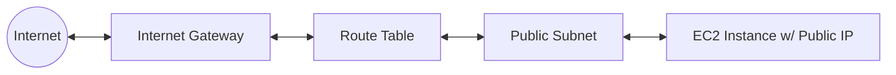

#AWS
#Cloud

---
tags: ['cloud', 'roadmap', 'aws', 'vpc']
---

## Summary
An **Internet Gateway (IGW)** is a horizontally scaled, redundant, and highly available VPC component that enables communication between your VPC and the internet. It acts as a gateway for internet-routable traffic and performs Network Address Translation (NAT) for instances with public IPv4 addresses.

## Detailed Explanation

### What is an Internet Gateway?
An Internet Gateway serves two main purposes:
1.  **Public Internet Access**: It provides a target in your VPC route tables for internet-bound traffic.
2.  **Network Address Translation (NAT)**: For IPv4 traffic, it performs 1-to-1 NAT for instances assigned with public IP addresses, mapping their private IP to the public/Elastic IP.

### How it Works
To enable internet access for a subnet (making it a "Public Subnet"), you must perform the following steps:
1.  **Create and Attach**: Create the IGW and attach it to your VPC. A VPC can only have **one** IGW attached at a time.
2.  **Update Route Tables**: Add a route to the subnet's route table that directs internet-bound traffic (`0.0.0.0/0` for IPv4, `::/0` for IPv6) to the IGW.
3.  **Public IP Assignment**: Ensure instances in the subnet have a public IPv4 address or an Elastic IP address.

### Connectivity Diagram


### Go Application (AWS SDK v2)
The following Go snippet demonstrates how to create an Internet Gateway and attach it to a VPC using the AWS SDK for Go v2.

```go
package main

import (
	"context"
	"fmt"
	"log"

	"github.com/aws/aws-sdk-go-v2/config"
	"github.com/aws/aws-sdk-go-v2/service/ec2"
	"github.com/aws/aws-sdk-go-v2/service/ec2/types"
)

func main() {
	ctx := context.TODO()
	cfg, err := config.LoadDefaultConfig(ctx, config.WithRegion("us-east-1"))
	if err != nil {
		log.Fatalf("unable to load SDK config, %v", err)
	}

	client := ec2.NewFromConfig(cfg)

	vpcID := "vpc-0123456789abcdef0"

	// 1. Create Internet Gateway
	createRes, err := client.CreateInternetGateway(ctx, &ec2.CreateInternetGatewayInput{})
	if err != nil {
		log.Fatalf("failed to create IGW, %v", err)
	}
	igwID := *createRes.InternetGateway.InternetGatewayId
	fmt.Printf("Created IGW: %s\n", igwID)

	// 2. Attach to VPC
	_, err = client.AttachInternetGateway(ctx, &ec2.AttachInternetGatewayInput{
		InternetGatewayId: &igwID,
		VpcId:             &vpcID,
	})
	if err != nil {
		log.Fatalf("failed to attach IGW to VPC, %v", err)
	}
	fmt.Printf("Attached IGW %s to VPC %s\n", igwID, vpcID)
}
```

## Interview Questions

**Q: Does an Internet Gateway charge you for its existence?**
**A:** No, there is no hourly charge for an Internet Gateway. However, you are charged for the data transfer (egress) from instances that use the gateway.

**Q: Can a VPC have multiple Internet Gateways?**
**A:** No. You can only attach one Internet Gateway to a VPC at a time. If you need to scale or handle high availability, the IGW itself is already horizontally scaled and highly available by design.

**Q: What is the difference between an Internet Gateway and a NAT Gateway?**
**A:** An IGW allows both inbound and outbound internet access for resources with public IPs (Public Subnet). A NAT Gateway allows resources in a private subnet to initiate outbound connections to the internet but prevents the internet from initiating connections to those resources.

**Q: Why can't my instance in a public subnet reach the internet even if an IGW is attached to the VPC?**
**A:** Possible reasons include:
1.  The instance lacks a public IPv4 address or Elastic IP.
2.  The route table for the subnet does not have a route (0.0.0.0/0) pointing to the IGW.
3.  The Security Group or Network ACL (NACL) is blocking the traffic.
