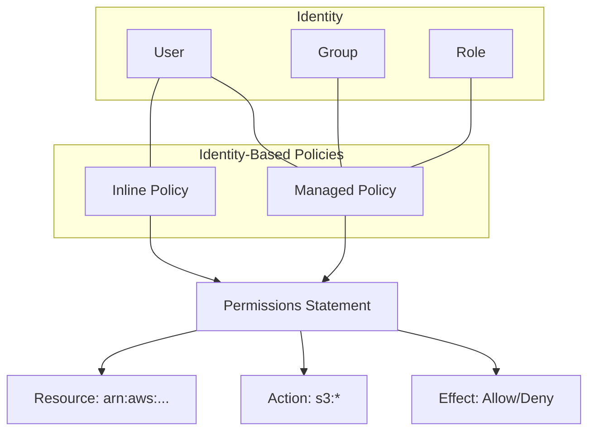

#AWS
#Cloud

---
tags: ['cloud', 'roadmap', 'aws', 'iam']
---

## Summary
Identity-based policies are JSON permissions documents attached directly to an IAM identity (User, Group, or Role). They define what actions an identity can perform, on which resources, and under what conditions. Unlike resource-based policies (which are attached to the resource itself), identity-based policies travel with the user or role, providing a centralized way to manage permissions for identities within an AWS account.

## Detailed Explanation
### 1. JSON Policy Structure
Every IAM policy is a JSON document containing one or more **Statements**. Each statement defines a single permission rule:

- **Version**: Specifies the policy language version. Use `"2012-10-17"` for the latest features.
- **Effect**: Specifies whether the statement allows or denies access (`Allow` or `Deny`).
- **Action**: A list of service-specific actions (e.g., `s3:ListBucket`, `ec2:StartInstances`).
- **Resource**: The Amazon Resource Name (ARN) of the specific resource(s) the actions apply to.
- **Condition (Optional)**: Specific circumstances under which the policy is in effect (e.g., `"aws:SourceIp": "203.0.113.0/24"`).

### 2. Types of Identity-Based Policies
- **Managed Policies**: Standalone policies that can be attached to multiple identities.
    - **AWS Managed Policies**: Maintained by AWS (e.g., `ReadOnlyAccess`).
    - **Customer Managed Policies**: Created and managed by you, offering precise control and versioning.
- **Inline Policies**: Policies embedded directly within a single user, group, or role. They are useful for maintaining a strict 1-to-1 relationship but lack reusability and version control.

### 3. Visual Representation


### 4. Application in Go
In Go, the `aws-sdk-go-v2` is used to manage these policies programmatically. This is essential for building custom orchestration tools or internal self-service portals.

```go
package main

import (
	"context"
	"encoding/json"
	"fmt"
	"log"

	"github.com/aws/aws-sdk-go-v2/aws"
	"github.com/aws/aws-sdk-go-v2/config"
	"github.com/aws/aws-sdk-go-v2/service/iam"
	"github.com/aws/aws-sdk-go-v2/service/iam/types"
)

// PolicyDocument represents the IAM JSON structure
type PolicyDocument struct {
	Version   string
	Statement []StatementEntry
}

type StatementEntry struct {
	Effect   string
	Action   []string
	Resource string
}

func main() {
	ctx := context.TODO()
	cfg, err := config.LoadDefaultConfig(ctx)
	if err != nil {
		log.Fatalf("failed to load configuration, %v", err)
	}

	client := iam.NewFromConfig(cfg)

	// 1. Define the Policy in JSON
	policy := PolicyDocument{
		Version: "2012-10-17",
		Statement: []StatementEntry{
			{
				Effect:   "Allow",
				Action:   []string{"s3:GetObject"},
				Resource: "arn:aws:s3:::my-secure-bucket/*",
			},
		},
	}
	policyJSON, _ := json.Marshal(policy)

	// 2. Create the Customer Managed Policy
	result, err := client.CreatePolicy(ctx, &iam.CreatePolicyInput{
		PolicyName:     aws.String("MySpecificS3Access"),
		PolicyDocument: aws.String(string(policyJSON)),
		Description:    aws.String("Allows reading from specific S3 bucket"),
	})
	if err != nil {
		log.Fatalf("failed to create policy, %v", err)
	}

	fmt.Printf("Created Policy: %s\n", *result.Policy.Arn)

	// 3. Attach to a Role
	_, err = client.AttachRolePolicy(ctx, &iam.AttachRolePolicyInput{
		RoleName:  aws.String("MyAppRole"),
		PolicyArn: result.Policy.Arn,
	})
	if err != nil {
		log.Fatalf("failed to attach policy, %v", err)
	}
}
```

## Interview Questions
- **Q: What is the primary difference between Identity-Based and Resource-Based policies?**
- **A:** Identity-based policies are attached to a user, group, or role and specify what that identity can do. Resource-based policies (like S3 Bucket Policies) are attached to the resource itself and specify who can access that resource.

- **Q: How does the "Explicit Deny" rule affect policy evaluation?**
- **A:** An explicit `Deny` in any applicable policy (identity-based, resource-based, or boundary) always overrides any `Allow`. If a request is denied by one policy, it remains denied regardless of other allows.

- **Q: When should you use an Inline Policy instead of a Managed Policy?**
- **A:** Use inline policies only when you want to ensure that a policy is never accidentally attached to another identity, or when you want the policy to be deleted automatically if the identity is deleted. However, managed policies are generally preferred for their reusability and version history.

- **Q: Explain the "Action" element in an IAM statement.**
- **A:** The `Action` element describes the specific operation or operations that are allowed or denied. It follows the format `service:operation` (e.g., `iam:ListUsers` or `dynamodb:PutItem`). Wildcards (`*`) can be used to match multiple operations.

- **Q: What is the "Principle of Least Privilege" and how do identity-based policies support it?**
- **A:** It is the practice of granting only the minimum permissions necessary to perform a task. Identity-based policies support this by allowing granular control over specific actions and resources for each individual user or role.
