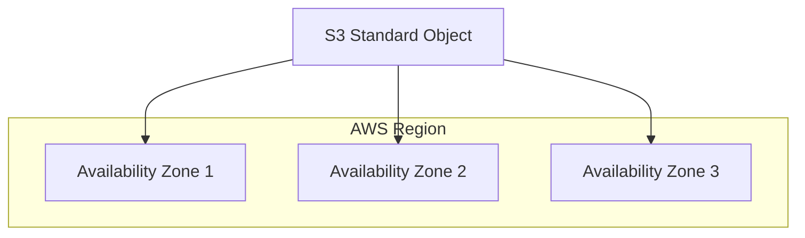

#AWS
#Cloud

---
tags: ['cloud', 'roadmap', 'aws', 's3']
---

## Summary
Amazon S3 Standard (S3 Standard) is the default storage class for frequently accessed data. It offers high durability, availability, and performance object storage with low latency and high throughput. Designed for **99.999999999% (11 nines)** durability, it stores data redundantly across at least three physically separated Availability Zones (AZs) within an AWS Region, making it resilient against the loss of an entire data center.

## Detailed Explanation

S3 Standard is the general-purpose storage choice for applications where data is accessed frequently and requires rapid retrieval without retrieval fees or minimum storage durations.

### Performance and Reliability
- **Durability (11 9s)**: Amazon S3 Standard is designed to provide 99.999999999% durability. AWS achieves this by automatically replicating data across multiple devices and at least three separate Availability Zones.
- **Availability**: It is designed for 99.99% availability over a given year, backed by a 99.9% Availability SLA.
- **Latency & Throughput**: Provides millisecond latency for the first byte of data and high throughput, suitable for real-time applications, gaming, and content distribution.

### Redundancy Model
S3 Standard ensures high availability and disaster resilience by distributing data across multiple independent Availability Zones.



### Key Use Cases
- **Cloud Applications**: General storage for application data, logs, and user content.
- **Content Distribution (CDN)**: Acts as the origin for Amazon CloudFront to serve static assets (images, video, JS/CSS) globally.
- **Big Data Analytics**: Serves as the storage layer for data lakes, allowing services like Amazon Athena, EMR, and Redshift Spectrum to perform in-place analytics.
- **Gaming & Mobile**: Provides low-latency access to game assets and user-generated content.

### Lifecycle Management
While S3 Standard is excellent for frequent access, it has the highest storage cost per GB among the regional storage classes. Organizations typically use **S3 Lifecycle policies** to automatically transition data to lower-cost tiers (like S3 Standard-IA or S3 Glacier) as it becomes less frequently accessed over time.

### Go Application
To work with S3 Standard in Go, you use the `aws-sdk-go-v2`. By default, when you upload an object to S3, it is stored in the `STANDARD` storage class.

```go
package main

import (
	"context"
	"fmt"
	"log"
	"strings"

	"github.com/aws/aws-sdk-go-v2/aws"
	"github.com/aws/aws-sdk-go-v2/config"
	"github.com/aws/aws-sdk-go-v2/service/s3"
	"github.com/aws/aws-sdk-go-v2/service/s3/types"
)

func main() {
	// Load the SDK configuration
	cfg, err := config.LoadDefaultConfig(context.TODO(), config.WithRegion("us-east-1"))
	if err != nil {
		log.Fatalf("unable to load SDK config, %v", err)
	}

	// Create an S3 client
	client := s3.NewFromConfig(cfg)

	bucketName := "my-standard-bucket"
	objectKey := "example-object.txt"
	body := "This is an object stored in S3 Standard storage class."

	// Upload an object explicitly specifying the Standard storage class
	_, err = client.PutObject(context.TODO(), &s3.PutObjectInput{
		Bucket:       aws.String(bucketName),
		Key:          aws.String(objectKey),
		Body:         strings.NewReader(body),
		StorageClass: types.StorageClassStandard,
	})

	if err != nil {
		log.Fatalf("failed to upload object, %v", err)
	}

	fmt.Printf("Successfully uploaded %s to %s using S3 Standard\n", objectKey, bucketName)
}
```

## Interview Questions

**Q: What is the durability and availability of S3 Standard?**
**A:** S3 Standard is designed for 99.999999999% (11 nines) durability and 99.99% availability. It has an availability SLA of 99.9%.

**Q: How does S3 Standard handle data redundancy compared to S3 One Zone-IA?**
**A:** S3 Standard replicates data across a minimum of **three Availability Zones** (AZs), whereas S3 One Zone-IA stores data in only **one AZ**. This makes S3 Standard resilient to the failure of an entire AZ, while data in One Zone-IA could be lost if that specific AZ fails.

**Q: When should you choose S3 Standard over S3 Standard-IA?**
**A:** Choose S3 Standard for frequently accessed data. S3 Standard-IA has lower storage costs but higher retrieval fees. If you access data more than once or twice a month, the retrieval costs in IA might outweigh the storage savings, making S3 Standard more cost-effective.

**Q: Does S3 Standard have a minimum storage duration?**
**A:** No. Unlike S3 Standard-IA (30 days) or S3 Glacier (90 days), S3 Standard has no minimum storage duration. You are only charged for the duration the data is actually stored.

**Q: What is the primary use case for S3 Standard in a Big Data context?**
**A:** It serves as the primary storage layer for Data Lakes. Because of its high throughput and low latency, it allows analytics services like Amazon Athena and EMR to process large datasets directly from S3 without the need for data movement.
