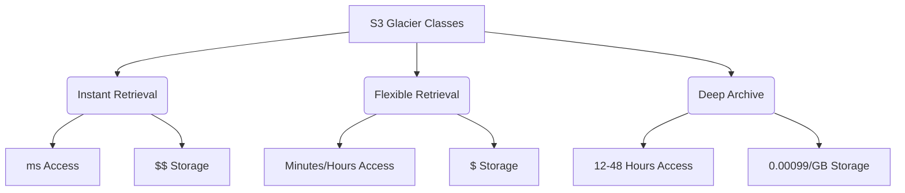

#AWS
#Cloud

---
tags: ['aws', 'roadmap', 's3', 'glacier', 'storage']
---

## Summary
Amazon S3 Glacier is a suite of low-cost storage classes designed for data archiving and long-term backup. It provides high durability (11 nines) and scalability, with three distinct tiers—**Instant Retrieval**, **Flexible Retrieval**, and **Deep Archive**—tailored to different access frequencies and retrieval speed requirements ranging from milliseconds to 48 hours.

## Detailed Explanation

Amazon S3 Glacier storage classes are purpose-built for "cold" data that is rarely accessed but must be preserved securely for long periods.

### 1. S3 Glacier Instant Retrieval
*   **Best For**: Long-lived data that is rarely accessed (e.g., once per quarter) but requires **immediate access** when requested.
*   **Retrieval Time**: Milliseconds (same performance as S3 Standard).
*   **Use Cases**: Medical records, news media assets, satellite imagery.
*   **Cost**: Lowest storage cost for millisecond access, but higher retrieval fees compared to Standard-IA.

### 2. S3 Glacier Flexible Retrieval (formerly S3 Glacier)
*   **Best For**: Archive data that does not require immediate access but needs the flexibility to retrieve large volumes at no cost.
*   **Retrieval Options**:
    *   **Expedited**: 1–5 minutes.
    *   **Standard**: 3–5 hours (can be started within minutes via S3 Batch Operations).
    *   **Bulk**: 5–12 hours (**Free**).
*   **Use Cases**: Offsite backups, disaster recovery.

### 3. S3 Glacier Deep Archive
*   **Best For**: Data that is accessed less than once a year and requires 7–10 years of retention.
*   **Retrieval Options**:
    *   **Standard**: 12 hours.
    *   **Bulk**: 48 hours.
*   **Use Cases**: Regulatory compliance archives (finance, healthcare), digital preservation.
*   **Cost**: The lowest cost storage class in AWS ($1/TB-month).

### Comparison Matrix



| Feature | Instant Retrieval | Flexible Retrieval | Deep Archive |
| :--- | :--- | :--- | :--- |
| **Retrieval Speed** | Milliseconds | 1 min to 12 hours | 12 to 48 hours |
| **Min. Storage Duration** | 90 days | 90 days | 180 days |
| **Min. Object Size** | 128 KB | 40 KB | 40 KB |
| **Retrieval Cost** | Per GB + Per Request | Per GB (except Bulk) | Per GB |

## Go Application

Using the **AWS SDK for Go v2**, you can specify the storage class when uploading an object or by transitioning existing objects via Lifecycle configuration.

### Uploading an Object to Glacier Deep Archive

```go
package main

import (
	"context"
	"log"
	"strings"

	"github.com/aws/aws-sdk-go-v2/aws"
	"github.com/aws/aws-sdk-go-v2/config"
	"github.com/aws/aws-sdk-go-v2/service/s3"
	"github.com/aws/aws-sdk-go-v2/service/s3/types"
)

func main() {
	ctx := context.TODO()
	cfg, err := config.LoadDefaultConfig(ctx)
	if err != nil {
		log.Fatalf("unable to load SDK config, %v", err)
	}

	client := s3.NewFromConfig(cfg)

	_, err = client.PutObject(ctx, &s3.PutObjectInput{
		Bucket:       aws.String("my-archive-bucket"),
		Key:          aws.String("logs/2025/backup.tar.gz"),
		Body:         strings.NewReader("archive content"),
		StorageClass: types.StorageClassGlacierDeepArchive,
	})

	if err != nil {
		log.Fatalf("failed to upload object, %v", err)
	}

	log.Println("Successfully uploaded to Deep Archive")
}
```

## Interview Questions

**Q: What is the main difference between S3 Glacier Instant Retrieval and S3 Standard-IA?**
**A:** Both provide millisecond access. However, Instant Retrieval has lower storage costs (up to 68% lower) but significantly higher retrieval costs. It is optimized for data accessed once a quarter, whereas Standard-IA is for data accessed once a month.

**Q: Can you retrieve data directly from S3 Glacier Flexible Retrieval using a GET request?**
**A:** No. Objects in Flexible Retrieval and Deep Archive must first be **restored** to a temporary copy (RRS or other) before they can be read. Only the Instant Retrieval class allows direct millisecond access via GET.

**Q: How can you achieve free data retrieval from S3 Glacier?**
**A:** By using the **Bulk Retrieval** option in S3 Glacier Flexible Retrieval. It typically takes 5–12 hours but incurs no retrieval fees.

**Q: What is the minimum storage duration for S3 Glacier Deep Archive?**
**A:** 180 days. If you delete or overwrite an object before this period, you are still charged for the remaining days.

**Q: When would you use S3 Glacier Deep Archive over Flexible Retrieval?**
**A:** When storage cost is the absolute priority and retrieval time (12-48 hours) is acceptable. It is ideal for data that is rarely accessed and must be kept for 7-10 years for compliance.
