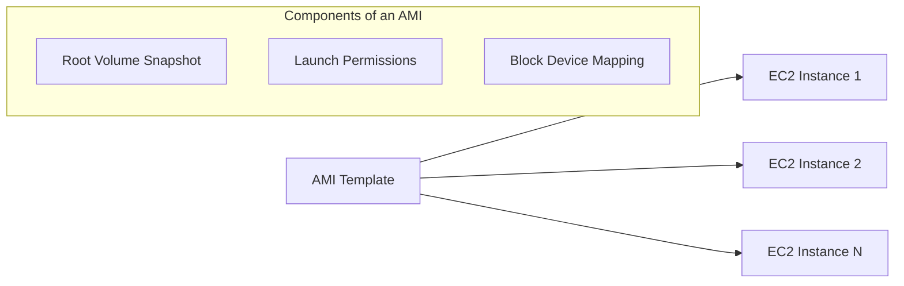

# AMIs (Amazon Machine Images)

## Summary
An **Amazon Machine Image (AMI)** is a pre-configured template used to create Amazon EC2 instances. It contains the operating system, application server, and applications needed to launch an instance, along with block device mappings for storage. AMIs are **regional** resources and serve as the foundational building blocks for deploying consistent environments and implementing Auto Scaling groups.

## Detailed Explanation

### 1. What is an AMI?
An AMI provides the information required to launch an instance. You must specify an AMI when you launch an instance. You can launch multiple instances from a single AMI when you need multiple instances with the same configuration.



### 2. AMI Categories
*   **Public AMIs**: Provided by AWS (Amazon Linux, Windows Server) or the community.
*   **Private AMIs**: Custom images created by your account for internal use, often "hardened" for security.
*   **AWS Marketplace**: A catalog of third-party software (e.g., Cisco, SAP, Bitnami) that can be deployed as AMIs.

### 3. Creating an AMI from an Instance
Creating a custom AMI allows you to capture the state of a configured instance to use as a baseline for future launches.

**Steps:**
1. Configure an EC2 instance with your desired OS, software, and settings.
2. (Recommended) Stop the instance to ensure data consistency.
3. Create the image.

#### Bash Example: Creating an AMI via AWS CLI
```bash
# Create an AMI from an existing instance
aws ec2 create-image \
    --instance-id i-0123456789abcdef0 \
    --name "Production-Web-Server-v1" \
    --description "Baseline image for web servers" \
    --no-reboot

# Wait for the AMI to become available
aws ec2 wait image-available --image-ids ami-0a1b2c3d4e5f6g7h8
```

### 4. Sharing and Copying AMIs
*   **Copying**: Since AMIs are region-locked, you must copy an AMI to a destination region before you can launch instances from it there.
*   **Sharing**: You can share AMIs with specific AWS Account IDs (private sharing) or make them public (community sharing).

#### Bash Example: Sharing an AMI with another account
```bash
aws ec2 modify-image-attribute \
    --image-id ami-0123456789abcdef0 \
    --launch-permission "Add=[{UserId=123456789012}]"
```

## Interview Questions

**Q: What is the difference between an AMI and an EBS Snapshot?**
**A:** A Snapshot is a point-in-time backup of a single EBS volume. An AMI is a package that includes one or more snapshots (including the root volume) plus metadata (permissions, architecture, block device mappings) required to boot a full EC2 instance.

**Q: If you delete an AMI, what happens to the instances already running from it?**
**A:** The instances continue to run normally. However, you cannot launch *new* instances from that AMI, and if the running instances are terminated, they cannot be relaunched using that AMI ID.

**Q: Can you use an AMI from `us-east-1` to launch an instance in `eu-west-1`?**
**A:** No. AMIs are regional. You must first copy the AMI from `us-east-1` to `eu-west-1`.

**Q: How do you handle billing for AMIs?**
**A:** You are charged for the storage used by the underlying EBS snapshots associated with the AMI. There is no flat fee for the AMI entity itself, only the storage costs of its components.

**Q: How do you share an encrypted AMI?**
**A:** You must share the AMI ID with the target account and also grant that account permissions to use the KMS key that was used to encrypt the AMI's snapshots.
