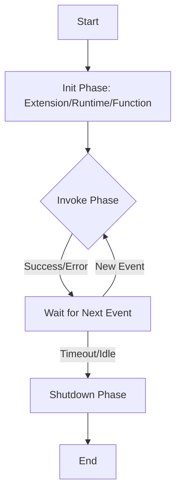

# Lambda Core (Functions, Triggers, Execution Model)

## Summary
AWS Lambda is a serverless, event-driven compute service that enables running code without provisioning or managing servers. It follows a pay-per-use model, automatically scaling from zero to thousands of concurrent executions. The core of Lambda is the **Function**, which runs within an isolated **Execution Environment**. Understanding how these functions are triggered (Invocations) and how they lifecycle (Execution Model) is critical for building performant and cost-effective serverless architectures.

## Detailed Explanation

### 1. The Lambda Execution Model
When Lambda executes a function, it initializes an execution environment: a secure, isolated container.

#### **Lifecycle Phases**
1.  **Init Phase**: Lambda performs three tasks:
    *   **Extension Init**: Starts registered extensions.
    *   **Runtime Init**: Initializes the runtime (e.g., Go, Python, Node.js).
    *   **Function Init**: Runs the code outside the handler (static initializers, global variables, SDK client setup).
2.  **Invoke Phase**: Lambda invokes the function handler. After the handler completes, it waits for the next invocation.
3.  **Shutdown Phase**: If no more events arrive, Lambda shuts down the runtime and extensions.



#### **Cold Starts vs. Warm Starts**
*   **Cold Start**: Occurs when Lambda must create a new execution environment (Full Init Phase). This adds latency.
*   **Warm Start**: Occurs when Lambda reuses an existing environment. Only the **Invoke Phase** runs, resulting in much lower latency.

### 2. Core Components
*   **Handler**: The entry point. In Go, this is a function passed to `lambda.Start()`.
*   **Event Object**: A JSON document containing the data for the function to process (e.g., S3 event, API Gateway request).
*   **Context Object**: Provides runtime information (Request ID, Deadline/Timeout, Function ARN, CloudWatch Log Group).

### 3. Invocation Types
| Type | Description | Common Use Case |
| :--- | :--- | :--- |
| **Synchronous** | Caller waits for the response. Retries are the caller's responsibility. | API Gateway, ALB, CLI |
| **Asynchronous** | Lambda queues the event and returns `202 Accepted`. Retries automatically (up to 2 times). | S3 Events, SNS, SES |
| **Event Source Mapping** | Lambda polls a stream or queue and invokes the function (Polling model). | SQS, Kinesis, DynamoDB Streams |

---

## Go Implementation Example

In Go, we use the `aws-lambda-go` SDK. It is recommended to initialize AWS SDK clients (like S3 or DynamoDB) **outside** the handler to benefit from warm starts.

```go
package main

import (
	"context"
	"fmt"
	"github.com/aws/aws-lambda-go/lambda"
	"github.com/aws/aws-lambda-go/lambdacontext"
)

// MyEvent represents the incoming JSON structure
type MyEvent struct {
	Name string `json:"name"`
}

// MyResponse represents the outgoing JSON structure
type MyResponse struct {
	Message string `json:"message"`
}

// HandleRequest is the Lambda handler.
// It can accept (context.Context, T) and return (R, error).
func HandleRequest(ctx context.Context, event MyEvent) (MyResponse, error) {
	// Accessing Context information
	lc, _ := lambdacontext.FromContext(ctx)
	fmt.Printf("RequestID: %s\n", lc.AwsRequestID)

	if event.Name == "" {
		return MyResponse{}, fmt.Errorf("name field is missing in event")
	}

	return MyResponse{
		Message: fmt.Sprintf("Hello %s from Lambda!", event.Name),
	}, nil
}

func main() {
	// Registration of the handler
	lambda.Start(HandleRequest)
}
```

---

## Interview Questions

1. **Q: How can you optimize a Lambda function to reduce Cold Start latency?**
   **A:** 1. Use Provisioned Concurrency to keep environments "warm". 2. Increase Memory (allocates more CPU). 3. Keep deployment packages small (e.g., use `ldflags` in Go to strip symbols). 4. Minimize the work done in the `Init` phase.

2. **Q: What happens if an Asynchronous invocation fails?**
   **A:** Lambda retries the invocation twice by default (3 attempts total). You can configure **Dead Letter Queues (DLQ)** or **Lambda Destinations** (OnFailure/OnSuccess) to handle events that fail all retries.

3. **Q: What is the purpose of the `Context` object?**
   **A:** It provides metadata about the invocation (Request ID, Log Stream) and, most importantly, allows you to check how much time is remaining before the timeout via `ctx.Deadline()`.

4. **Q: How does Lambda handle scaling?**
   **A:** Lambda scales horizontally. Each concurrent request gets its own execution environment. Scaling is limited by the **Account Concurrency Limit** (default 1,000 per region), though this can be increased.

5. **Q: Why should you initialize database connections outside the handler?**
   **A:** To leverage **Execution Environment Reuse**. Code outside the handler runs during the `Init` phase and persists across warm starts, allowing you to reuse expensive connections instead of re-establishing them for every request.
