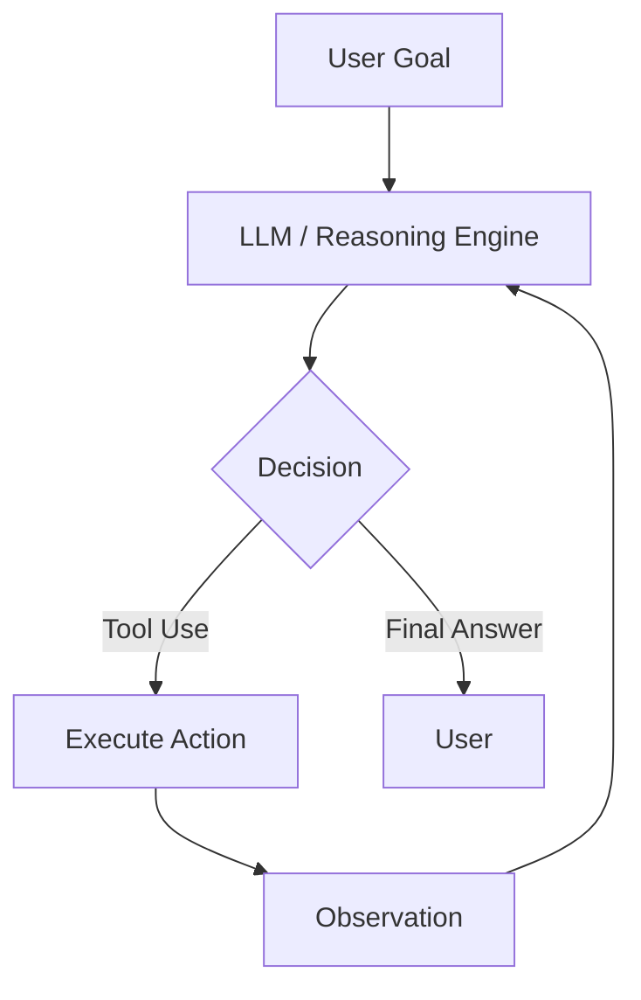

## Summary
AI Agents are autonomous or semi-autonomous systems that leverage Large Language Models (LLMs) as their central reasoning engine to perceive their environment, reason about goals, and take actions to achieve them. Unlike traditional software that follows rigid scripts, agents can adapt to new information and handle open-ended tasks by iterating through a loop of observation and action.

## Detailed Explanation
### **The Core Loop: Perception, Reasoning, Action**
An AI agent operates in a continuous cycle:
1.  **Perception**: Receiving input (user prompt, sensor data, or feedback from a previous action).
2.  **Reasoning**: Using the LLM to analyze the input, plan the next step, and decide which tool (if any) to use.
3.  **Action**: Executing the decided step, such as calling an API, searching the web, or generating a final response.

### **The ReAct Pattern (Reason + Act)**
One of the most foundational patterns for AI agents is **ReAct**. It forces the model to generate a "Thought" before taking an "Action".
-   **Thought**: The model's internal reasoning about the current state.
-   **Action**: The specific tool call or command.
-   **Observation**: The result of the action (e.g., "The weather in Madrid is 15°C").

By alternating between reasoning and acting, the agent reduces hallucinations and can perform complex, multi-step tasks.

### **Autonomy vs. Automation**
-   **Automation**: Pre-defined workflows (e.g., "If X happens, do Y").
-   **Autonomy**: The agent determines the "How" and "When" based on a high-level goal (e.g., "Organize a trip to Japan under $2000").

### **Agent Architecture**

## Interview Questions
*   **Q: What is the main difference between a standard LLM chatbot and an AI Agent?**
    *   **A:** A standard chatbot typically provides a direct response based on its training data. An AI agent is equipped with "agency"—it can use external tools, maintain a stateful loop of reasoning, and iterate until a goal is met, effectively interacting with the external world.
*   **Q: Explain the ReAct pattern and why it is useful.**
    *   **A:** ReAct combines reasoning (thoughts) and acting (tool use). It is useful because it allows the model to "think out loud," which improves performance on complex tasks and allows it to incorporate external knowledge (observations) back into its reasoning process, reducing errors.
*   **Q: What are the primary components of an agentic system?**
    *   **A:** The main components are the Brain (LLM), Planning (breaking tasks down), Memory (Short-term/Context and Long-term/RAG), and Tools (APIs, calculators, code interpreters).
