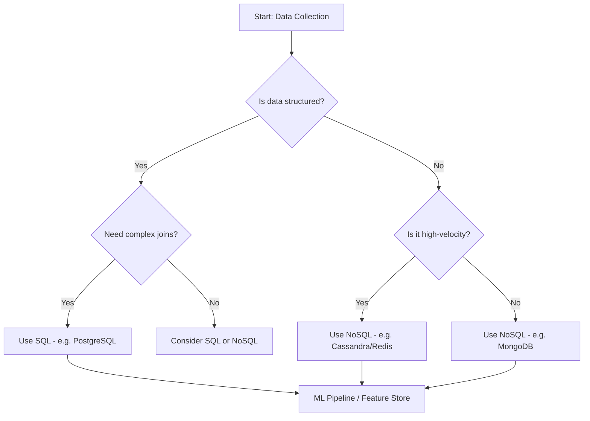

---
---

## Summary
In the context of Machine Learning (ML) data collection, the choice between SQL and NoSQL databases depends on the nature of the data and the scale of the system. **SQL (Relational)** databases are preferred for structured, consistent data where relationships and complex querying are paramount. **NoSQL (Non-Relational)** databases are the go-to for unstructured, semi-structured, or high-velocity data that requires horizontal scalability and schema flexibility. Modern ML workflows also increasingly utilize **Vector Databases** for storing and retrieving high-dimensional embeddings.

## Detailed Explanation

### SQL: Relational Databases
SQL (Structured Query Language) databases store data in predefined tables with rows and columns. They are built on the **ACID** (Atomicity, Consistency, Isolation, Durability) principle, ensuring data integrity.

*   **Structure**: Rigid schema defined before data insertion.
*   **Scaling**: Primarily vertical (adding more power to a single server).
*   **ML Application**: Ideal for structured features (e.g., user profiles, transaction history, sensor readings with fixed formats) where joins across multiple tables are necessary to engineer features.
*   **Popular Tools**: PostgreSQL, MySQL, MariaDB.

### NoSQL: Non-Relational Databases
NoSQL databases offer a flexible schema and are designed for distributed data stores where high throughput and scalability are critical.

*   **Types**:
    *   **Document-oriented**: (e.g., MongoDB) Stores data as JSON-like documents. Great for semi-structured data.
    *   **Key-Value stores**: (e.g., Redis) Extremely fast for caching and real-time state.
    *   **Column-family**: (e.g., Cassandra) Optimized for massive datasets across many servers.
    *   **Graph databases**: (e.g., Neo4j) Best for data with complex relationships like social networks or fraud detection.
*   **Scaling**: Horizontal (adding more servers/nodes to a cluster).
*   **ML Application**: Storing raw logs, social media feeds, or data from web scrapers where the structure might change over time.

### Comparison Matrix

| Feature | SQL (Relational) | NoSQL (Non-Relational) |
| :--- | :--- | :--- |
| **Data Model** | Predefined Schema | Flexible/Dynamic Schema |
| **Consistency** | Strong (ACID) | Eventual (often BASE) |
| **Scaling** | Vertical | Horizontal |
| **Querying** | Powerful Joins (SQL) | Pattern-based / MapReduce |
| **Best For** | Transactional/Structured data | Unstructured/Large-scale data |

### Mermaid Diagram: Data Selection Flow



### Go Implementation Examples

In Go, we interact with SQL databases using the standard `database/sql` package and NoSQL databases via specific drivers.

#### 1. Collecting Data from SQL (PostgreSQL)

```go
package main

import (
	"database/sql"
	"fmt"
	"log"

	_ "github.com/lib/pq" // PostgreSQL driver
)

type UserFeature struct {
	ID    int
	Age   int
	Score float64
}

func fetchSQLData(connStr string) ([]UserFeature, error) {
	db, err := sql.Open("postgres", connStr)
	if err != nil {
		return nil, err
	}
	defer db.Close()

	rows, err := db.Query("SELECT id, age, score FROM user_metrics WHERE active = true")
	if err != nil {
		return nil, err
	}
	defer rows.Close()

	var features []UserFeature
	for rows.Next() {
		var f UserFeature
		if err := rows.Scan(&f.ID, &f.Age, &f.Score); err != nil {
			return nil, err
		}
		features = append(features, f)
	}
	return features, nil
}

func main() {
	connStr := "user=postgres password=secret dbname=ml_data sslmode=disable"
	data, _ := fetchSQLData(connStr)
	fmt.Printf("Fetched %d records for ML training\n", len(data))
}
```

#### 2. Collecting Data from NoSQL (MongoDB)

```go
package main

import (
	"context"
	"fmt"
	"log"
	"time"

	"go.mongodb.org/mongo-driver/bson"
	"go.mongodb.org/mongo-driver/mongo"
	"go.mongodb.org/mongo-driver/mongo/options"
)

func fetchNoSQLData(uri string) {
	ctx, cancel := context.WithTimeout(context.Background(), 10*time.Second)
	defer cancel()

	client, err := mongo.Connect(ctx, options.Client().ApplyURI(uri))
	if err != nil {
		log.Fatal(err)
	}
	defer client.Disconnect(ctx)

	collection := client.Database("ml_raw").Collection("logs")
	
	// Querying for high-latency events for anomaly detection
	filter := bson.M{"latency": bson.M{"$gt": 500}}
	cursor, err := collection.Find(ctx, filter)
	if err != nil {
		log.Fatal(err)
	}
	defer cursor.Close(ctx)

	for cursor.Next(ctx) {
		var result bson.M
		if err := cursor.Decode(&result); err != nil {
			log.Fatal(err)
		}
		fmt.Println("Processing raw log entry for ML:", result["_id"])
	}
}
```

## Interview Questions

**Q: When would you prefer a NoSQL database over a SQL database for an ML pipeline?**
**A:** When dealing with high-volume, high-velocity, or unstructured data (like logs, tweets, or sensor streams) that doesn't fit into a rigid schema. NoSQL is also preferred when horizontal scalability is a requirement to handle massive datasets that exceed the capacity of a single relational server.

**Q: What is ACID compliance and why does it matter for data collection?**
**A:** ACID stands for Atomicity, Consistency, Isolation, and Durability. It ensures that database transactions are processed reliably. For data collection, ACID compliance is crucial when collecting "source of truth" data (like financial transactions or user records) where missing or corrupted data would lead to biased or incorrect ML models.

**Q: Explain the difference between "schema-on-write" and "schema-on-read".**
**A:** "Schema-on-write" (SQL) requires the data structure to be defined before the data is saved, ensuring data quality at the entry point. "Schema-on-read" (NoSQL) allows raw data to be stored without a strict format, with the structure being applied only when the data is queried. NoSQL's "schema-on-read" is often better for rapid data collection from diverse, changing sources.

**Q: What are Vector Databases and why are they important for modern ML?**
**A:** Vector Databases (e.g., Pinecone, Milvus) are specialized stores for high-dimensional vectors (embeddings). They are essential for applications like semantic search, recommendation systems, and Retrieval-Augmented Generation (RAG) because they allow for efficient "nearest neighbor" searches, which traditional SQL/NoSQL databases are not optimized for.
