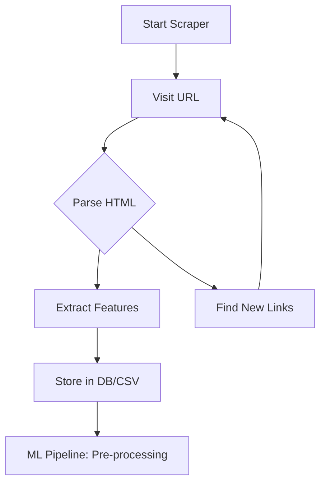

---
---

## Summary
The internet serves as a primary, dynamic data source for Machine Learning, offering a vast array of real-world information through web scraping and public datasets. Unlike static local datasets, the internet provides real-time access to evolving trends, user behaviors, and diverse text or image corpora. Leveraging this source effectively requires a combination of robust scraping pipelines (using tools like `colly` or `BeautifulSoup`), knowledge of public repositories (Kaggle, AWS Open Data), and a strict adherence to ethical and legal standards like `robots.txt` compliance and GDPR.

## Detailed Explanation

### 1. The Internet as a Machine Learning Goldmine
In the modern ML lifecycle, data is the most critical asset. The internet acts as a "live" repository where models can fetch:
- **E-commerce Data**: For price prediction and recommendation systems.
- **Social Media & Forums**: For Sentiment Analysis and Natural Language Processing (NLP).
- **News & Articles**: For trend forecasting and topic modeling.
- **Open Repositories**: High-quality, curated datasets for benchmarking and research.

### 2. Web Scraping: Techniques & Tools
Web scraping is the automated process of extracting structured data from websites. 
- **Static Scraping**: Parsing HTML directly (e.g., using `goquery` in Go or `BeautifulSoup` in Python).
- **Dynamic Scraping**: Handling JavaScript-rendered content using headless browsers (e.g., `Playwright` or `Selenium`).

#### Ethical & Legal Considerations
- **Robots.txt**: Always check `example.com/robots.txt` to see which paths are off-limits for crawlers.
- **Rate Limiting**: Implement delays to avoid overwhelming the target server (DDoS-like behavior).
- **Data Privacy**: Ensure compliance with regulations like **GDPR** (EU) and **CCPA** (California) when collecting personal data.
- **Copyright**: Respect the intellectual property of the content creators.

### 3. Public Datasets & Repositories
Instead of scraping from scratch, many ML engineers leverage established public repositories:
- **Kaggle**: The most popular platform for ML competitions and datasets.
- **UCI Machine Learning Repository**: A classic source for academic datasets.
- **Google Dataset Search**: A specialized search engine for finding datasets across the web.
- **AWS Open Data / Registry of Open Data on AWS**: Large-scale datasets (satellite imagery, genomic data) hosted on the cloud.

### 4. Implementation in Go (Golang)
Go is an excellent choice for data collection due to its high performance and concurrency model (`Goroutines`). The `colly` framework is the industry standard for building fast, distributed scrapers.

#### Workflow Diagram


#### Go Code Example: Using Colly
Below is a simple Go example using the `colly` library to scrape product names and prices from an e-commerce site.

```go
package main

import (
	"fmt"
	"log"

	"github.com/gocolly/colly/v2"
)

func main() {
	// Instantiate default collector
	c := colly.NewCollector(
		colly.AllowedDomains("example-shop.com"),
	)

	// On every <a> element with href attribute call callback
	c.OnHTML(".product-item", func(e *colly.HTMLElement) {
		name := e.ChildText(".product-title")
		price := e.ChildText(".product-price")

		fmt.Printf("Found Product: %s | Price: %s\n", name, price)
	})

	// Before making a request print "Visiting ..."
	c.OnRequest(func(r *colly.Request) {
		fmt.Println("Visiting", r.URL.String())
	})

	// Start scraping
	err := c.Visit("https://example-shop.com/products")
	if err != nil {
		log.Fatal(err)
	}
}
```

## Interview Questions

**Q: What is the difference between web scraping and web crawling?**
**A:** Web crawling is the process of systematically browsing the web to index pages (like Google Search), whereas web scraping is the targeted extraction of specific data from those pages for a particular use case (like ML model training).

**Q: How do you handle websites that use heavy JavaScript to render data?**
**A:** For JS-heavy sites, standard HTML parsers won't work. You need to use a headless browser automation tool like **Playwright** or **Selenium** to render the page before extracting the data, or intercept the site's internal API calls.

**Q: What are the risks of using the internet as a data source for ML?**
**A:** Key risks include **data drift** (internet trends change quickly), **legal liability** (breaching TOS or privacy laws), and **bias** (the internet often contains skewed or unrepresentative data that can pollute a model).

**Q: How does Go's concurrency help in web scraping?**
**A:** Go's `Goroutines` allow you to handle thousands of concurrent network requests with minimal memory overhead, making it significantly faster than traditional synchronous scrapers for large-scale data collection.
