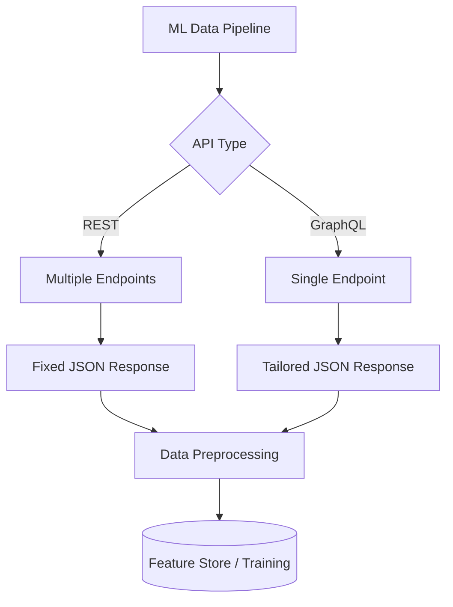

---
---

## Summary
APIs (Application Programming Interfaces) are critical tools for programmatically collecting structured data from web services for Machine Learning pipelines. REST and GraphQL are the two primary paradigms used, each offering different trade-offs in terms of data transfer efficiency and complexity. While REST uses multiple resource-based endpoints, GraphQL allows clients to request exactly the data they need through a single endpoint, minimizing over-fetching. Effective data collection via APIs requires robust handling of rate limiting, authentication, and pagination to ensure a continuous and reliable flow of data for model training and evaluation.

## Detailed Explanation

### 1. APIs as Data Sources
In the context of Machine Learning, APIs serve as a bridge between your data pipeline and external data providers (e.g., social media, financial markets, IoT platforms). Unlike web scraping, which extracts data from HTML, APIs provide structured data (typically JSON or XML) that is easier to parse and less prone to breaking when the UI changes.

### 2. REST vs. GraphQL for ML Data

| Feature | REST (Representational State Transfer) | GraphQL |
| :--- | :--- | :--- |
| **Endpoint** | Multiple (one per resource) | Single endpoint (usually `/graphql`) |
| **Data Fetching** | Fixed structure (Over-fetching common) | Flexible (Client requests specific fields) |
| **Versionability** | Versioning in URL (e.g., `/v1/`) | Versionless (Schema evolution) |
| **Speed** | Can be slower due to multiple round-trips | Faster for complex/nested data |

#### Architectural Overview


### 3. Key Challenges & Strategies

#### A. Rate Limiting
API providers impose limits to prevent abuse.
- **Go Strategy**: Use a `time.Ticker` or a rate-limiting library (e.g., `golang.org/x/time/rate`) to throttle requests. Always check for `429 Too Many Requests` headers like `Retry-After`.

#### B. Pagination
To handle large datasets, APIs return data in chunks.
- **Offset-based**: `/api/data?limit=100&offset=200`. Simple but slow for deep pages.
- **Cursor-based**: `/api/data?after=XYZ`. More efficient for ML datasets as it avoids re-scanning.

#### C. Authentication
Most APIs require an `API Key` or `OAuth2` token. In Go, these are typically passed in the `Authorization` header.

### 4. Go Implementation Examples

#### Fetching from a REST API
Go's standard library is powerful for RESTful data collection.

```go
package main

import (
	"encoding/json"
	"fmt"
	"net/http"
	"time"
)

type WeatherData struct {
	City        string  `json:"name"`
	Temperature float64 `json:"main.temp"`
}

func fetchWeather(city string) (*WeatherData, error) {
	url := fmt.Sprintf("https://api.openweathermap.org/data/2.5/weather?q=%s&appid=YOUR_KEY", city)
	
	client := &http.Client{Timeout: 10 * time.Second}
	resp, err := client.Get(url)
	if err != nil {
		return nil, err
	}
	defer resp.Body.Close()

	if resp.StatusCode != http.StatusOK {
		return nil, fmt.Errorf("API request failed with status: %d", resp.StatusCode)
	}

	var data WeatherData
	if err := json.NewDecoder(resp.Body).Decode(&data); err != nil {
		return nil, err
	}
	return &data, nil
}
```

#### Fetching from a GraphQL API
For GraphQL, libraries like `github.com/machinebox/graphql` are commonly used for simplicity.

```go
package main

import (
	"context"
	"fmt"
	"github.com/machinebox/graphql"
)

type RepoResponse struct {
	Repository struct {
		StargazerCount int `json:"stargazerCount"`
	} `json:"repository"`
}

func fetchRepoStats(owner, name string) {
	client := graphql.NewClient("https://api.github.com/graphql")
	
	req := graphql.NewRequest(`
		query ($owner: String!, $name: String!) {
			repository(owner: $owner, name: $name) {
				stargazerCount
			}
		}
	`)
	req.Var("owner", owner)
	req.Var("name", name)
	req.Header.Set("Authorization", "Bearer YOUR_TOKEN")

	var resp RepoResponse
	if err := client.Run(context.Background(), req, &resp); err != nil {
		fmt.Println("Error:", err)
		return
	}
	fmt.Printf("Stars: %d\n", resp.Repository.StargazerCount)
}
```

## Interview Questions

**Q: What is "Over-fetching" in the context of REST APIs, and how does GraphQL solve it?**
**A:** Over-fetching occurs when a REST endpoint returns more data than the client needs for its specific task (e.g., fetching a full User object just to get the username). GraphQL solves this by allowing the client to define a query that specifies exactly which fields should be returned, reducing bandwidth and parsing overhead.

**Q: How do you handle Rate Limiting when building a data scraper for ML?**
**A:** I check for HTTP 429 status codes and inspect headers like `X-RateLimit-Reset` or `Retry-After`. In Go, I implement an exponential backoff strategy and use the `golang.org/x/time/rate` package to ensure my scraper stays within the provider's limits.

**Q: Why is cursor-based pagination preferred over offset-based pagination for large ML datasets?**
**A:** Cursor-based pagination is more efficient because it doesn't require the database to skip `N` rows, which becomes increasingly expensive as `N` grows. It also prevents "skipping" or "duplicating" data if items are added/removed between requests, ensuring data integrity for the dataset.

**Q: How would you handle sensitive credentials like API Keys in a Go data collection service?**
**A:** I would never hardcode them. I'd use environment variables or a secret management service (like HashiCorp Vault or AWS Secrets Manager) and load them into the Go application using `os.Getenv` or a configuration library like `Viper`.
