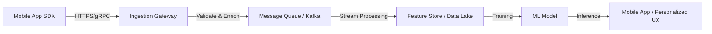

---
---
## Summary
Mobile apps serve as a rich, real-time data source for Machine Learning, offering deep insights into user behavior and environmental context through device sensors and telemetry. Unlike web or static databases, mobile data includes granular movement, location, and hardware-specific signals (e.g., battery, connectivity) that enable personalized experiences, health tracking, and predictive analytics. However, leveraging this data effectively requires a scalable ingestion architecture that balances high-frequency data collection with device constraints like battery life, network bandwidth, and strict privacy regulations.

## Detailed Explanation

Mobile devices are ubiquitous "edge nodes" that generate vast amounts of data. In the context of Machine Learning, mobile apps are often the primary touchpoint for collecting high-fidelity data that isn't available from other sources.

### 1. Types of Mobile Data
Mobile data can be categorized into three main streams:

*   **Sensor Data**: Hardware-level signals from the device.
    *   **Inertial Measurement Unit (IMU)**: Accelerometer (linear acceleration), Gyroscope (angular velocity), and Magnetometer. Used for activity recognition (e.g., walking vs. driving) and gesture detection.
    *   **Spatial/Location**: GPS, Barometer (altitude), and Wi-Fi/Bluetooth RSSI for indoor positioning.
    *   **Environmental**: Light sensors, proximity sensors, and occasionally temperature or humidity.
*   **Interaction Data (Telemetry)**: Logs of how users engage with the app.
    *   **Clickstream**: Every tap, swipe, and scroll event.
    *   **Session Metrics**: Dwell time on specific screens, navigation paths, and churn points.
    *   **Content Consumption**: Text entered, media played, and search queries.
*   **Device & Context Data**: Metadata about the environment.
    *   **System State**: Battery health, charging status, available storage, and RAM usage.
    *   **Connectivity**: Network type (5G, LTE, Wi-Fi) and signal strength, which can be features for predicting user frustration or app performance.

### 2. Architectural Data Flow
Collecting data from millions of mobile devices requires a robust backend capable of handling high-concurrency "bursty" traffic.



### 3. Data Ingestion with Go
Go (Golang) is an excellent choice for building ingestion gateways due to its high performance, lightweight concurrency (Goroutines), and excellent standard library for HTTP handling.

Below is an example of a Go-based telemetry ingestion service that processes sensor data from mobile devices.

```go
package main

import (
	"encoding/json"
	"fmt"
	"log"
	"net/http"
	"time"
)

// SensorData represents granular movement data from a mobile device
type SensorData struct {
	Accelerometer struct {
		X float64 `json:"x"`
		Y float64 `json:"y"`
		Z float64 `json:"z"`
	} `json:"accelerometer"`
	Gyroscope struct {
		X float64 `json:"x"`
		Y float64 `json:"y"`
		Z float64 `json:"z"`
	} `json:"gyroscope"`
}

// TelemetryPayload represents the full data packet sent by the mobile app
type TelemetryPayload struct {
	DeviceID   string     `json:"device_id"`
	Timestamp  time.Time  `json:"timestamp"`
	UserID     string     `json:"user_id"`
	AppVersion string     `json:"app_version"`
	Sensors    SensorData `json:"sensors"`
	Events     []string   `json:"events"`
}

// TelemetryHandler processes incoming data streams
func TelemetryHandler(w http.ResponseWriter, r *http.Request) {
	if r.Method != http.MethodPost {
		http.Error(w, "Only POST allowed", http.StatusMethodNotAllowed)
		return
	}

	var payload TelemetryPayload
	if err := json.NewDecoder(r.Body).Decode(&payload); err != nil {
		http.Error(w, "Invalid payload", http.StatusBadRequest)
		return
	}

	// In a real application, you would send this to a message queue (Kafka/NATS)
	// for asynchronous processing and storage in a Feature Store.
	go func(p TelemetryPayload) {
		log.Printf("Received telemetry from device %s: Accelerometer X=%.2f", 
			p.DeviceID, p.Sensors.Accelerometer.X)
		// Process(p)
	}(payload)

	w.WriteHeader(http.StatusAccepted)
	fmt.Fprint(w, "Data queued for processing")
}

func main() {
	http.HandleFunc("/v1/telemetry", TelemetryHandler)
	log.Println("Telemetry Ingestion Service starting on :8080...")
	if err := http.ListenAndServe(":8080", nil); err != nil {
		log.Fatal(err)
	}
}
```

### 4. Implementation Challenges
*   **Battery & Data Impact**: Collecting high-frequency sensor data (e.g., 50Hz) can drain battery and consume user data plans. Solutions include local buffering, batch uploading over Wi-Fi, and "Edge ML" (preprocessing data on-device to send only relevant summaries).
*   **Privacy & Consent**: Adherence to GDPR, CCPA, and Apple's App Tracking Transparency (ATT). Developers should implement **Differential Privacy** or **Federated Learning** to train models without raw data ever leaving the device.
*   **Data Fragmentation**: Different mobile hardware (e.g., cheap vs. high-end Android sensors) produces data with varying levels of noise and accuracy. Models must be robust to these variations.

## Interview Questions

**Q: What are the main challenges when using mobile sensors as an ML data source?**
**A:** The primary challenges are battery consumption, network bandwidth, and data quality. High-frequency sensor sampling can quickly drain a device's battery. Additionally, sensor hardware varies significantly across manufacturers, leading to inconsistent data quality and noise that must be handled during preprocessing.

**Q: How does privacy regulation (like GDPR or Apple's ATT) impact mobile data collection for ML?**
**A:** These regulations require explicit user consent for tracking and data collection. This often leads to "selection bias" in datasets, as only a subset of users may opt-in. To mitigate this, engineers use privacy-preserving techniques like Federated Learning, where models are trained locally on-device, or Differential Privacy, which adds noise to data to prevent individual identification.

**Q: When would you choose to preprocess mobile data on the device (Edge) versus on the server?**
**A:** On-device (Edge) preprocessing is preferred when dealing with high-volume raw data (like video or high-frequency IMU) to save bandwidth and improve privacy. Server-side processing is better when the computation is too intensive for mobile CPUs or when the data needs to be aggregated with other cross-user datasets to provide context.

**Q: How would you handle "missing data" from a mobile source (e.g., app in background, no signal)?**
**A:** Missing data is common in mobile. Strategies include local caching (SQLite or Room) to store data during offline periods, and using sequence-aware ML models (like LSTMs or Transformers with masking) that can handle irregular time intervals or missing steps in a time-series.
