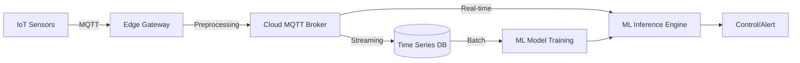

---
---

## Summary
**IoT (Internet of Things) sensors** are a primary source of high-frequency, real-time data for Machine Learning models, particularly in industrial and monitoring contexts. These sensors collect physical parameters (temperature, vibration, light, etc.) and transmit them via lightweight protocols like **MQTT** or **CoAP**. In ML workflows, IoT data is crucial for **Predictive Maintenance**, **Anomaly Detection**, and **Real-time Optimization**, though it often requires significant preprocessing to handle noise and sampling irregularities.

## Detailed Explanation

### 1. Types of IoT Sensors in ML
IoT sensors are the "eyes and ears" of ML systems in the physical world. Common categories include:
*   **Environmental Sensors**: Temperature, humidity, pressure, air quality.
*   **Motion and Position**: Accelerometers, gyroscopes, GPS, proximity sensors.
*   **Industrial Sensors**: Vibration (for motor health), current/voltage (for energy load), flow meters.
*   **Acoustic/Visual**: Microphones for sound analysis, low-power cameras for edge computer vision.

### 2. Communication Protocols
Because many IoT devices are battery-powered or have limited bandwidth, they use specialized protocols:
*   **MQTT (Message Queuing Telemetry Transport)**: The industry standard. A lightweight pub/sub protocol designed for high-latency or unreliable networks.
*   **CoAP (Constrained Application Protocol)**: A specialized web transfer protocol for use with constrained nodes and networks.
*   **HTTP/REST**: Often used by more powerful gateways to send aggregated data to the cloud.

### 3. Data Flow Architecture
The journey from sensor to ML model typically involves several stages:
1.  **Perception Layer**: Raw physical signal converted to digital data.
2.  **Edge Computing**: Optional preprocessing (filtering, compression) performed near the sensor to reduce latency and bandwidth.
3.  **Transport Layer**: Data sent via MQTT/HTTP to a broker or gateway.
4.  **Ingestion Layer**: A system like Kafka or AWS IoT Core receives and routes the messages.
5.  **Storage Layer**: Time-series databases (InfluxDB) or Data Lakes (S3) store the historical data for training.
6.  **ML Layer**: Features are engineered from the time-series data for training or real-time inference.

### 4. Challenges with IoT Data
*   **Noise and Outliers**: Physical sensors often produce "glitches" or noisy readings.
*   **Missing Data**: Network drops or sensor failures lead to gaps in the time-series.
*   **Clock Synchronization**: Ensuring that readings from different sensors are aligned in time.
*   **High Velocity**: Handling thousands of messages per second requires robust ingestion pipelines.

### Mermaid Diagram: IoT to ML Pipeline



## Go Implementation Example

In Go, the most common way to collect IoT data is by using an MQTT client. Below is a simplified example of a data collector that subscribes to a sensor topic and prepares the data for an ML feature store.

### Collecting Sensor Data via MQTT

```go
package main

import (
	"fmt"
	"log"
	"os"
	"os/signal"
	"syscall"
	"time"

	mqtt "github.com/eclipse/paho.mqtt.golang"
)

// SensorData represents the payload from an IoT device
type SensorData struct {
	DeviceID  string  `json:"device_id"`
	Timestamp int64   `json:"timestamp"`
	Value     float64 `json:"value"`
}

func main() {
	// 1. MQTT Client Options
	opts := mqtt.NewClientOptions().AddBroker("tcp://localhost:1883")
	opts.SetClientID("ml-data-collector")
	opts.SetDefaultPublishHandler(messagePubHandler)

	// 2. Connect to Broker
	client := mqtt.NewClient(opts)
	if token := client.Connect(); token.Wait() && token.Error() != nil {
		log.Fatalf("Error connecting to MQTT: %v", token.Error())
	}

	// 3. Subscribe to sensor topic (e.g., factory/+/vibration)
	topic := "factory/+/vibration"
	token := client.Subscribe(topic, 1, func(client mqtt.Client, msg mqtt.Message) {
		// In a real app, you would unmarshal JSON here
		fmt.Printf("Received sensor data for ML: %s from topic: %s\n", msg.Payload(), msg.Topic())
		
		// Logic to push to a Feature Store or Time-Series DB (InfluxDB)
		ingestToFeatureStore(msg.Payload())
	})

	if token.Wait() && token.Error() != nil {
		fmt.Println(token.Error())
		os.Exit(1)
	}

	fmt.Printf("Subscribed to %s. Waiting for sensor data...\n", topic)

	// Keep application running
	keepAlive()
}

func messagePubHandler(client mqtt.Client, msg mqtt.Message) {
	fmt.Printf("Received message: %s from topic: %s\n", msg.Payload(), msg.Topic())
}

func ingestToFeatureStore(payload []byte) {
	// Simulation of data ingestion logic
	// Here you would normalize data and handle outliers before storage
}

func keepAlive() {
	sigs := make(chan os.Signal, 1)
	signal.Notify(sigs, syscall.SIGINT, syscall.SIGTERM)
	<-sigs
}
```

## Interview Questions

**Q: Why is MQTT preferred over HTTP for IoT data collection?**
**A:** MQTT is a lightweight, asynchronous "push" protocol with a smaller header size than HTTP. It uses a long-lived TCP connection, reducing the overhead of repeated handshakes. This is critical for battery-powered devices and networks with low bandwidth or high latency.

**Q: What is "Edge Computing" and why is it important for ML in IoT?**
**A:** Edge computing involves processing data at or near its source (on the device or a local gateway) instead of sending all raw data to a central cloud. For ML, it allows for real-time inference (lower latency) and "data reduction" (filtering noise or aggregating data), which saves bandwidth and reduces cloud storage costs.

**Q: How do you handle temporal alignment (time synchronization) when collecting data from multiple sensors?**
**A:** Temporal alignment is typically handled by using **Network Time Protocol (NTP)** to sync sensor clocks or by timestamping data at the gateway upon arrival. In the ML pipeline, data is often re-sampled into fixed time-bins (e.g., every 100ms) using interpolation to align asynchronous streams.

**Q: What are the best storage solutions for raw IoT data intended for ML training?**
**A:** **Time-Series Databases (TSDB)** like InfluxDB or Prometheus are best for high-velocity metrics. For massive historical scale, **Data Lakes** (like AWS S3 or Google Cloud Storage) using formats like **Parquet** (which is optimized for columnar access) are preferred, as they are cost-effective and integrate well with ML training frameworks like Spark or TensorFlow.
