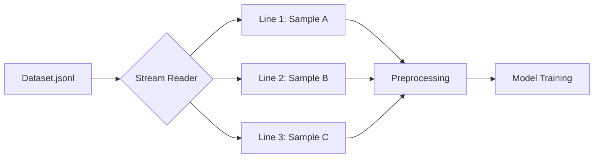

---
---

## Summary
JSON (JavaScript Object Notation) is a lightweight, text-based, and human-readable data format widely used for storing and exchanging semi-structured data. In Machine Learning, JSON is particularly valuable for datasets requiring nested hierarchies, such as computer vision annotations (COCO format) or natural language processing metadata. Its language-independent nature and support for complex data types like arrays and nested objects make it more flexible than CSV for modern, high-dimensional datasets.

## Detailed Explanation

### 1. What is JSON?
JSON is built on two structures:
-   **A collection of name/value pairs**: Realized in Go as a `struct` or a `map`.
-   **An ordered list of values**: Realized in Go as a `slice` or `array`.

### 2. Why JSON for Machine Learning?
While CSV is excellent for simple tabular data, JSON shines in several ML-specific scenarios:
-   **Nested Data**: Useful for hierarchical features (e.g., a user having multiple purchase events).
-   **Sparse Features**: JSON doesn't require a value for every "column," saving space in datasets where many features are optional.
-   **Metadata Storage**: Frequently used to store hyperparameters, model configurations, and dataset lineage.
-   **Standardized Annotations**: Industry standards like the **COCO (Common Objects in Context)** format for object detection use JSON to link images with multiple bounding boxes and segments.

### 3. JSON Lines (JSONL)
Standard JSON files must be loaded entirely into memory to be parsed (as they are wrapped in `[]`). For massive ML datasets, this is inefficient. **JSONL (JSON Lines)** solves this by having each line be a valid, standalone JSON object.
-   **Streaming friendly**: Models can read one sample at a time.
-   **Resilient**: If a file is corrupted, only the broken lines are lost, not the entire dataset.

### 4. Comparison: JSON vs. Others
| Format | Human Readable | Nested Support | Speed | Use Case |
| :--- | :--- | :--- | :--- | :--- |
| **CSV** | Yes | No | High | Simple Tabular Data |
| **JSON** | Yes | Yes | Medium | Metadata, NLP, CV |
| **Parquet** | No | Yes | High | Large-scale Analytics |

### 5. Mermaid Diagram: JSONL Processing Flow


### 6. JSON in Go
Go's `encoding/json` package provides powerful tools for handling JSON. For ML applications, using `struct` tags is the standard way to map JSON keys to Go fields.

#### Example: Parsing an ML Dataset Sample
```go
package main

import (
	"encoding/json"
	"fmt"
	"log"
)

// Record represents a single sample in an ML dataset
type Record struct {
	ID        int      `json:"id"`
	Label     string   `json:"label"`
	Features  []float64 `json:"features"`
	Metadata  map[string]interface{} `json:"metadata,omitempty"`
}

func main() {
	// Sample JSON data (e.g., from a data collection API)
	jsonData := `{"id": 101, "label": "cat", "features": [0.1, 0.5, -0.2], "metadata": {"source": "camera_01"}}`

	var record Record
	err := json.Unmarshal([]byte(jsonData), &record)
	if err != nil {
		log.Fatal(err)
	}

	fmt.Printf("Loaded Sample %d: %s with %d features\n", record.ID, record.Label, len(record.Features))
}
```

#### Example: Efficiently Reading JSONL (Streaming)
```go
package main

import (
	"encoding/json"
	"os"
)

func streamJSONL(filePath string) error {
	file, err := os.Open(filePath)
	if err != nil {
		return err
	}
	defer file.Close()

	decoder := json.NewDecoder(file)
	for decoder.More() {
		var record Record
		if err := decoder.Decode(&record); err != nil {
			return err
		}
		// Process each sample (e.g., feed to a training channel)
		_ = record
	}
	return nil
}
```

## Interview Questions

**Q: When should you prefer JSON over CSV for a Machine Learning project?**
**A:** Use JSON when your data is semi-structured or hierarchical (e.g., an image with an unknown number of object detections). JSON is also preferred when you need to store rich metadata alongside your features or when dealing with sparse datasets where many fields are frequently empty.

**Q: What is JSONL and why is it preferred for large-scale ML training?**
**A:** JSONL stands for JSON Lines, where each line is a valid JSON object. It is preferred because it allows for **streaming**. You can read a dataset sample-by-sample without loading the entire file into RAM, making it scalable for gigabyte-sized datasets. It also makes splitting datasets and parallel processing easier.

**Q: How do you handle optional fields in a JSON dataset when using Go?**
**A:** In Go, you use the `omitempty` struct tag (e.g., \`json:"metadata,omitempty"\`). When marshaling, if the field is its zero value, it will be excluded from the JSON output. When unmarshaling, if the field is missing, the Go struct field will simply remain at its zero value (or `nil` if it's a pointer/map/slice).

**Q: What is the main performance drawback of using JSON for high-performance ML pipelines?**
**A:** JSON is text-based, meaning it is significantly slower to parse than binary formats like **Protobuf** or **Parquet**. It also has a larger file size because it repeats keys for every record. For massive throughput, engineers often convert JSON datasets into more efficient binary formats during the "Data Transformation" stage.
