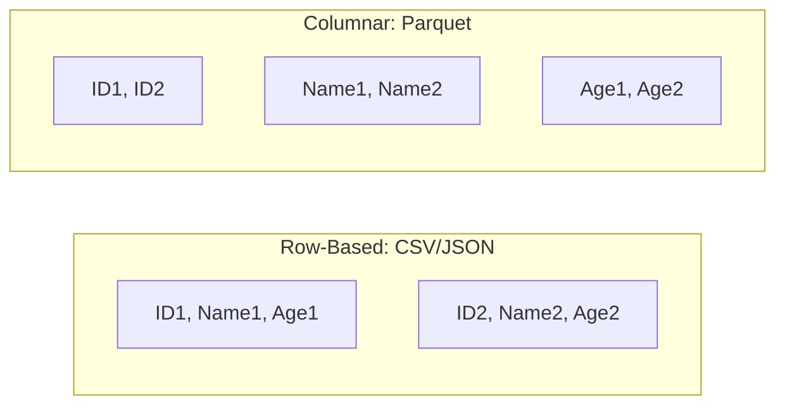

## Summary
Apache Parquet is an open-source, column-oriented data file format designed for efficient data storage and retrieval, particularly in big data and machine learning ecosystems. Unlike row-based formats like CSV or JSON, Parquet stores nested data structures in a flat columnar format, allowing for high compression ratios and efficient "predicate pushdown" filtering. It is highly optimized for complex queries that only require a subset of columns, making it the industry standard for ML data lakes and data collection pipelines.

## Detailed Explanation

### Columnar Storage Architecture
Parquet's primary advantage is its columnar storage layout. In a row-based format, data is stored line by line (horizontal). In Parquet, values for each column are stored together (vertical). This is crucial for analytical workloads where queries typically aggregate or filter based on specific columns rather than entire records.

**MermaidJS: Columnar vs Row Storage**


### Key Components
1.  **Row Groups**: Horizontal partitions of the data. Each row group contains a column chunk for each column in the dataset.
2.  **Column Chunks**: Chunks of data for a particular column within a row group.
3.  **Pages**: The smallest unit of storage. Data pages are compressed and encoded separately.
4.  **Footer**: Located at the end of the file, it contains the file metadata, including the schema and the start locations of all column chunks. This allows readers to jump directly to relevant data without scanning the whole file.

### Performance Optimizations
*   **Compression**: Since data in a column is of the same type (e.g., all integers), Parquet can achieve very high compression ratios using algorithms like **Snappy**, **Gzip**, or **Zstandard**.
*   **Encoding**: Parquet uses efficient encodings like **Dictionary Encoding** (storing unique values once), **Run-Length Encoding (RLE)**, and **Delta Encoding**.
*   **Predicate Pushdown**: Filtering occurs at the storage layer. If a query filters for `Age > 30`, the reader can skip entire row groups or pages based on min/max statistics stored in the metadata.
*   **Projection Pushdown**: Only the requested columns are read from disk, drastically reducing I/O overhead.

### Parquet in Machine Learning (Go)
In Go-based ML pipelines (e.g., data ingestion services, feature stores), Parquet is used to handle massive datasets efficiently. Using libraries like `github.com/parquet-go/parquet-go`, developers can read and write Parquet files with strong typing and high performance.

**Go Implementation Example**
```go
package main

import (
	"fmt"
	"log"
	"os"

	"github.com/parquet-go/parquet-go"
)

// Define the schema using Go structs with parquet tags
type UserAction struct {
	UserID    int64  `parquet:"user_id"`
	Action    string `parquet:"action"`
	Timestamp int64  `parquet:"timestamp"`
}

func main() {
	// 1. Create a Parquet file
	file, err := os.Create("actions.parquet")
	if err != nil {
		log.Fatal(err)
	}
	defer file.Close()

	// 2. Initialize the writer with the schema derived from the struct
	writer := parquet.NewWriter(file, parquet.SchemaOf(UserAction{}))

	// 3. Write data records
	actions := []UserAction{
		{UserID: 1, Action: "click", Timestamp: 1700000000},
		{UserID: 2, Action: "view", Timestamp: 1700000010},
		{UserID: 3, Action: "purchase", Timestamp: 1700000020},
	}

	for _, action := range actions {
		if err := writer.Write(action); err != nil {
			log.Fatal(err)
		}
	}

	// 4. Close the writer to flush buffers and write the footer metadata
	if err := writer.Close(); err != nil {
		log.Fatal(err)
	}
	fmt.Println("Parquet file created successfully with 3 records.")
}
```

### Why use Parquet for ML?
1.  **Feature Selection**: ML models often use only a fraction of available features. Parquet allows reading only those specific columns.
2.  **Schema Enforcement**: Ensures data consistency across training and inference, preventing "training-serving skew".
3.  **Interoperability**: Parquet is supported by virtually all big data tools (Spark, Presto, AWS Athena, Pandas, Dask).

## Interview Questions

**Q: Why is Parquet faster than CSV for analytical queries?**
**A:** Parquet is columnar, meaning it only reads the columns required by the query (Projection Pushdown). It also stores metadata like min/max values for each page, allowing it to skip irrelevant data (Predicate Pushdown). CSV requires reading the entire file row-by-row and parsing every field, which is extremely I/O intensive for large datasets.

**Q: What is "Predicate Pushdown" in the context of Parquet?**
**A:** It is an optimization where the filtering logic is "pushed" down to the storage layer. The reader uses metadata (statistics) in the Parquet file to determine if a row group or page can possibly contain the data matching the filter criteria. If not, the data is never read from disk, saving time and resources.

**Q: How does Parquet handle nested data structures?**
**A:** Parquet uses the **Dremel algorithm**, which decomposes nested structures (like JSON objects) into a flat columnar format using **Definition Levels** (to track nulls) and **Repetition Levels** (to track array elements). This allows for efficient storage and partial reading of complex types without losing the benefits of columnar storage.

**Q: When would you choose Snappy vs Zstandard compression for Parquet?**
**A:** **Snappy** is optimized for high speed and low CPU usage, making it ideal for real-time processing where I/O isn't the primary bottleneck. **Zstandard (Zstd)** provides much higher compression ratios at the cost of more CPU, making it better for long-term storage or when bandwidth/disk space is the limiting factor.
