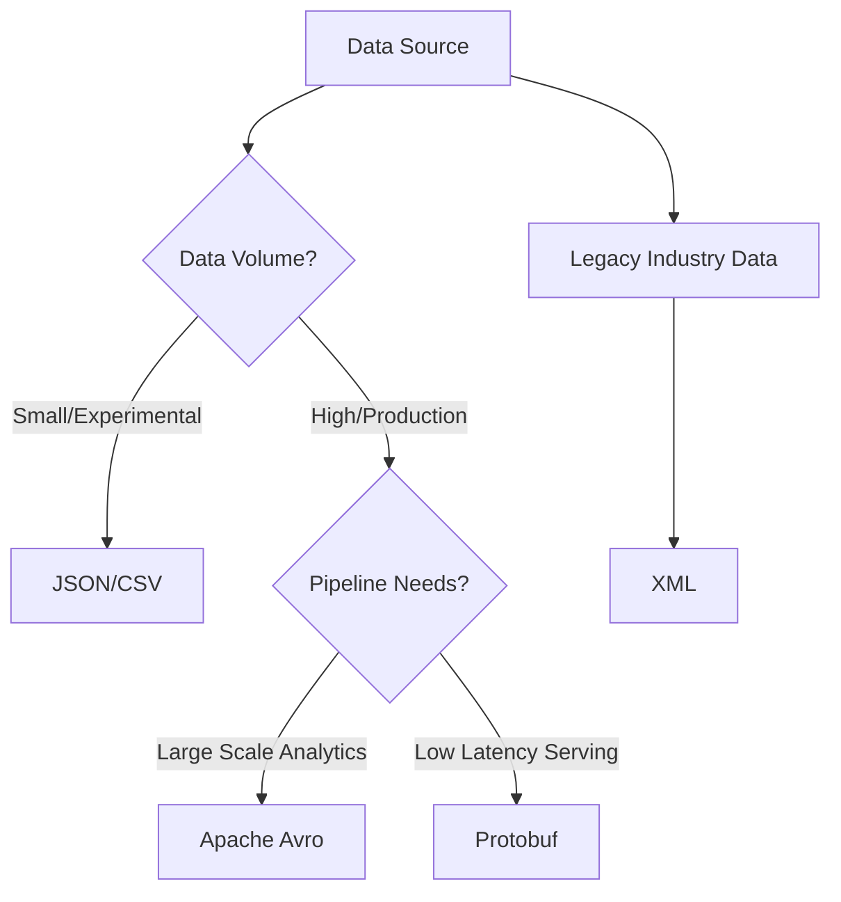

---
---

## Summary
While CSV and JSON are common for small-scale experimentation, high-performance Machine Learning (ML) pipelines often leverage specialized data formats like XML, Avro, and Protobuf to handle complexity and scale. XML is primarily used for structured document data and legacy integration, while Avro and Protobuf are binary formats designed for high efficiency, schema enforcement, and interoperability. Avro is particularly dominant in Big Data ecosystems like Apache Kafka due to its rich schema evolution capabilities, whereas Protobuf is the industry standard for high-speed service-to-service communication and compact feature storage in frameworks like TensorFlow.

## Detailed Explanation

In the context of ML data collection, choosing the right format impacts storage costs, processing speed, and the ability of the pipeline to adapt to changing model requirements.

### Comparison of Advanced Data Formats

| Feature | XML | Apache Avro | Protocol Buffers (Protobuf) |
| :--- | :--- | :--- | :--- |
| **Type** | Textual (Hierarchical) | Binary (Row-oriented) | Binary (Message-oriented) |
| **Schema** | XSD / DTD (Optional) | JSON Schema (Mandatory) | .proto file (Mandatory) |
| **Efficiency** | Low (High overhead) | High (Compact) | Very High (Optimized) |
| **Evolution** | Manual / Brittle | Automatic & Robust | Field Tag based |
| **Common Use Case** | Legacy APIs, Medical data | Data Lakes, Stream Processing | gRPC, Model Serving, TFRecords |

### 1. XML (Extensible Markup Language)
XML is a human-readable, tag-based format that supports complex, deeply nested structures. In ML, it is often encountered when ingesting data from industries like healthcare (HL7) or finance, where data is inherently document-centric.

**Go Implementation Example:**
Go's standard library provides robust support for XML through the `encoding/xml` package.

```go
package main

import (
	"encoding/xml"
	"fmt"
)

// FeatureSet represents a structured collection of ML features in XML
type FeatureSet struct {
	XMLName xml.Name  `xml:"features"`
	ID      string    `xml:"id,attr"`
	Values  []float64 `xml:"value"`
}

func main() {
	// Sample XML data from a legacy source
	data := []byte(\`<features id="obs_1024"><value>0.75</value><value>1.42</value></features>\`)
	
	var fs FeatureSet
	if err := xml.Unmarshal(data, &fs); err != nil {
		fmt.Printf("Error unmarshaling XML: %v\n", err)
		return
	}
	
	fmt.Printf("Loaded Observation ID: %s, Features: %v\n", fs.ID, fs.Values)
}
```

### 2. Apache Avro
Avro is a language-neutral data serialization system. It is uniquely suited for ML data collection because it stores the **schema with the data**. This "self-describing" nature makes it the preferred format for data lakes (Hadoop, Spark) and real-time streaming (Kafka).

**Key Advantage: Schema Evolution**
As ML models evolve, you may need to add new features or remove old ones. Avro handles this by defining strict rules for backward and forward compatibility, preventing pipeline breaks during data ingestion.

**Go Implementation (using hamba/avro):**

```go
package main

import (
	"fmt"
	"github.com/hamba/avro/v2"
)

func main() {
	// 1. Define the schema (usually stored in a separate .avsc file)
	schemaText := \`{
		"type": "record",
		"name": "FeatureVector",
		"fields": [
			{"name": "label", "type": "int"},
			{"name": "score", "type": "float"}
		]
	}\`
	schema := avro.MustParse(schemaText)

	// 2. Define a matching Go struct
	type FeatureVector struct {
		Label int     \`avro:"label"\`
		Score float32 \`avro:"score"\`
	}

	// 3. Serialize (Marshal)
	in := FeatureVector{Label: 1, Score: 0.98}
	data, _ := avro.Marshal(schema, in)

	// 4. Deserialize (Unmarshal)
	var out FeatureVector
	_ = avro.Unmarshal(schema, data, &out)
	
	fmt.Printf("Decoded ML Data -> Label: %d, Score: %f\n", out.Label, out.Score)
}
```

### 3. Protocol Buffers (Protobuf)
Protobuf is Google's high-performance serialization format. It is significantly faster and smaller than XML or JSON because it transmits data in a raw binary format using numeric field tags instead of field names.

In Machine Learning, Protobuf is used for:
- **TFRecords**: The standard format for TensorFlow training data.
- **Model Serving**: gRPC (which uses Protobuf) is the standard for low-latency model inference.

### Selection Logic for ML Pipelines


## Interview Questions

**Q: Why is Avro preferred over JSON for high-throughput ML data ingestion?**
**A:** Avro is a binary format, making it much smaller and faster to parse than text-based JSON. Crucially, it enforces a schema, ensuring data quality before it reaches the ML model. It also supports "Schema Evolution," allowing teams to add new features to the data stream without breaking existing consumers.

**Q: When should an ML Engineer choose Protobuf over other formats?**
**A:** Protobuf is the best choice when performance is the top priority, such as in real-time model serving or when using TensorFlow's TFRecord format. Its strict schema (.proto files) and generated code provide high type safety across different programming languages.

**Q: What are the downsides of using XML for ML features?**
**A:** XML is very verbose; the tags (e.g., `<feature>...</feature>`) often take up more space than the data itself. This leads to high storage costs and slow I/O. Additionally, parsing XML is CPU-intensive compared to binary formats like Avro or Protobuf.

**Q: Explain the role of a Schema Registry in an Avro-based ML pipeline.**
**A:** A Schema Registry stores the versions of schemas used for different data topics. It allows the ML pipeline to dynamically retrieve the correct schema version needed to decode a specific record, ensuring that producers and consumers stay in sync even as the data structure changes over time.
