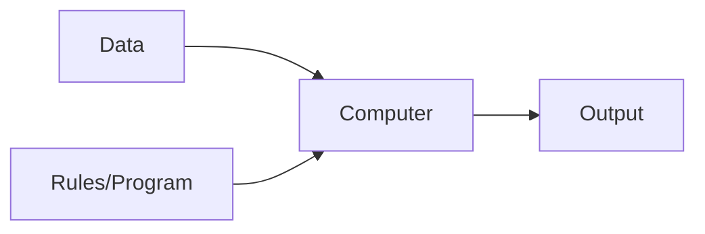
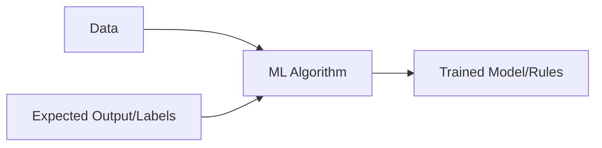

## Summary

Machine Learning (ML) is a subfield of Artificial Intelligence (AI) that empowers computers to learn from data and improve their performance over time without being explicitly programmed for every specific task. By leveraging statistical techniques and algorithms, ML systems identify patterns within large datasets to make predictions, group similar items, or optimize decision-making processes. It is the driving force behind modern technologies like recommendation engines, autonomous vehicles, and advanced medical diagnostics.

## Detailed Explanation

### **What is Machine Learning?**

At its core, Machine Learning is about building mathematical models that can learn from experience.

*   **Arthur Samuel (1959):** Defined it as the "field of study that gives computers the ability to learn without being explicitly programmed."
*   **Tom Mitchell (1997):** Provided a more engineering-oriented definition: "A computer program is said to learn from experience **E** with respect to some class of tasks **T** and performance measure **P**, if its performance at tasks in **T**, as measured by **P**, improves with experience **E**."

### **Machine Learning vs. Traditional Programming**

In traditional programming, a developer writes explicit rules (logic) to process data. In Machine Learning, the machine "learns" those rules by looking at data and the desired results.

#### **Traditional Programming Flow**

#### **Machine Learning Flow**

| Feature | Traditional Programming | Machine Learning |
| :--- | :--- | :--- |
| **Logic** | Explicitly coded by humans | Discovered by the algorithm from data |
| **Data Requirements** | Low to moderate | High (requires representative datasets) |
| **Complexity Handling** | Limited by human ability to define rules | Excellent at handling high-dimensional/complex patterns |
| **Adaptability** | Hard-coded; requires manual updates | Can adapt to new data by re-training |

---

### **The Three Main Types of Machine Learning**

Machine learning algorithms are typically categorized based on how they receive feedback during training.

#### **1. Supervised Learning**
The model is trained on **labeled data**, meaning the input data is paired with the correct output.
*   **Goal:** Learn a mapping from inputs to outputs.
*   **Key Tasks:** 
    *   **Classification:** Predicting a category (e.g., Spam vs. Not Spam).
    *   **Regression:** Predicting a continuous value (e.g., Housing prices).
*   **Examples:** Linear Regression, Support Vector Machines (SVM), Random Forest.

#### **2. Unsupervised Learning**
The model works with **unlabeled data** and must find hidden structures or patterns on its own.
*   **Goal:** Discover underlying patterns or groupings in data.
*   **Key Tasks:** 
    *   **Clustering:** Grouping similar data points (e.g., Customer segmentation).
    *   **Dimensionality Reduction:** Simplifying data without losing key information (e.g., PCA).
*   **Examples:** K-Means Clustering, Principal Component Analysis (PCA), Association Rules.

#### **3. Reinforcement Learning (RL)**
The model (agent) learns by interacting with an **environment**. It receives "rewards" for good actions and "penalties" for bad ones.
*   **Goal:** Maximize cumulative rewards over time.
*   **Analogy:** Teaching a dog a trick by giving it treats (rewards) for correct behavior.
*   **Examples:** Game-playing AI (AlphaGo), Robotics, Autonomous driving.

*Note: There is also **Semi-Supervised Learning**, which uses a mix of a small amount of labeled data and a large amount of unlabeled data.*

---

### **Real-World Applications**

*   **Healthcare:** Predicting diseases from medical imagery (Computer Vision) or discovering new drug compounds.
*   **Finance:** Fraud detection, algorithmic trading, and credit scoring.
*   **E-commerce:** Recommendation systems (Amazon/Netflix) and personalized marketing.
*   **Natural Language Processing (NLP):** Virtual assistants (Siri/Alexa), machine translation, and sentiment analysis.
*   **Transportation:** Route optimization and self-driving car navigation.

## Interview Questions

**Q: How would you explain Machine Learning to a non-technical person?**
**A:** Imagine teaching a child to recognize a cat. Instead of giving them a list of rules (like "cats have pointy ears"), you show them thousands of pictures of cats. Eventually, the child learns to recognize a cat on their own. Machine Learning does the same with computers—we provide examples (data), and the computer finds the patterns to make its own decisions.

**Q: What is the difference between an "Algorithm" and a "Model"?**
**A:** An **Algorithm** is the procedure or set of rules used to find patterns (e.g., Linear Regression). A **Model** is the output of that algorithm after it has been trained on a specific dataset. You can think of the algorithm as the "teacher" and the model as the "knowledge" the student acquired.

**Q: When should you NOT use Machine Learning?**
**A:** ML should be avoided if:
1. The problem can be solved with simple, deterministic rules.
2. You don't have enough high-quality, representative data.
3. The cost of building and maintaining a model outweighs the benefits.
4. Transparency and "explainability" are strictly required, and the best ML solution is a "black box."

**Q: What is "Labeling" in the context of Machine Learning?**
**A:** Labeling is the process of identifying raw data (images, text, videos) and adding one or more relevant tags to provide context so that a Machine Learning model can learn from it. In Supervised Learning, these labels serve as the "ground truth" for training.
