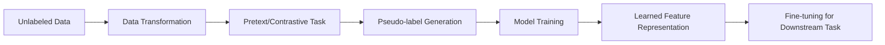

## Summary
Self-supervised learning (SSL) is a machine learning paradigm where the model is trained on a task using the data itself to generate supervisory signals, rather than relying on externally-provided labels. By formulating "pretext tasks" that generate pseudo-labels from unlabeled data, models can learn rich representations that often rival or exceed those learned through traditional supervised training. This approach is fundamental to modern foundation models like BERT, GPT, and SimCLR.

## Detailed Explanation

### The Core Concept
Self-supervised learning sits between supervised and unsupervised learning. It leverages the scale of unlabeled data (like unsupervised learning) but uses a supervised learning framework by automatically extracting labels from the data.

### Pretext Tasks
A **pretext task** is an auxiliary objective that forces the model to learn features that are useful for a "downstream" task of interest. Common examples include:

#### Computer Vision
- **Rotation Prediction**: Rotating an image by 0, 90, 180, or 270 degrees and training the model to predict the rotation angle.
- **Jigsaw Puzzles**: Dividing an image into a grid, shuffling the tiles, and asking the model to predict the original arrangement.
- **Colorization**: Taking a grayscale version of a color image and predicting the missing color channels.
- **Context Prediction**: Given two patches from an image, predicting their relative spatial position.

#### Natural Language Processing (NLP)
- **Masked Language Modeling (MLM)**: Hiding certain words in a sentence and training the model to predict them based on surrounding context (e.g., **BERT**).
- **Next Sentence Prediction (NSP)**: Predicting whether a given sentence follows another in a coherent text.
- **Autoregressive Modeling**: Predicting the next token in a sequence based on all previous tokens (e.g., **GPT**).

### Contrastive Learning
Contrastive learning is a powerful SSL technique that aims to group similar samples closely in the embedding space while pushing dissimilar samples apart.

- **SimCLR (Simple Framework for Contrastive Learning)**:
  1. Take an image $x$ and apply two different random augmentations (e.g., crop, flip, color jitter) to create two "views" $x_i$ and $x_j$.
  2. Treat $(x_i, x_j)$ as a **positive pair**.
  3. Treat all other images in the current batch as **negative samples**.
  4. Train the encoder to maximize the similarity (typically cosine similarity) between positive pairs while minimizing it for negative pairs using the **InfoNCE** loss.

### Workflow Diagram



### Go Application: Contrastive Similarity Logic
While the heavy lifting of ML is usually done in Python, the mathematical core of SSL—calculating similarity between embeddings—can be implemented in Go. This is useful for building high-performance inference services or feature stores.

```go
package main

import (
	"fmt"
	"math"
)

// Vector represents a high-dimensional embedding
type Vector []float64

// DotProduct calculates the scalar product of two vectors
func DotProduct(v1, v2 Vector) float64 {
	sum := 0.0
	for i := range v1 {
		sum += v1[i] * v2[i]
	}
	return sum
}

// Norm calculates the Euclidean length (L2 norm)
func Norm(v Vector) float64 {
	sum := 0.0
	for _, val := range v {
		sum += val * val
	}
	return math.Sqrt(sum)
}

// CosineSimilarity is the standard metric for Contrastive Learning (e.g., SimCLR)
func CosineSimilarity(v1, v2 Vector) float64 {
	denom := Norm(v1) * Norm(v2)
	if denom == 0 {
		return 0
	}
	return DotProduct(v1, v2) / denom
}

func main() {
	// Simulated embeddings of two augmented views of the same image (Positive Pair)
	viewA := Vector{0.1, 0.85, -0.2, 0.4}
	viewB := Vector{0.12, 0.83, -0.18, 0.41}

	// Simulated embedding of a completely different image (Negative Pair)
	other := Vector{-0.5, 0.1, 0.9, -0.3}

	fmt.Printf("Similarity (Positive Pair): %.4f\n", CosineSimilarity(viewA, viewB))
	fmt.Printf("Similarity (Negative Pair): %.4f\n", CosineSimilarity(viewA, other))
}
```

## Interview Questions

### Q: What is the main advantage of Self-Supervised Learning over Supervised Learning?
**A:** The primary advantage is the ability to use virtually unlimited amounts of unlabeled data. Supervised learning is bottlenecked by the cost and time required for human labeling. SSL allows models to learn general-purpose features from the entire internet or massive datasets before being fine-tuned on small, labeled datasets for specific tasks.

### Q: Explain the concept of "Data Augmentation" in the context of SimCLR.
**A:** In SimCLR, data augmentation is not just for regularization but is central to defining the task. By applying random transformations (cropping, resizing, color distortion, Gaussian blur) to the same image, we create two different but semantically identical views. The model's job is to learn that these two different-looking images represent the same underlying concept.

### Q: What is a "Collapsing Solution" in SSL and how is it prevented?
**A:** A collapsing solution occurs when the model finds a shortcut to minimize the loss by mapping all inputs to the same constant vector. If every embedding is the same, similarity is always 1, which might satisfy certain loss functions without learning anything. It is prevented by using negative samples (InfoNCE loss), stop-gradient operations (BYOL), or decorrelation constraints (Barlow Twins).

### Q: Why is BERT considered a self-supervised model?
**A:** BERT (Bidirectional Encoder Representations from Transformers) is self-supervised because it creates its own labels from raw text. It uses the "Masked Language Modeling" task, where it hides words and tries to predict them. The "labels" are simply the original words that were present in the text, requiring no manual annotation.
