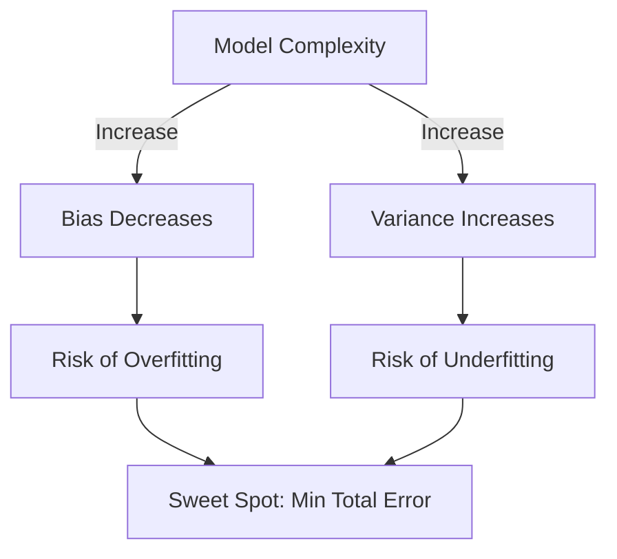

## Summary
Model evaluation is the process of using different evaluation metrics and validation techniques to understand a machine learning model's performance, strengths, and weaknesses. Its primary goal is to assess how well a model generalizes to new, unseen data, which is essential for selecting the best model and ensuring its reliability in real-world applications.

## Detailed Explanation

### Generalization
**Generalization** is the ability of a machine learning model to provide accurate predictions on data it has never seen before. A model that generalizes well has successfully captured the underlying patterns of the data rather than just memorizing the training samples. In practice, we estimate generalization by evaluating the model on a **test set** that was not used during training.

### Overfitting and Underfitting
Understanding the relationship between training and test error is crucial for identifying these two common issues:

*   **Overfitting**: Occurs when a model learns the training data "too well," including its noise and random fluctuations. 
    *   **Characteristics**: High accuracy on training data, poor performance on test data.
    *   **Causes**: High model complexity, insufficient training data, or over-training.
    *   **Solutions**: Regularization (L1/L2), pruning, or gathering more data.
*   **Underfitting**: Occurs when a model is too simple to capture the underlying structure of the data.
    *   **Characteristics**: Low performance on both training and test data.
    *   **Causes**: Model too simple (e.g., linear model for non-linear data), poor feature selection.
    *   **Solutions**: Increasing model complexity, feature engineering, or reducing regularization.

### Bias-Variance Tradeoff
The Bias-Variance Tradeoff is a central challenge in machine learning that involves balancing two sources of error:

1.  **Bias**: Error due to overly simplistic assumptions in the learning algorithm. High bias leads to **underfitting**.
2.  **Variance**: Error due to the model's sensitivity to small fluctuations in the training set. High variance leads to **overfitting**.

**The Relationship:**
*   As **Model Complexity** increases, **Bias** decreases (the model fits the training data better) but **Variance** increases (the model becomes more sensitive to specific training samples).
*   The **Optimal Model** is found at the point where the total error (Bias² + Variance + Irreducible Error) is at its minimum.



### Evaluation in Go (Example)
While Python is the standard for ML research, Go is often used for production-grade evaluation pipelines. Below is a simple implementation of an accuracy metric:

```go
package main

import (
	"fmt"
	"errors"
)

// Accuracy calculates the percentage of correct predictions
func Accuracy(actual, predicted []int) (float64, error) {
	if len(actual) != len(predicted) {
		return 0, errors.New("input slice lengths must match")
	}
	if len(actual) == 0 {
		return 0, nil
	}

	correct := 0
	for i := range actual {
		if actual[i] == predicted[i] {
			correct++
		}
	}
	return float64(correct) / float64(len(actual)), nil
}

func main() {
	yTrue := []int{1, 0, 1, 1, 0}
	yPred := []int{1, 0, 0, 1, 0}
	
	acc, _ := Accuracy(yTrue, yPred)
	fmt.Printf("Evaluation Accuracy: %.2f%%\n", acc*100)
}
```

## Interview Questions

**Q: What is the difference between training error and generalization error?**
**A:** Training error is the error rate on the data used to build the model, while generalization error (or test error) is the expected error rate on new, unseen data. A large gap between the two usually indicates overfitting.

**Q: Why do we use a validation set in addition to a training and test set?**
**A:** The validation set is used to tune hyperparameters and perform model selection without "leaking" information from the test set. The test set should only be used once at the very end to provide an unbiased estimate of final performance.

**Q: How does the Bias-Variance tradeoff change when you add more training data?**
**A:** Generally, adding more training data reduces **variance** because the model becomes less sensitive to individual data points. It does not significantly affect bias, which is inherent to the model's architecture.

**Q: What are some techniques to reduce overfitting in a complex model?**
**A:** Common techniques include **Regularization** (adding a penalty for large weights), **Cross-Validation** (to ensure results are consistent), **Dropout** (for neural networks), and **Early Stopping** (stopping training before the model starts learning noise).
