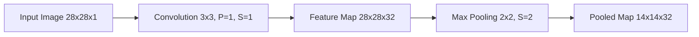

# CNN Basics: Convolution, Padding, Pooling, Strides

## Summary
Convolutional Neural Networks (CNNs) are the backbone of modern computer vision. Unlike standard neural networks that flatten inputs, CNNs preserve the spatial structure of data by using **local connectivity** and **parameter sharing**. The core operations—**Convolution**, **Padding**, **Strides**, and **Pooling**—work together to extract hierarchical features while managing the spatial dimensions and computational complexity of the network.

## Detailed Explanation

### 1. Convolution (The Feature Extractor)
The convolution operation is the primary building block. It involves a small matrix called a **kernel** (or filter) sliding across the input data.

*   **Operation**: For each position, the kernel performs element-wise multiplication with the input patch and sums the results to produce a single value in the **Feature Map**.
*   **Filters**: A layer can have multiple filters, each learning to detect different features (e.g., one for vertical edges, another for horizontal ones).
*   **Local Receptive Field**: Each neuron in a feature map only "looks" at a small local region of the input.

### 2. Padding
When a filter slides over an image, the pixels at the edges are "visited" fewer times than those in the center. Furthermore, the output size naturally shrinks. Padding solves these issues by adding extra pixels (usually zeros) around the border.

*   **Valid Padding (No Padding)**: The output size is $(I - K + 1)$. The output is smaller than the input.
*   **Same Padding**: Adds enough zeros so the output size is the same as the input $(O = I)$, assuming a stride of 1.

### 3. Strides
Stride is the "step size" of the filter as it moves across the input image.

*   **Stride = 1**: The filter moves one pixel at a time (standard).
*   **Stride > 1**: The filter jumps pixels, which reduces the output dimensions and performs a form of downsampling.

### 4. Pooling (Downsampling)
Pooling layers are used to reduce the spatial size of the representation, which reduces the number of parameters and computation in the network, and helps control overfitting.

*   **Max Pooling**: Takes the maximum value from the window. Highly effective for picking out the most prominent features.
*   **Average Pooling**: Takes the average. Smoother but often less effective for deep features than Max Pooling.

### Output Size Formula
The dimensions of the output feature map are calculated as:
$$O = \left\lfloor \frac{I - K + 2P}{S} \right\rfloor + 1$$
Where:
- $I$: Input size (height/width)
- $K$: Kernel size
- $P$: Padding
- $S$: Stride

### Visual Representation (Mermaid)



### Python Implementation

#### PyTorch Example
```python
import torch
import torch.nn as nn

class BasicCNN(nn.Module):
    def __init__(self):
        super(BasicCNN, self).__init__()
        # Convolutional layer: 1 input channel, 32 output filters, 3x3 kernel
        # Padding=1 ensures 'Same' padding for stride=1
        self.conv = nn.Conv2d(in_channels=1, out_channels=32, kernel_size=3, stride=1, padding=1)
        
        # Max Pooling: 2x2 window with stride of 2
        self.pool = nn.MaxPool2d(kernel_size=2, stride=2)

    def forward(self, x):
        # x: [batch, 1, 28, 28]
        x = self.conv(x)  # Result: [batch, 32, 28, 28]
        x = self.pool(x)  # Result: [batch, 32, 14, 14]
        return x

# Input tensor
sample_input = torch.randn(1, 1, 28, 28)
model = BasicCNN()
output = model(sample_input)
print(f"Output shape: {output.shape}")
```

#### Keras/TensorFlow Example
```python
import tensorflow as tf
from tensorflow.keras import layers, models

model = models.Sequential([
    # Input shape (28, 28, 1)
    layers.Input(shape=(28, 28, 1)),
    
    # Conv2D with 'same' padding
    layers.Conv2D(32, kernel_size=(3, 3), strides=(1, 1), padding='same', activation='relu'),
    
    # MaxPooling
    layers.MaxPooling2D(pool_size=(2, 2), strides=(2, 2))
])

model.summary()
```

## Interview Questions

**Q: Why do we use zero-padding in CNNs?**
**A:** Padding serves two main purposes: it prevents the spatial dimensions from shrinking too rapidly as we go deeper into the network, and it allows the kernels to extract features from the pixels located at the edges of the image.

**Q: What is the effect of increasing the Stride?**
**A:** Increasing the stride reduces the overlap between local receptive fields and decreases the spatial dimensions of the output feature map more aggressively. It can be used as an alternative to pooling for downsampling.

**Q: How does Max Pooling provide translational invariance?**
**A:** Since Max Pooling takes the maximum value in a small neighborhood, a small shift (translation) in the input features will likely still result in the same maximum value being selected, making the network's output more robust to slight changes in position.

**Q: Calculate the output size: Input 32x32, Kernel 5x5, Stride 1, Padding 0.**
**A:** $O = (32 - 5 + 2*0) / 1 + 1 = 28$. The output size is 28x28.

**Q: When would you prefer Average Pooling over Max Pooling?**
**A:** Max Pooling is generally preferred for computer vision as it captures the most "salient" features. However, Average Pooling might be used in the final layers of a network (Global Average Pooling) to reduce the feature map to a single value per channel while retaining global context, or in tasks where the exact intensity of features matters more than just their presence.
