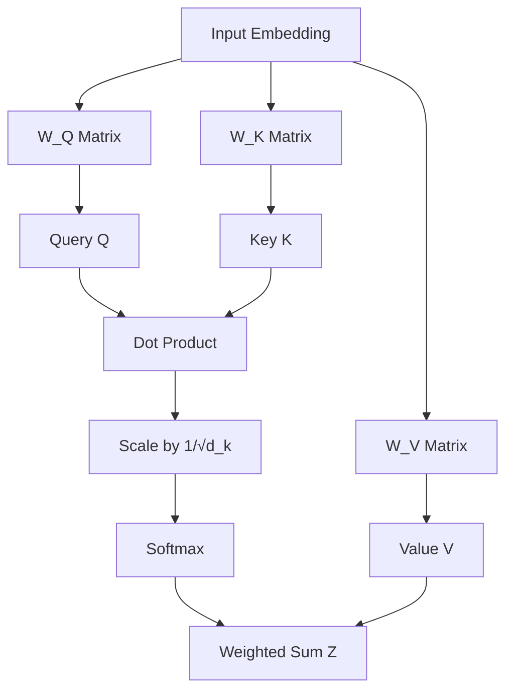

## Summary

**Self-Attention**, also known as intra-attention, is a mechanism that relates different positions of a single sequence in order to compute a representation of that sequence. Unlike traditional RNNs that process tokens sequentially, self-attention allows each token in a sequence to "attend" to all other tokens simultaneously, capturing long-range dependencies and contextual relationships. It is the fundamental building block of the **Transformer** architecture.

## Detailed Explanation

The self-attention mechanism allows the model to assign different levels of importance (weights) to different parts of the input data. For example, when processing the word "it" in the sentence *"The animal didn't cross the street because it was too tired"*, self-attention helps the model realize that "it" refers to "animal" rather than "street".

### The Core Components: Query, Key, and Value

The mechanism uses three learned linear projections for each input token:

1.  **Query ($Q$):** Represents the "request". It asks: "What am I looking for in the other tokens?"
2.  **Key ($K$):** Represents the "label". It says: "This is what I contain; compare me with the queries."
3.  **Value ($V$):** Represents the "content". It is the actual information that gets passed forward once a match is found between a Query and a Key.

### The Scaled Dot-Product Attention Process

The mathematical flow of self-attention follows these steps:

1.  **Dot Product Scoring:** Calculate the similarity between a Query and all Keys.
    $$\text{Scores} = Q \cdot K^T$$
2.  **Scaling:** Divide the scores by the square root of the dimension of the key vectors ($\sqrt{d_k}$). This prevents the dot products from growing too large in magnitude, which could lead to extremely small gradients during softmax (vanishing gradient problem).
3.  **Softmax:** Apply the softmax function to normalize the scores into a probability distribution.
    $$\text{Weights} = \text{softmax}\left(\frac{Q K^T}{\sqrt{d_k}}\right)$$
4.  **Weighted Sum:** Multiply the weights by the Value vectors to produce the final output $Z$.
    $$Z = \text{Weights} \cdot V$$

**The Unified Formula:**
$$\text{Attention}(Q, K, V) = \text{softmax}\left(\frac{QK^T}{\sqrt{d_k}}\right)V$$

### Visualization of the Flow



### PyTorch Implementation

A basic implementation of the Scaled Dot-Product Attention:

```python
import torch
import torch.nn as nn
import torch.nn.functional as F
import math

def scaled_dot_product_attention(query, key, value, mask=None):
    """
    Compute 'Scaled Dot Product Attention'.
    
    Args:
        query: (batch, n_heads, seq_len, d_k)
        key: (batch, n_heads, seq_len, d_k)
        value: (batch, n_heads, seq_len, d_v)
        mask: Optional mask for padding or look-ahead
    """
    d_k = query.size(-1)
    
    # 1. Dot product (Q * K^T)
    # scores shape: (batch, n_heads, seq_len, seq_len)
    scores = torch.matmul(query, key.transpose(-2, -1)) / math.sqrt(d_k)
    
    # 2. Apply mask (if provided)
    if mask is not None:
        scores = scores.masked_fill(mask == 0, -1e9)
    
    # 3. Softmax to get attention weights
    p_attn = F.softmax(scores, dim=-1)
    
    # 4. Multiply by Value
    return torch.matmul(p_attn, value), p_attn

# Example usage
# d_k = 64
# q = torch.randn(1, 8, 10, 64) # batch=1, heads=8, seq=10, dim=64
# k = torch.randn(1, 8, 10, 64)
# v = torch.randn(1, 8, 10, 64)
# output, weights = scaled_dot_product_attention(q, k, v)
```

## Interview Questions

**Q: Why do we scale the dot product by $\sqrt{d_k}$?**
**A:** When $d_k$ is large, the dot products can grow very large in magnitude. This pushes the softmax function into regions where it has extremely small gradients (the "plateau" regions), making it difficult for the model to learn via backpropagation. Scaling keeps the values in a range where softmax is more sensitive to changes.

**Q: What is the computational complexity of self-attention?**
**A:** The complexity is $O(n^2 \cdot d)$, where $n$ is the sequence length and $d$ is the embedding dimension. This quadratic dependency on $n$ is the primary reason why standard Transformers struggle with very long sequences (e.g., thousands of tokens).

**Q: How does self-attention differ from the attention used in older Seq2Seq (RNN) models?**
**A:** Older attention mechanisms typically focused on the relationship between an encoder and a decoder (connecting two different sequences). Self-attention calculates the relationship between tokens **within the same sequence**, allowing the model to build a richer contextual representation of each token based on its neighbors.

**Q: What is the difference between Self-Attention and Multi-Head Attention?**
**A:** Multi-head attention runs multiple self-attention operations (heads) in parallel, each with its own learned $W_Q, W_K, W_V$ matrices. This allows the model to jointly attend to information from different representation subspaces at different positions (e.g., one head focusing on grammar, another on semantic meaning).
