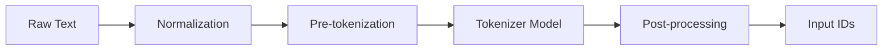

# NLP: Tokenization

## Summary
**Tokenization** is the foundational process in Natural Language Processing (NLP) that involves breaking down a stream of text into smaller, meaningful units called **tokens**. These tokens serve as the basic building blocks for downstream tasks like part-of-speech tagging, named entity recognition, and language modeling. In modern LLMs, tokenization has evolved from simple whitespace splitting to sophisticated **subword algorithms** (like BPE and WordPiece) that balance vocabulary size with the ability to handle rare or unseen words efficiently.

## Detailed Explanation

### 1. Types of Tokenization

#### **Word Tokenization**
Splits text into individual words based on delimiters (spaces, punctuation).
- **Pros**: Intuitive, preserves word-level semantics.
- **Cons**: High vocabulary size; cannot handle **Out-of-Vocabulary (OOV)** words (e.g., "unhappiness" might be unknown if only "happy" is in the vocab).
- **Tools**: NLTK, SpaCy.

#### **Character Tokenization**
Splits text into individual characters (a, b, c, ...).
- **Pros**: Very small vocabulary; no OOV issues (every word is a sequence of characters).
- **Cons**: Extremely long sequences for the model to process; individual tokens lose semantic meaning (a single "t" means nothing).

#### **Subword Tokenization**
The industry standard for modern LLMs (BERT, GPT, Llama). It breaks words into frequent chunks (e.g., "tokenization" → "token" + "ization").
- **Pros**: Handles OOV words by breaking them into known sub-parts; maintains a manageable vocabulary size (~30k-100k tokens).
- **Algorithms**:
    - **Byte-Pair Encoding (BPE)**: Iteratively merges the most frequent pairs of characters/sequences. (Used by GPT).
    - **WordPiece**: Similar to BPE but merges based on maximizing the likelihood of the training data. (Used by BERT).
    - **SentencePiece**: Language-agnostic; treats whitespace as a character (`_`), allowing for reversible tokenization. (Used by T5, Llama).

### 2. Tokenization Pipeline



1. **Normalization**: Lowercasing, removing accents, or Unicode normalization.
2. **Pre-tokenization**: Splitting on whitespace or punctuation to create initial "candidate" words.
3. **Tokenizer Model**: Applying BPE/WordPiece rules to get final subword tokens.
4. **Post-processing**: Adding special tokens like `[CLS]`, `[SEP]`, or `<s>`.

### 3. Python Implementation Examples

#### **Traditional Word Tokenization (NLTK & SpaCy)**
```python
import nltk
from nltk.tokenize import word_tokenize
import spacy

# NLTK approach
text = "Tokenization is fun, isn't it?"
tokens_nltk = word_tokenize(text)
print(f"NLTK: {tokens_nltk}")

# SpaCy approach (Linguistic aware)
nlp = spacy.load("en_core_web_sm")
doc = nlp(text)
tokens_spacy = [token.text for token in doc]
print(f"SpaCy: {tokens_spacy}")
```

#### **Modern Subword Tokenization (HuggingFace)**
```python
from transformers import AutoTokenizer

# Load a pre-trained tokenizer (e.g., BERT)
tokenizer = AutoTokenizer.from_pretrained("bert-base-uncased")

text = "Tokenization is the foundation of NLP."
encoded = tokenizer(text)

print(f"Tokens: {tokenizer.tokenize(text)}")
print(f"Token IDs: {encoded['input_ids']}")
```

## Interview Questions

**Q: Why is subword tokenization preferred over word tokenization in modern LLMs?**
**A:** Subword tokenization solves the "Out-of-Vocabulary" (OOV) problem and manages vocabulary size. It allows the model to represent rare words as combinations of frequent sub-parts (e.g., "playing" = "play" + "ing"), which ensures every input can be mapped to a representation while keeping the embedding matrix computationally efficient.

**Q: How does the Byte-Pair Encoding (BPE) algorithm work?**
**A:** BPE starts by treating every character as a token. It then iteratively identifies the most frequent adjacent pair of tokens in the corpus and merges them into a single new token. This process continues until a predefined vocabulary size is reached.

**Q: What is the difference between WordPiece and BPE?**
**A:** While both merge subword units, BPE selects the most **frequent** pair to merge. In contrast, WordPiece selects the pair that **maximizes the likelihood** of the training data (i.e., the pair that increases the probability of the language model the most).

**Q: What is the role of 'special tokens' in tokenization?**
**A:** Special tokens provide structural information to the model. For example, `[CLS]` (BERT) is used for classification tasks, `[SEP]` separates sentences, `[PAD]` handles variable-length sequences, and `[MASK]` is used for masked language modeling.
