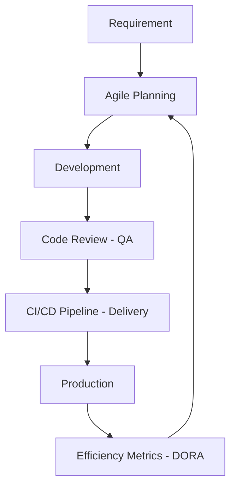

---
---

## Summary
The **Process** pillar is one of the foundational aspects of Engineering Management, focusing on how work is organized, executed, and delivered. It encompasses the methodologies (Agile), the mechanics of shipping software (Delivery), the standards for correctness (Quality Assurance), and the optimization of team output (Efficiency). A well-defined process ensures predictability, reduces friction, and allows the team to focus on building value rather than navigating chaos.

## Detailed Explanation

### 1. Agile Methodologies
Agile is the dominant mindset for modern software development, prioritizing iterative progress and rapid feedback loops.
*   **Scrum**: Defined roles (PO, Scrum Master, Team) and ceremonies (Sprint Planning, Daily Stand-up, Review, Retrospective).
*   **Kanban**: Visualizing work on a board, limiting Work in Progress (WIP), and focusing on continuous flow.
*   **Lean**: Eliminating waste, amplifying learning, and delivering as fast as possible.

### 2. Delivery & SDLC
Delivery covers the entire journey from a developer's machine to the production environment.
*   **SDLC (Software Development Life Cycle)**: The end-to-end process from requirement analysis to maintenance.
*   **CI/CD**: Continuous Integration ensures code is merged and tested frequently; Continuous Deployment automates the release process.
*   **Deployment Strategies**: Techniques like Blue/Green deployments or Canary releases to minimize risk during updates.

### 3. Quality Assurance (QA)
QA is not just about finding bugs; it's about preventing them and maintaining a high standard of excellence.
*   **Testing Pyramid**: Balancing unit tests (many, fast), integration tests (some), and E2E tests (few, slow).
*   **Shift-Left Testing**: Integrating testing earlier in the development cycle.
*   **Code Reviews**: Peer verification to ensure code quality, knowledge sharing, and adherence to standards.

### 4. Efficiency & Metrics
Measuring and optimizing the process to ensure the team is performing at its best.
*   **DORA Metrics**: The industry standard for measuring delivery performance:
    *   **Deployment Frequency**: How often code is shipped.
    *   **Lead Time for Changes**: Time from code commit to production.
    *   **Change Failure Rate**: Percentage of deployments causing failure.
    *   **MTTR (Mean Time to Recovery)**: Time to restore service after an incident.
*   **SPACE Framework**: A broader look at productivity including Satisfaction, Performance, Activity, Communication, and Efficiency.

## Go Application

In the context of a Go (Golang) ecosystem, the **Process** pillar is often implemented through strict tooling and automated workflows. Go's built-in support for testing and formatting makes it ideal for enforcing quality and efficiency.

### Quality Assurance: Robust Testing in Go
Go's `testing` package is the core of its QA process. For efficiency, EMs often enforce high coverage and use table-driven tests.

```go
package process

import (
	"testing"
)

// CalculateEfficiency is a dummy function to demonstrate QA
func CalculateEfficiency(tasksCompleted, totalTasks int) float64 {
	if totalTasks == 0 {
		return 0
	}
	return (float64(tasksCompleted) / float64(totalTasks)) * 100
}

// Table-driven test: A Go best practice for QA efficiency
func TestCalculateEfficiency(t *testing.T) {
	tests := []struct {
		name      string
		completed int
		total     int
		want      float64
	}{
		{"Perfect score", 10, 10, 100.0},
		{"Half way", 5, 10, 50.0},
		{"Zero total", 5, 0, 0.0},
		{"Zero completed", 0, 10, 0.0},
	}

	for _, tt := range tests {
		t.Run(tt.name, func(t *testing.T) {
			if got := CalculateEfficiency(tt.completed, tt.total); got != tt.want {
				t.Errorf("CalculateEfficiency() = %v, want %v", got, tt.want)
			}
		})
	}
}
```

### Delivery: CI/CD Pipeline for Go
A typical delivery process for a Go application using GitHub Actions. This ensures that every commit meets the quality standards before being eligible for delivery.

```yaml
# .github/workflows/delivery.yml
name: Go Delivery Process

on:
  push:
    branches: [ main ]
  pull_request:
    branches: [ main ]

jobs:
  build-and-test:
    runs-on: ubuntu-latest
    steps:
    - uses: actions/checkout@v3

    - name: Set up Go
      uses: actions/setup-go@v4
      with:
        go-version: '1.21'

    - name: Lint (QA)
      run: |
        go install github.com/golangci/golangci-lint/cmd/golangci-lint@latest
        golangci-lint run

    - name: Test (QA)
      run: go test -v -coverprofile=coverage.out ./...

    - name: Build (Delivery)
      run: go build -v -o app ./main.go
```

## Process Flow (MermaidJS)


## Interview Questions

**Q: How do you balance the need for speed (Delivery) with the need for stability (Quality)?**
**A:** This is balanced by implementing automated guardrails (CI/CD), fostering a culture of "Shift-Left" testing, and using metrics like DORA. High-performing teams don't trade quality for speed; they use high quality to achieve speed.

**Q: What are DORA metrics and why are they important for an Engineering Manager?**
**A:** DORA metrics are four key indicators (Deployment Frequency, Lead Time, Change Failure Rate, and MTTR) that measure software delivery performance. They are important because they provide an objective, data-driven way to identify bottlenecks and track the effectiveness of process improvements.

**Q: When would you choose Kanban over Scrum for a team?**
**A:** Kanban is often preferred for teams with highly unpredictable work items, such as DevOps or Maintenance teams, where a "flow-based" approach is more effective than time-boxed Sprints. It is also useful when the team wants to minimize overhead and focus strictly on throughput and WIP limits.
